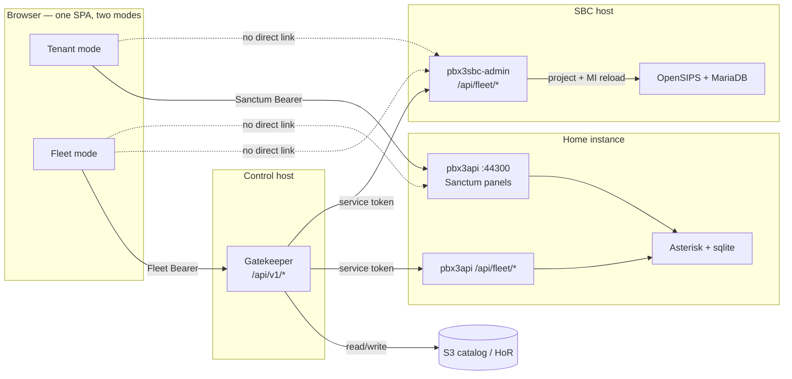

# Fleet HTTP / management channels

**Audience:** implementers tracing “who talks to whom” for admin (not SIP).  
**Companion:** runtime big picture in **`FLEET_SYSTEM_OVERVIEW.md`** §2. Modes: **`TENANT_MOBILITY_FLEET_CONSOLE_DESIGN.md`** §2.5. Create push: **`FLEET_TENANT_CREATE_REQUIREMENTS.md`**.

**Rule of thumb:** the browser never calls the SBC fleet API and never holds ops IAM. Fleet mutations go **SPA → Gatekeeper → (S3 | home `/api/fleet` | SBC `/api/fleet`)**.

---

## Direction — Filament vs edge HTTP (locked 2026-09-03)

**Not committing now:** a full HTTP mirror of every Filament panel, or SPA talking to the SBC.

**Keeping the door open:** edge features must stay callable without living only inside Livewire / Filament UI code, so a later local admin API or more fleet projections do not require a rewrite.

| Do | Do not |
|----|--------|
| Put mutators / projectors in **shared PHP services** (or thin controller actions Filament and `/api/fleet` both call) | Bury create/update/delete **only** in Livewire `save()` with no reusable service |
| Grow **`/api/fleet/*`** when a fact **graduates to catalog HoR** or needs headless Gatekeeper ops (intent-shaped) | Stuff every Peer / dialect / Fail2ban knob into `/api/fleet` “because SPA might want it” |
| Keep fleet routes **intent** (`registerDomain`, `projectDids`, `repoint`) — Rule 7 | Leak raw OpenSIPS SQL / table shapes into Gatekeeper |
| Tag / hide **fleet-owned** rows in Filament (Rule 13) | Let Fleet SPA call SBC Bearer APIs directly |
| Optional later: **local** edge admin API (Filament session or local token) sharing the same services | Treat Filament scrape / browser automation as an integration path |

**Graduation test:** “Should catalog own this?” → if yes, Gatekeeper + `/api/fleet` project. If no, stay edge-authored in Filament (standalone + break-glass) until product moves it.

Ties **`DESIGN_RULES.md`** Rules **7** + **13** · **`SBC_PRODUCT_TRACKS.md`** (direction pointer).

---

## Direction — SSO / central IdP (attractive end-goal; not building now)

**Why this sits here:** SSO is about **identity**, not about collapsing HTTP planes. It must not rewrite the mermaid above.

**Compatible:** corporate IdP (OIDC/SAML) proves *who* the operator is; each plane still issues or validates **its own** authorization.

| Plane | SSO role | Still required |
|-------|----------|----------------|
| **Fleet** | IdP → Gatekeeper login / session (natural home for fleet SSO) | `fleet_*` abilities; SPA Fleet mode → Gatekeeper only |
| **Tenant / home** | IdP → instance (or broker) token for Sanctum-class API | Tenant mode → `pbx3api` only; Rule **10** (no catalog mutate via instance admin) |
| **SBC Filament** | Optional IdP for *edge* operators (standalone / break-glass) | Local edge auth; **not** fleet projection; SPA still never calls `/api/fleet` |

**Incompatible (breaks the laws):**

- One SSO session that can administer **home + fleet + SBC + S3** without plane gates  
- Fleet SPA (or IdP access token) calling **SBC** `/api/fleet/*` “because we have SSO”  
- Stretching instance `admin` into catalog / move / onboard  

**Does not require:** a full Filament twin API. Shared mutator services (section above) keep automation and a later local edge API possible; SSO lands at **login surfaces**, not by exposing every Peer knob over HTTP.

**Status:** attractive end-goal; fleet cookie/SSO still **deferred** (try-it auth enough for now). Detail when scheduled: **`pbx3/workingdocs/FLEET_AUTH_COOKIE_SSO.md`** (if present) · Gatekeeper TOTP **`FLEET_GATEKEEPER_TOTP_REQUIREMENTS.md`** · SPA **`AUTH_PATTERNS.md`** (central auth shapes). TODO #16.

---

## Mermaid — management channels



**Dotted “no direct link”** = product rule, not a missing wire to add.

### Same as text

```text
  Tenant mode SPA ──Sanctum──► pbx3api (:44300) ──► Asterisk / sqlite
                                      ▲
  Fleet mode SPA ──Fleet Bearer──► Gatekeeper (/api/v1)
                                      │
                    ┌─────────────────┼─────────────────┐
                    ▼                 ▼                 ▼
                   S3          home /api/fleet    SBC /api/fleet
               (catalog HoR)   (service token)    (service token)
                                                      │
                                                      ▼
                                              OpenSIPS local DB
```

---

## Call path (not SPA)

Phones / WebRTC softphones use **SIP** (and WSS at the edge). That path does **not** go through Gatekeeper or the SPA:

```text
  Phone / browser softphone ──SIP/WSS──► SBC ──SIP──► home Asterisk
```

See **`FLEET_SYSTEM_OVERVIEW.md`** §2 for the fleet runtime diagram.

---

## Auth cheatsheet

| Hop | Auth |
|-----|------|
| SPA Tenant → home | Sanctum instance token |
| SPA Fleet → Gatekeeper | Gatekeeper Bearer (`fleet_*`) |
| Gatekeeper → home `/api/fleet/*` | `PBX3_FLEET_SERVICE_TOKEN` |
| Gatekeeper → SBC `/api/fleet/*` | same fleet service token |
| SPA → SBC `/api/fleet/*` | **never** |

---

## Code pointers

| Surface | Routes |
|---------|--------|
| Home Sanctum + home fleet receive | `pbx3api/routes/api.php` |
| SBC fleet receive | `pbx3sbc-admin/routes/api.php` |
| Gatekeeper client to SBC | `pbx3-directory/gatekeeper/src/SbcFleetClient.php` |
| Gatekeeper API (SPA face) | `pbx3-directory/gatekeeper/README.md` |
