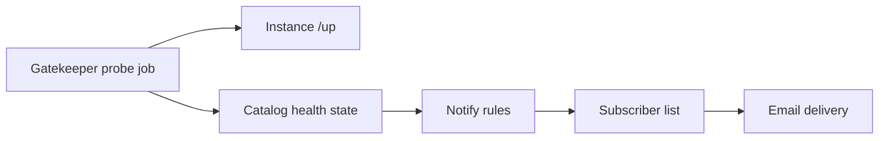

# Fleet ops — failure notification (requirements)

**Status:** **Not implemented** — requirements opened 2026-07-16.  
**MVP:** Notify interested operators of **failure conditions**. Threat / intrusion analytics are a later phase.  
**Related:** **`IMPLEMENTATION_PLAN.md`** § Fleet & monitoring (`last_seen_at` probe); **`FLEET_EGRESS_AVAILABILITY_REQUIREMENTS.md`** (trunk health → alerts); **`DESIGN_RULES.md`** Rule 5 (directory outage ≠ instance SLA); Fleet users / abilities (Gatekeeper).

---

## Problem

Operators can miss fleet failures until a customer calls: instance API down, node unreachable from the control plane, tenant-move jobs stuck/failed, or (once available) Egress Unavail. Today there is **local mitigation** (fail2ban on nodes) and **in-panel visibility** when someone is looking, but **no push notification** to people who care.

We need a durable way for **interested users** to learn about failure conditions without sitting in Fleet mode.

---

## Design stance (settled for this plan)

| Topic | Choice |
|-------|--------|
| **v1 scope** | **Failure conditions only** |
| **Home of record** | **Gatekeeper** — subscriptions + delivery (Fleet control plane) |
| **v1 channel** | **Email** to subscribed Fleet users (+ optional static ops address) |
| **Detection** | Reuse / extend the planned **catalog probe** (`api_base_url` → `last_seen_at`); do not invent a second health system |
| **Call path** | Notify plane is **not** in the call path (**Rule 5**). Calls keep working if Gatekeeper or mail is down; operators simply go dark on alerts |

---

## Requirements (when prioritized)

### R1 — Detect failure conditions

| Signal | Source | Notes |
|--------|--------|-------|
| **Instance unreachable** | Gatekeeper probe of instance `api_base_url` (e.g. `/up`) | Updates catalog `last_seen_at` / health; fire on transition to down (and optionally after N consecutive misses) |
| **Catalog maintenance / decommissioned** | Catalog lifecycle | Optional notify when an instance enters maintenance or is soft-decommissioned |
| **Move job failed / aborted** | Gatekeeper tenant-move jobs | Notify on terminal failure (and optionally long stuck `running`) |
| **Egress Unavail** | Instance trunk / AMI state (depends on **`FLEET_EGRESS_AVAILABILITY_REQUIREMENTS.md`** R1–R2) | Wire in only after qualify/health signals exist; do not fake this in v1 |

**Acceptance:** A controlled lab outage (stop API on one node) produces a durable “instance down” event on the control plane within the probe interval.

### R2 — Subscribe interested users

| Item | Detail |
|------|--------|
| **Who** | Gatekeeper Fleet users (email on the user record); optional global ops mailbox via env/config |
| **What** | Per-user (or ability-gated) subscription: all fleet failures vs selected instances |
| **Authorship** | Subscriptions live on Gatekeeper (SQLite or successor), not on each node |
| **Ability** | Likely `fleet_admin` or a dedicated `fleet_notify` (decide at implement) — default: admins can manage subscriptions |

**Acceptance:** Enabling notify for `fleet@…` and causing R1 down → that mailbox receives mail; unsubscribed users do not.

### R3 — Notify (v1 = email)

| Item | Detail |
|------|--------|
| **Channel** | Email (SMTP or provider API — choose at implement; keep adapter-shaped) |
| **Content** | Instance id/label/FQDN, failure type, first-seen / last-ok timestamps, link to Fleet UI (Instances / Jobs) when URL known |
| **Dedup / flap** | Do not mail on every probe tick; notify on **state transition** (or after hysteresis). Optional daily digest later |
| **Failure of notify** | Log on Gatekeeper; do not affect call path or block probe job |

**Acceptance:** One clear email per down transition; recovery may send a single “cleared” mail (product choice at implement).

### R4 — Non-goals (v1)

- SPA in-app inbox, Slack, Teams, webhooks, PagerDuty  
- Threat / intrusion analytics (fail2ban → notify, SIP scan correlation, Security Hub)  
- Node-local mail (each Asterisk emailing operators) as the fleet path  
- Putting notification or directory availability into the **call path**  
- Requiring S3 or SPA to be up for probes to run (Gatekeeper owns the job)

---

## Relation to other tracks

| Track | How it feeds notify |
|-------|---------------------|
| **`last_seen_at` probe + SPA badges** (`IMPLEMENTATION_PLAN.md` § Fleet & monitoring) | **Primary detection** for instance reachability; badges = in-UI; this doc = push |
| **Egress availability** | Once Egress qualify works, Unavail becomes a first-class failure signal (R1) |
| **Failover + shadowing** | Separate mini-project; notify may later cover failover events |
| **S7+ Security Hub** | Compliance / attested audit — not ops failure mail |

---

## Suggested implementation order (future)

1. **Catalog probe job** on Gatekeeper → persist `last_seen_at` / health (shared with SPA badges).  
2. **Subscription store** + minimal admin (CLI or Fleet Users panel).  
3. **Email adapter** + transition-based notify for instance down/up.  
4. **Move-job terminal failure** notify.  
5. **Egress Unavail** (after egress R1–R2).  
6. Later: webhooks / Slack; threat-oriented signals.

---

## Open questions (later design pass)

- Hysteresis: how many missed probes before “down”?  
- Cleared / recovery emails vs down-only?  
- Per-instance vs fleet-wide subscription UX.  
- Solo / no-Gatekeeper installs: out of scope for this fleet track (operators use node Logs / local tooling).  
- Rate limits and quiet hours.

---

## References

| Doc | Section |
|-----|---------|
| **`DESIGN_RULES.md`** | Rule 5 — directory outage ≠ instance SLA; EC2 mental model (monitor the fleet) |
| **`IMPLEMENTATION_PLAN.md`** | § Fleet & monitoring |
| **`FLEET_EGRESS_AVAILABILITY_REQUIREMENTS.md`** | R2 preflight / alerts |
| **`CENTRAL_ADMIN_DIRECTION.md`** | Central monitoring (direction) |

---

*Last updated: 2026-07-16 — requirements capture; no code.*
