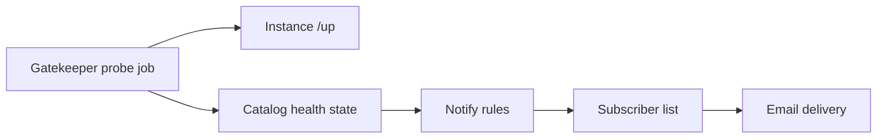

# Fleet ops — failure notification (requirements)

**Status:** **v1 + lifecycle + misconfig REGISTER + move-job + Fail2ban ban→email + Egress Unavail + velocity_irsf (V2)** (2026-07-24) — catalog `/up` probe + SMTP; maintenance/decommission mail; node REGISTER-loop → Gatekeeper; **move job failed/aborted** mail; **SBC Fail2ban ban → Gatekeeper**; **Egress Unavail/cleared**; **velocity IRSF** from instance CDR. SPA badges = later.  
**MVP:** Notify interested operators of **failure conditions**.  
**Later (same notify plane, different detection):** Peer Fail2ban auto-whitelist on next carrier onboard; **fleet home Fail2ban auto-whitelist** (TODO **#5e** — lab gap); velocity **V5 auto-block** still on velocity track.  
**Related:** **`IMPLEMENTATION_PLAN.md`** § Fleet & monitoring (`last_seen_at` probe); **`FLEET_EGRESS_AVAILABILITY_REQUIREMENTS.md`** (trunk health → alerts); **`DESIGN_RULES.md`** Rule 5 (directory outage ≠ instance SLA); Fleet users / abilities (Gatekeeper); instance **CoS** / dial policy (prevention cousin of velocity).

---

## Problem

Operators can miss fleet failures until a customer calls: instance API down, node unreachable from the control plane, tenant-move jobs stuck/failed, or (once available) Egress Unavail. Today there is **local mitigation** (fail2ban on nodes) and **in-panel visibility** when someone is looking, but **no push notification** to people who care.

We need a durable way for **interested users** to learn about failure conditions without sitting in Fleet mode.

---

## Design stance (settled for this plan)

| Topic | Choice |
|-------|--------|
| **v1 scope** | **Failure conditions only** |
| **Home of record** | **Gatekeeper** — subscriptions + delivery (Fleet control plane) |
| **v1 channel** | **Email** to subscribed Fleet users (+ optional static ops address) |
| **Detection** | Reuse / extend the planned **catalog probe** (`api_base_url` → `last_seen_at`); do not invent a second health system |
| **Mail transport** | **SMTP** for v1 (`Mailer` + `SmtpMailer`). No SES as HoR — portable; other providers = new `Mailer` class later |
| **Call path** | Notify plane is **not** in the call path (**Rule 5**). Calls keep working if Gatekeeper or mail is down; operators simply go dark on alerts |
| **Prometheus / Grafana** | **Out of this leg.** Optional later for fleet/instance **pretty metrics** (dashboards, quality time series) — not the v1 notify HoR. DIY farms often bolt these on; we may document exporters later without making Alertmanager the product subscription model. |
| **Velocity / call-pattern checks** | **Out of failure-notify v1.** Own track — **`FLEET_TOLL_FRAUD_VELOCITY_REQUIREMENTS.md`**. This doc = delivery only. |

---

## Industry patterns (grounding — not a product teardown)

Patterns common across PBX / MSP / CPaaS ops. **Not** verified UIs of current 3CX/Twilio/FreePBX releases — useful shape only. Competitive fleet shape lives in **`ARCHITECTURE_PEER_REVIEW.md`**; this section is about **detect → notify**.

### Detection

| Pattern | Who uses it (roughly) | Idea |
|---------|------------------------|------|
| **Active probe / heartbeat** | CloudWatch instance status, MSP RMM, many PBX “system health” crons | Control plane polls `/health` or SIP OPTIONS; mark down after N misses |
| **Passive metrics + thresholds** | Prometheus/Grafana, Kamailio exporters, Twilio Monitor–class | Agents push CPU, call-fail %, ASR, trunk RTT; alert on rules |
| **SIP qualify / OPTIONS** | Asterisk PJSIP, OpenSIPS gateway monitoring | Endpoint Unavail → ops signal (our egress track) |
| **CDR / quality analytics** | CPaaS (Twilio, Telnyx), contact-center suites | Error-code spikes, short calls, regional outages — service health more than box-down |
| **Velocity / toll-fraud rules** | Carrier fraud desks, MSP “international surge” alerts, some hosted PBX add-ons | Rate/destination anomalies on outbound (premium, unusual country, burst dials) — often hours behind if carrier-only |

### Notification

| Pattern | Typical shape |
|---------|----------------|
| **Email on state change** | Classic PBX / small MSP — still the default MVP |
| **Webhook → Slack / Teams / PagerDuty** | Modern SaaS ops; product emits event, customer routes |
| **Cloud alarms (SNS / EventBridge / CloudWatch)** | AWS-shaped fleets — close to our EC2 mental model (`DESIGN_RULES.md`) |
| **In-product dashboard + badge** | Commercial cloud PBX “system status”; email secondary |
| **Tiered severity** | info → warn → page (page only on call-path or multi-node impact) |

### Telecom-specific nuances

- **Control plane vs call path** — serious designs keep alerting off the media path (**Rule 5**).
- **Flap control** — SIP trunks flap; use **hysteresis** + optional “cleared” messages (or digests).
- **Two audiences** — fleet/ops (node down, SBC Unavail) vs tenant admin (their trunks/extensions) — often different subscriptions. Velocity alerts may need **tenant-scoped** recipients as well as fleet ops.
- **CPaaS** leans on API status + webhooks + Monitor alerts, not “SSH the box”; **hosted PBX / MSP** lean on panel health + email/SMS.
- **DIY OpenSIPS/Asterisk farms** often bolt on Nagios/Zabbix/Prometheus rather than rich notify inside the PBX UI.
- **Carrier fraud services** are valuable as a backstop; product velocity checks aim to **spot odd dial patterns earlier** (minutes, not next-business-day invoices).

### How that maps to our MVP

Gatekeeper probe → catalog state → subscribed **email** sits in the **CloudWatch-style status check + email** lane — normal for an MSP fleet console, deliberately simpler than CPaaS Monitor or full Prometheus. **Settled (2026-07-16):** this leg is **failure notification only**; do not pull Prometheus/Alertmanager into v1. Natural evolutions after email (still notify-plane): **webhooks**, then PagerDuty-class routing. **Pretty metrics** (Prometheus + Grafana for fleet/instance dashboards, SIP/CDR time series) are a **separate optional track** — bolt-on or documented exporters, not a substitute for Gatekeeper subscriptions.

---

## Requirements (when prioritized)

### R1 — Detect failure conditions

| Signal | Source | Notes |
|--------|--------|-------|
| **Instance unreachable** | Gatekeeper probe of instance `api_base_url` (e.g. `/up`) | **v1 done** — down after 2 misses + cleared |
| **Catalog maintenance / decommissioned** | Catalog lifecycle (`PATCH` status) | **Done** — mail on → maintenance / → decommissioned / back → active |
| **Move job failed / aborted** | Gatekeeper tenant-move jobs | **Done** — notify on `failed` and `aborted` (abort + rollback) |
| **Egress Unavail** | Instance trunk / AMI state (depends on **`FLEET_EGRESS_AVAILABILITY_REQUIREMENTS.md`** R1–R2) | **Done (2026-07-22)** — `pbx3:ops-egress-qualify` → `egress_unavail` ops-event → SMTP |
| **Velocity IRSF** | Instance CDR surge ( **`FLEET_TOLL_FRAUD_VELOCITY_REQUIREMENTS.md`** V2) | **Done (2026-07-24)** — `pbx3:ops-velocity` → `velocity_irsf` ops-event → SMTP |

**Acceptance:** A controlled lab outage (stop API on one node) produces a durable “instance down” event on the control plane within the probe interval.

### R2 — Subscribe interested users

| Item | Detail |
|------|--------|
| **Who** | Gatekeeper Fleet users (email on the user record); optional global ops mailbox via env/config |
| **What** | Per-user (or ability-gated) subscription: all fleet failures vs selected instances |
| **Authorship** | Subscriptions live on Gatekeeper (SQLite or successor), not on each node |
| **Ability** | Likely `fleet_admin` or a dedicated `fleet_notify` (decide at implement) — default: admins can manage subscriptions |

**Acceptance:** Enabling notify for `fleet@…` and causing R1 down → that mailbox receives mail; unsubscribed users do not.

### R3 — Notify (v1 = email)

| Item | Detail |
|------|--------|
| **Channel** | Email (SMTP or provider API — choose at implement; keep adapter-shaped) |
| **Content** | Instance id/label/FQDN, failure type, first-seen / last-ok timestamps, link to Fleet UI (Instances / Jobs) when URL known |
| **Dedup / flap** | Do not mail on every probe tick; notify on **state transition** (or after hysteresis). Optional daily digest later |
| **Failure of notify** | Log on Gatekeeper; do not affect call path or block probe job |

**Acceptance:** One clear email per down transition; recovery may send a single “cleared” mail (product choice at implement).

### R4 — Non-goals (v1)

- SPA in-app inbox, Slack, Teams, webhooks, PagerDuty  
- **Prometheus / Grafana / Alertmanager** as the failure-notify plane (optional **metrics** track later — see design stance)  
- Threat / intrusion **analytics** (SIP scan correlation, Security Hub) — **except** Fail2ban **ban → email** and whitelist automation called out in § Fail2ban (planned, not v1 probe)  
- **Call-pattern velocity / toll-fraud detection** — **`FLEET_TOLL_FRAUD_VELOCITY_REQUIREMENTS.md`** (not failure-notify v1)  
- Node-local mail (each Asterisk emailing operators) as the fleet path  
- Putting notification or directory availability into the **call path**  
- Requiring S3 or SPA to be up for probes to run (Gatekeeper owns the job)

---

## Relation to other tracks

| Track | How it feeds notify |
|-------|---------------------|
| **`last_seen_at` probe + SPA badges** (`IMPLEMENTATION_PLAN.md` § Fleet & monitoring) | **Primary detection** for instance reachability; badges = in-UI; this doc = push |
| **Egress availability** | Once Egress qualify works, Unavail becomes a first-class failure signal (R1) |
| **Failover + shadowing** | Instance shadow SKU framing locked — **`INSTANCE_SHADOWING_REQUIREMENTS.md`**; notify may cover promote events |
| **S7+ Security Hub** | Compliance / attested audit — not ops failure mail |
| **Prometheus / Grafana (optional later)** | Pretty metrics / quality time series — **not** this notify leg |
| **Toll fraud / velocity** | Odd outbound call patterns → same notify delivery; detection on instance — **`FLEET_TOLL_FRAUD_VELOCITY_REQUIREMENTS.md`** |
| **Fail2ban (SBC)** | Auto-whitelist **fleet homes** + **inbound Peers**; **manual** site IPs; **ban → email** — § below |

---

## Fail2ban — whitelist automation + ban notify

**Context:** SBC Fail2Ban UI (status / manual whitelist / sync) already exists. Manual coverage is not enough for production peering.

### Whitelist (edge — pbx3sbc-admin)

| Source | Requirement |
|--------|-------------|
| **Fleet Asterisk / home IPs** | **Automate (required):** on node register / dispatcher membership / Peer `role=asterisk` save, add/remove Fail2ban whitelist + sync. Homes must never be banned for edge SIP. **Open — TODO #5e** (Toliman banned 2026-08-12; manual `/32` only). |
| **Carrier inbound Peer IPs** | **Automate:** on Peer create/update/delete for inbound signaling rows (`role=inbound` / literal source IPs), add/remove Fail2ban whitelist + sync. **Deferred** until next carrier onboard. |
| **Customer site IPs** | **Manual only** (existing Fail2Ban whitelist UI is enough). **Operator discipline:** whitelist known site/office NAT CIDRs **before phones go live** — no site CRM, no auto-discovery. Without this, one misconfigured phone can ban the whole site. |

Authorship stays on the **SBC** (**Rule 13**). Detail: **`pbx3sbc/workingdocs/PEERING-PLAN.md`** §0.1.

### Ban → email (same notify delivery plane) — **done**

| Item | Direction |
|------|-----------|
| **Signal** | New Fail2ban ban on SBC SIP jail (`opensips-brute-force`) — polled by `pbx3sbc:ops-fail2ban-bans` |
| **Emit** | SBC → Gatekeeper `POST /api/v1/ops-events` `{type:fail2ban_ban}` → SMTP to `notify_failures` subscribers |
| **Throttle** | Gatekeeper per jail+IP cooldown; SBC caps emits/tick; first poll seeds without mail |
| **Enable** | `PBX3_OPS_FAIL2BAN_BAN_NOTIFY=true` + `PBX3_GATEKEEPER_URL` / `TOKEN` on SBC admin; cron example `deploy/cron.d/pbx3sbc-fail2ban-notify.example` |
| **Not for misconfig phones on known sites** | See § Misconfigured phones — ban is the wrong tool there |

---

## Misconfigured phones — REGISTER loops (notify on node; ban on SBC)

**Problem:** Handsets often fire repeated failed REGISTER (right extension, wrong password). On known office NATs, **Fail2ban must not be the primary response** — one bad phone behind shared NAT can take down the whole site.

| Stance | Detail |
|--------|--------|
| **Where SIP is seen** | Phones always transit the **SBC**; instance `:5060` is **SBC-only**. Asterisk source IP is the SBC, never the handset/site. |
| **Instance Fail2ban (Asterisk jail)** | **Off** — banning would only hit SBC peers and break trunks. Keep **sshd** / API jails. |
| **SBC Fail2ban** | Ban/whitelist on **real** client IPs. **Known office NAT** → manual whitelist (no site CRM). **Cellular / road warrior** → do **not** whitelist (dynamic); temporary ban on abuse is OK. Scanners → ban. |
| **Notify (shipped)** | Node `pbx3api` `pbx3:ops-register-loops` scans Asterisk messages; peer gate = SBC IPs in node `ignoreip`; threshold **5 / 600s**; resolves shortuid → dialable ext + name; `POST /api/v1/ops-events` `{type:misconfig_register}` → Gatekeeper SMTP. Enable: `PBX3_OPS_REGISTER_LOOP_ENABLED=true` + Gatekeeper URL/token. |
| **Mail** | Dialable extension (+ shortuid + name), source IP (SBC), instance, count/window — fix credentials. |
| **Later** | — ban→email shipped (see § Fail2ban). |

---

## Velocity / toll fraud (own track)

**Moved:** Call-pattern velocity / IRSF-style detection is a **separate phase track** — see **`FLEET_TOLL_FRAUD_VELOCITY_REQUIREMENTS.md`** (V0–V5). This document remains the **delivery** plane (subscriptions + SMTP + `ops-events`).

---

## Suggested implementation order

1. **Catalog probe job** on Gatekeeper → persist `last_seen_at` / health (shared with SPA badges). **Done (v1).**  
2. **Subscription store** + Fleet Users checkbox. **Done (v1).**  
3. **Email adapter (SMTP)** + transition-based notify for instance down/up. **Done (v1).**  
4. **Move-job terminal failure** notify. **Done** (`failed` / `aborted`).  
5. **Egress Unavail** (after egress R1–R2). **Done** — instance `pbx3:ops-egress-qualify` → Gatekeeper `egress_unavail`.  
6. **Misconfigured phones** (REGISTER-loop notify on node; SIP ban on SBC) — **Done** (node scanner + Gatekeeper ops-events; instance Asterisk jail off).  
7. Later (notify plane): webhooks / Slack. **Fail2ban ban→email — Done.**  
8. **Separate track:** optional Prometheus + Grafana for metrics dashboards.  
9. **Toll fraud / velocity track:** **`FLEET_TOLL_FRAUD_VELOCITY_REQUIREMENTS.md`** (instance detect → Gatekeeper deliver).  
10. ~~**Fail2ban fleet-home auto-whitelist**~~ — **Done (#5e, 2026-08-19):** Provision edge upsert + Decom retire via SBC `retire-node-whitelist`.  
11. **Fail2ban Peer auto-whitelist** (next carrier onboard).

---

## Open questions (settled for v1 / remaining)

### Failure notify (v1) — settled 2026-07-16

- Hysteresis: **2** missed probes before “down”.  
- Cleared / recovery emails: **yes** (one mail).  
- Subscription: fleet-wide `notify_failures` flag (not per-instance yet).  
- Solo / no-Gatekeeper installs: out of scope.  
- Rate limits / quiet hours: later.

### Velocity / Fail2ban / misconfig REGISTER

- **Velocity:** open product forks live in **`FLEET_TOLL_FRAUD_VELOCITY_REQUIREMENTS.md`**.  
- Fail2ban / REGISTER: see sections above.

---

## References

| Doc | Section |
|-----|---------|
| **`DESIGN_RULES.md`** | Rule 5 — directory outage ≠ instance SLA; EC2 mental model (monitor the fleet) |
| **`IMPLEMENTATION_PLAN.md`** | § Fleet & monitoring |
| **`FLEET_EGRESS_AVAILABILITY_REQUIREMENTS.md`** | R2 preflight / alerts |
| **`FLEET_TOLL_FRAUD_VELOCITY_REQUIREMENTS.md`** | Toll fraud / call-pattern velocity (own track) |
| **`ARCHITECTURE_PEER_REVIEW.md`** | Competitive fleet shape (not notify-specific) |
| **`pbx3sbc/workingdocs/PEERING-PLAN.md`** | §0.1 Fail2ban — auto fleet homes + carrier inbound; manual site IPs |
| **`CENTRAL_ADMIN_DIRECTION.md`** | Central monitoring (direction) |

---

*Last updated: 2026-07-24 — delivery plane includes `velocity_irsf` (V2).**`FLEET_TOLL_FRAUD_VELOCITY_REQUIREMENTS.md`** (V0 framing).*
