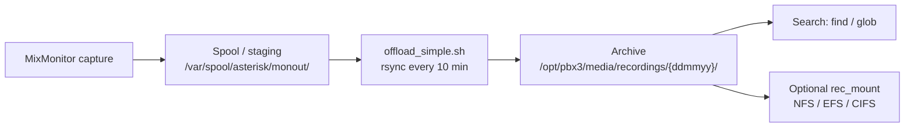
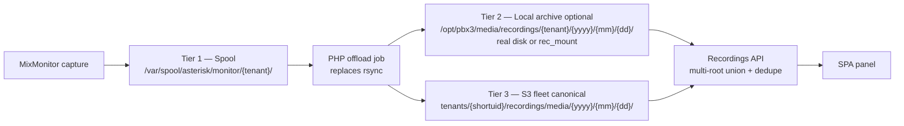
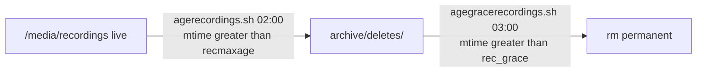
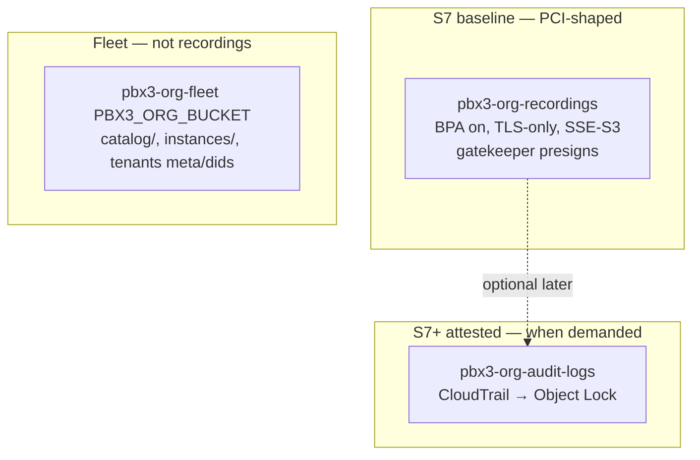
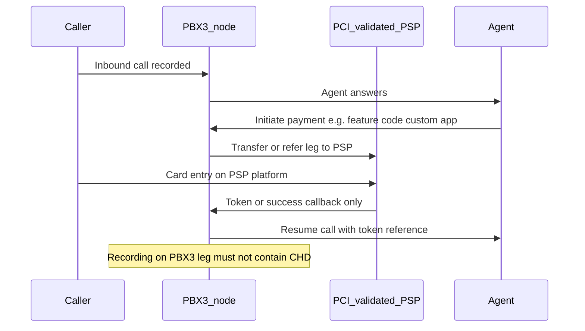

# Recordings storage & search — design

**Status:** Design (2026-07-07; amended — SQLite catalog, deletion §6.1, PCI §6.2–6.4 PSP handoff)  
**Related:** **`IMPLEMENTATION_PLAN.md`** § Phase R1 / § Phase S7 · **`TENANT_MOBILITY_FLEET_CONSOLE_DESIGN.md`** §2.6 / §2.6.1 · **`DESIGN_RULES.md`** (Rule 1 fail-safe)

This document captures the agreed **shape** of call recordings storage and search: how the legacy system worked, what **Phase R1** shipped, and how **local archive offload** (R1.5) and **S3 offload** (S7) should extend it. It is written as durable history so implementers do not have to rediscover the reasoning.

---

## 1. Current state (Phase R1 — shipped)

**Capture:** `pbx3cagi` `SetRecord` / `MixMonitor` writes finished wav files to:

```
/var/spool/asterisk/monitor/{tenant_shortuid}/{filename}.wav
```

**Filename convention** (regular call):

```
{epoch}-{tenant_shortuid}-{calledid}-{clid}.wav
```

Queue calls may add `{queue}-{extension}` tokens or a `Qexec` prefix (unswept).

**Operator UX:** `pbx3api` `RecordingIndexService` + `RecordingController` list/search/stream/download from the recordings filesystem disk (`PBX3_RECORDINGS_ROOT`, default `/var/spool/asterisk/monitor`). `pbx3spa` Recordings panel (ported from legacy `sarkrecordings`) provides filters, inline play, and download. Tenant column shows `cluster.pkey` (display name), not shortuid.

**Principle (Rule 1):** R1 works **without S3** — same as telephony. Capture and playback do not depend on offload, NFS, or the fleet control plane.

**Gap vs legacy:** R1 reads the **spool only**. There is no offload to `/opt/pbx3/media/recordings`, no date-folder archive layout, no S3 upload, and no `recused` tally job wired to the new API path.

---

## 2. Legacy system (pre-PBX3 SPA/API)

On the previous system, recordings followed a **two-tier local** model with optional external storage.

### 2.1 Flow



| Step | Mechanism | Notes |
|------|-----------|-------|
| Capture | MixMonitor | Legacy used `monout` staging; current `pbx3cagi` writes directly to `monitor/{tenant}/` |
| Offload | `offload_simple.sh` (cron `*/10`) | `rsync --remove-source-files -a` from spool to archive |
| Archive layout | **Date-first** | `/opt/pbx3/media/recordings/{ddmmyy}/` — flat day folders |
| External storage | `rec_mount` | Tenant field: mount command for NFS/EFS/CIFS; PBX3 provides local mountpoint |
| Retention | `agerecordings.sh` (02:00), `agegracerecordings.sh` (03:00) | Per-tenant `recmaxage`; `find … -mtime +N` moves aged files to delete bin |
| Usage tally | `manageRecs.php` (03:00) | `du` per tenant → `cluster.recused` |
| Search | `find` / glob over archive tree | Filename embeds epoch + tenant pkey substring |

A rewrite stub (`rewrite-offload_simple.sh`) already notes:

> *HAS TO BE REWRITTEN FOR S3 RECORDINGS STORE — WILL MOVE TO PHP DUE TO THE INDEX MANAGEMENT*

### 2.2 Tenant config (still in schema)

| Field | Purpose |
|-------|---------|
| `rec_mount` | Optional mount command for external recording storage |
| `rec_final_dest` | Path or target after staging |
| `rec_age` / `recmaxage` | Max age in days (local retention) |
| `recused` | Display: disk usage per tenant (legacy `du` tally) |
| `callrecord_1` | Recording mode (None / compass / Both / OTR — OTR deprecated) |

See `sqlite_create_tenant.sql`, `Tenant` model, SPA tenant advanced fields.

### 2.3 What worked well

- **Spool stays small** — hot capture separate from durable archive
- **Date folders** — narrow search space for “recordings on date X”
- **`rec_mount`** — customer brings own storage without app changes
- **Filename metadata** — epoch + parties in the name enables search without a DB on POSIX filesystems

### 2.4 What does not port to S3

- **`find` / glob** — no equivalent on S3; must use **prefix listing** and/or an **index**
- **NFS mount as “the archive”** — fleet tenants move between nodes; per-node NFS does not follow
- **Date-only folders without tenant** — harder to scope per-tenant IAM and tenant moves

---

## 3. Target architecture — three tiers

**Decision (2026-07-07):** **S3-first for fleet** — S3 under `tenants/{shortuid}/recordings/` is the **canonical fleet archive**. Local `/opt/pbx3/media/recordings` (+ optional `rec_mount`) remains an **optional on-prem / legacy path**, not the fleet source of truth.



### 3.1 Tier 1 — Spool (always)

| Property | Value |
|----------|-------|
| Path | `/var/spool/asterisk/monitor/{tenant_shortuid}/` |
| Writer | Asterisk MixMonitor via `pbx3cagi` |
| Reader | R1 API (immediate operator access to recent calls) |
| Retention | Short — files move out via offload job; not the long-term store |

**Rule 1:** Calls and capture **never** depend on Tier 2 or Tier 3 being available.

### 3.2 Tier 2 — Local archive (optional)

| Property | Value |
|----------|-------|
| Default path | `/opt/pbx3/media/recordings/` (configurable via `rec_final_dest` / env) |
| Layout | **Tenant-first, then date** — `{tenant_shortuid}/{yyyy}/{mm}/{dd}/{filename}.wav` |
| External | `rec_mount` — same mount abstraction as legacy; archive root may be NFS/EFS/CIFS |
| Writer | PHP offload job (move or copy from spool after file stable) |
| Reader | Extended `RecordingIndexService` (multi-root) |
| Retention | `rec_age` / `recmaxage` — local delete; same hybrid spirit as backups option C |

**Layout change from legacy:** Legacy used **date-only** top level (`{ddmmyy}/`). New layout adds **tenant** as the first path segment to align with:

- R1 spool layout (`{tenant}/…`)
- Per-tenant retention and `du` tally
- Filename still carries epoch + parties for search

**Open (see §8):** Confirm tenant-first vs retaining date-first for customers who expect the old tree.

### 3.3 Tier 3 — S3 (fleet canonical)

| Property | Value |
|----------|-------|
| **Bucket** | **Dedicated recordings bucket** (§6.3) — **not** the shared org bucket that hosts public `catalog/` |
| Prefix | `tenants/{shortuid}/recordings/media/{yyyy}/{mm}/{dd}/{object}.wav` |
| Writer | Async upload after local file stable — **presigned PUT** from control-plane gatekeeper (§5) |
| Reader | `ListObjectsV2` by prefix + presigned GET for play/download when local copy gone |
| Retention | S3 lifecycle from `tenants/{shortuid}/recordings/policy.json` (`maxage_days` ← `recmaxage`) |
| Move | **Unchanged on tenant move** — prefix is tenant-stable; only `meta.json.instance_id` updates |

Sidecar (recommended at upload):

```
tenants/{shortuid}/recordings/media/{yyyy}/{mm}/{dd}/{object}.txt
```

JSON or key=value: `epoch`, `callerid`, `dnid`, `queue`, `extension`, `duration`, `tenant_shortuid`, `filename`.

---

## 4. Search strategy

### 4.1 The core problem

On POSIX, operators could run `find /opt/pbx3/media/recordings … -name '*555*'`. **S3 has no find.** `ListObjects` is efficient only when the **key prefix** matches the query (tenant + date). Global caller/callee search across years of objects requires scanning many keys or maintaining an **index**.

### 4.2 By tier

| Query type | Tier 1/2 (local) | Tier 3 (S3) |
|------------|------------------|-------------|
| List newest | Directory scan + sort by epoch in filename | Prefix list + sort |
| Filter by tenant | `{tenant}/` directory or filename | `tenants/{shortuid}/recordings/` prefix |
| Filter by date range | Walk `{tenant}/{yyyy}/{mm}/{dd}/` or filter parsed epoch | `…/media/{yyyy}/{mm}/{dd}/` prefix per day |
| Search caller/callee | Filename parse + substring match on scan | Filter **after** prefix list, or **index** |
| Play / download | `response()->file()` | Local if present; else presigned GET |

### 4.3 Index approach (settled 2026-07-07)

**Preferred:** tenant-scoped **`recordings` table** in SQLite (§4.5) — indexed SQL search, moves with tenant miniDB, aligns with legacy MySQL catalog.

Supplementary mechanisms (not primary operator search):

| Level | Mechanism | Role |
|-------|-----------|------|
| **Primary** | SQLite `recordings` table (`cluster` = tenant shortuid) | Interactive list/search/play resolution |
| **Reconciliation** | Filesystem scan + S3 prefix list | Backfill or repair index drift |
| **Export / DR** | Optional monthly `manifest-{yyyy}-{mm}.jsonl` under tenant S3 prefix | Portable backup of metadata; not the live query path |
| **Compliance** | Athena / OpenSearch | Large fleet / legal discovery — deferred |

Do not use S3 prefix listing alone as the operator search path once the SQLite catalog ships.

### 4.4 Multi-root API

`RecordingIndexService` (or successor) queries the **`recordings` table first** when present; falls back to filesystem scan (R1 behaviour) if the table is empty or a row is missing (**Rule 1** — search is not in the call path).

**Read path:**

1. `SELECT … FROM recordings WHERE cluster = ?` (+ date / caller / callee filters)
2. Resolve blob: `local_path` if file exists on this node; else presigned GET from `s3_key`
3. Reconciliation job (nightly or on-demand): compare table vs spool/archive/S3; insert missing rows, clear stale `local_path`

**Union / dedupe** (during transition or reconciliation):

1. Scan spool root(s) and local archive root(s)
2. If enabled, list S3 prefix(es) for requested tenant/date window
3. **Dedupe** on stable id (R1 encoding or table `id`)
4. Expose `location`: `spool` | `archive` | `s3` | `s3_only`

SPA: **“archived”** badge when `location === 's3_only'` (S7.7).

### 4.5 Tenant-scoped SQLite catalog (preferred)

Recordings belong to **tenants**. Search metadata lives in a **`recordings` table** in the tenant-scoped SQLite schema — same pattern as `queue`, `greeting`, `inroutes` (one node DB file; rows scoped by `cluster` = tenant shortuid).

**Mobility:** The table **moves with the tenant** via `tenant:export` / `tenant:import` (`TenantMobilityService`). Add `recordings` to `TENANT_DATA_TABLES` when the table ships. This is **tenant-owned metadata**, not stranded on the old instance after a move.

**Legacy precedent:** MySQL catalog `recordings` table (`caller-id`, `callee-id`, `cdate`, `tenant-id`, `s3key`) — see `mysql_create_catalog.sql`.

**Proposed schema (sketch):**

```sql
CREATE TABLE recordings (
  id          TEXT PRIMARY KEY,       -- ksuid or stable id
  cluster     TEXT NOT NULL,          -- tenant shortuid (RI)
  epoch       INTEGER NOT NULL,
  callerid    TEXT,
  dnid        TEXT,                   -- callee (calledid)
  queue       TEXT,
  extension   TEXT,
  filename    TEXT NOT NULL,
  local_path  TEXT,                   -- null when s3_only on this node
  s3_key      TEXT,                   -- durable locator; survives tenant move
  location    TEXT NOT NULL,          -- spool | archive | s3 | s3_only
  filesize    INTEGER,
  z_created   datetime,
  UNIQUE(cluster, filename)
);
-- indexes: (cluster, epoch), (cluster, callerid), (cluster, dnid)
```

**Locators after tenant move:**

| Field | On move |
|-------|---------|
| `s3_key` | **Unchanged** — S3 prefix is tenant-stable (`tenants/{shortuid}/recordings/…`) |
| `local_path` | Valid only on the node that holds the file; cleared or stale after move |
| Row itself | **Imported** on destination with tenant miniDB |
| On-node wavs | Optional `tenant:export --include-recordings`; otherwise S3-backed rows still searchable/playable |

**Write path:** insert or update row when recording is stable — at offload (R1.5), on S3 upload complete (S7), with reconciliation backfill from filesystem/S3.

**Rule 1:** SQLite is for **operator search and blob pointers**, not capture. MixMonitor still writes to spool if the DB is unavailable; API falls back to filesystem scan.

---

## 5. Fleet, IAM, and tenant move

Cross-reference **`TENANT_MOBILITY_FLEET_CONSOLE_DESIGN.md`** §2.6 / §2.6.1 — not re-decided here.

| Topic | Recording implication |
|-------|----------------------|
| Node IAM | Drop blanket `tenants/*` write; backups stay on `instances/{ksuid}/` |
| Upload | Gatekeeper `POST /s3/presign` — scoped PUT on **`PBX3_RECORDINGS_BUCKET`** to `tenants/{hosted_shortuid}/recordings/*` (not org/catalog bucket) |
| Fail-safe | Gatekeeper down → calls continue; local disk authoritative until upload succeeds |
| Tenant move | S3 recordings **stay** under `tenants/{shortuid}/recordings/`; **`recordings` table rows move** with tenant miniDB; optional `--include-recordings` for on-node wav bundle |
| Control plane | Same service as S3 gatekeeper — not a separate recordings app |

---

## 6. Retention hybrid

Same pattern as instance backups (option C in **`DESIGN_RULES.md`**): local disk is the **hot cache**; S3 is the **DR / long-term** copy until lifecycle expires it.

| Store | Policy | Mechanism |
|-------|--------|-----------|
| Spool | Hours / until offloaded | Offload job removes after stable |
| Local archive | `recmaxage` (days), optional `recmaxsize` (bytes) | PHP retention job (§6.1) replaces `agerecordings.sh` |
| S3 | `policy.json` `maxage_days` ← `recmaxage` | Lifecycle rule + `class=recording` tag |

Local eviction does **not** delete the S3 copy until S3 lifecycle expires it. The SQLite row **survives** local deletion when `s3_key` is set (§6.1).

### 6.1 Deletion & ageing

Legacy used **four** tenant fields and a **two-stage** local delete. The new design keeps the semantics where they still apply and extends them across **local file**, **SQLite index**, and **S3**.

#### Tenant config (cluster table)

| Field | Default | Role |
|-------|---------|------|
| `recmaxage` | 60 (days) | **Primary** per-tenant max age — used by retention job and S3 `policy.json` |
| `rec_age` | 60 (days) | Legacy duplicate of age limit; prefer `recmaxage` for new code |
| `rec_grace` | 5 (days) | Soft-delete grace: how long files stay in the delete bin before permanent purge |
| `recmaxsize` | 0 (unlimited) | Max **bytes** per tenant on local storage; evict **oldest first** when exceeded |

All four are already in `sqlite_create_tenant.sql` and exposed in the SPA tenant advanced panel.

#### Legacy two-stage delete (reference)



- **`agerecordings.sh`** — per tenant, `find … -mtime +recmaxage` → **move** to delete bin (recoverable).
- **`agegracerecordings.sh`** — `find deletes … -mtime +rec_grace` → **permanent** `rm`.

Both scripts carry legacy notes that grace/delete-bin is *"no longer necessary with S3"* — fleet target is hybrid local + S3 lifecycle, not delete-bin-only.

#### Tri-store consistency on delete

Retention must keep **local file**, **`recordings` row**, and **S3 object** aligned.

| Event | Local file | SQLite `recordings` row | S3 object |
|-------|------------|-------------------------|-----------|
| Age out, **S3 copy exists** | Move to delete bin → purge after `rec_grace` | **Keep row**; set `location = s3_only`, clear `local_path` | Unchanged until lifecycle |
| Age out, **local-only** (no `s3_key`) | Delete bin → purge after `rec_grace` | **DELETE row** after permanent purge |
| `recmaxsize` exceeded | Evict oldest until under cap | Same rules as age-out per row | Unchanged if uploaded |
| S3 lifecycle expires object | — | **DELETE row** (reconciliation job) | Deleted by lifecycle |
| Operator manual delete (future UI) | Delete if present | DELETE or tombstone | DELETE via gatekeeper presign |

**Row lifetime rule:** a row is removed only when **no copy remains** (local and S3 both gone). If S3 still holds the object, local deletion transitions the row to `s3_only` — still searchable and playable via presigned GET.

#### When retention runs (R1.5 / S7)

| Job | Schedule (legacy analogue) | Action |
|-----|---------------------------|--------|
| **Age-out** | Daily ~02:00 (`agerecordings.sh`) | Per hosted tenant: find archive (+ spool if policy includes) files older than `recmaxage`; soft-delete to `{archive_root}/deletes/{tenant}/` or mark row |
| **Grace purge** | Daily ~03:00 (`agegracerecordings.sh`) | Permanent delete from delete bin after `rec_grace`; delete SQLite row if no `s3_key` |
| **Size cap** | Same age-out pass or separate | If `recmaxsize` > 0 and `recused` over cap, evict oldest recordings until under limit |
| **S3 lifecycle** | AWS-managed | Expire `tenants/{shortuid}/recordings/media/…` per `policy.json` |
| **Reconciliation** | Nightly (S7.9) | Remove rows whose `s3_key` no longer exists; fix drift |

**Tenant move:** retention policy (`recmaxage`, `rec_grace`, `recmaxsize`) travels in the tenant miniDB. The **destination node** runs retention for **hosted** tenants — same as extensions or queues.

#### Soft delete: delete bin vs tombstone (open)

| Approach | Fit | Notes |
|----------|-----|-------|
| **Delete bin** (legacy) | On-prem / local archive | `{archive_root}/deletes/{tenant}/`; recoverable for `rec_grace` days |
| **Row tombstone** (`deleted_at` column) | Fleet + SPA | Row hidden from list; hard-delete after grace; no second filesystem tree |
| **S3 versioning** | Fleet DR | Version stack on object; heavier ops; defer unless compliance requires |

**Lean for R1.5:** keep **delete bin** for local parity; add optional `deleted_at` on the row when soft-deleting so the API can hide tombstoned rows before filesystem purge. Revisit full S3 versioning in S7+.

#### Index updates on delete

| Step | SQLite change |
|------|----------------|
| Soft-delete (age-out) | Optional `deleted_at` set; or row unchanged until purge |
| Local purge, S3 remains | `local_path = NULL`, `location = s3_only` |
| Local + S3 gone | `DELETE FROM recordings WHERE id = ?` |
| Reconciliation sees missing S3 key | `DELETE` orphan row |

Operator list (`GET /recordings`) excludes rows with `deleted_at` set (when tombstone column ships).

---

### 6.2 PCI DSS — staged approach (settled 2026-07-14)

Call recordings **can** contain **cardholder data (CHD)** if agents take card details on a recorded line. A bucket that *may* hold CHD can fall in **PCI DSS** scope. Full attestation is **process + controls + often QSA** — most current PBX3 customers do **not** require that now. Do **not** slow S7 on compliance theatre; do **not** ship a layout that blocks PCI later.

**Strict PCI posture (settled 2026-07-07):** **pause/resume recording** (or DTMF masking alone) is **not** sufficient under QSA scrutiny. Customers requiring **strict PCI DSS** must **hand off card capture to a specialist PSP** (§6.4). That facilitation is **S7+**, not an S7 ship gate.

#### Two bars (do not conflate)

| Bar | When | Meaning |
|-----|------|---------|
| **S7 baseline — PCI-shaped** | Ship gate for Phase S7 | Private dedicated bucket, least-privilege **presigns**, TLS-only, encryption at rest (**SSE-S3** OK), honest “**not PCI-attested**” docs. Engineering readiness so attested controls can bolt on **without** key/layout rewrite. |
| **S7+ attested / CDE hardening** | Customer demand or sales requires PCI posture | KMS CMK, CloudTrail data events → WORM audit bucket, Security Hub PCI CSPM, IAM/review cadence, organisational attestation. Optional **strict** profile = PSP handoff (§6.4). |

**Product language (S7):** “Private encrypted DR store for call recordings; **not** a PCI DSS certified cardholder data environment.” Customers who accept spoken CHD on recorded lines own that risk until they buy S7+ / strict.

#### S7 baseline controls (our responsibility — ship these)

| Area | Control | Implementation notes |
|------|---------|----------------------|
| **Bucket boundary** | Dedicated **`PBX3_RECORDINGS_BUCKET`** | Never co-locate with public `catalog/` (§6.3) |
| **Access control** | **Block Public Access** on recordings bucket | Account-wide BPA only if it does not break intentional public catalog on the **fleet** bucket |
| | **Least privilege** via **gatekeeper presigns** | Nodes do **not** get blanket `tenants/*` (mobility §2.6.1); short-lived PUT/GET scoped to hosted tenant prefix |
| **Encryption in transit** | **HTTPS/TLS** only | Bucket policy `aws:SecureTransport`; API playback over TLS |
| **Encryption at rest** | **SSE-S3** (S3-managed keys) default | Enough for baseline DR; upgrade path to **KMS CMK** is bucket config, not app rewrite |
| **Ops honesty** | Document non-attested | **`OPS_S3_RUNBOOK.md`** — no claim of PCI certification |

#### S7+ attested controls (defer — not S7 exit criteria)

| Area | Control | Notes |
|------|---------|-------|
| **Encryption at rest** | **KMS CMK** + scoped key policy | Replace or wrap SSE-S3 when customer requires |
| **Monitoring** | **CloudTrail** data events on recordings bucket | |
| **Immutable audit** | Separate audit-log bucket with **Object Lock** | Not subject to recording `recmaxage` |
| **Compliance tooling** | **Security Hub** (or equiv.) PCI standard | Find/remediate loop |
| **Process** | QSA / SAQ / customer questionnaires | Outside product sprint |

#### PBX3 alignment

- **Trust boundary:** gatekeeper / control plane owns recordings-bucket presigns and (later) attested controls — same seam as catalog (mobility §2.6).
- **Tenant isolation:** `tenants/{shortuid}/recordings/` prefixes limit blast radius.
- **Rule 9:** treat recordings bucket as S3-API portable; do not hard-wire AWS-only attestation APIs into domain code.

#### Scope note

R1 / R1.5 stay local (no S3). **S7 ships the baseline shape.** Attestation and PSP are **S7+**. **Bucket layout:** §6.3.

### 6.3 PCI scope & S3 bucket structure (settled 2026-07-07)

**Decision:** call recordings that may hold **cardholder data (CHD)** must live in a **dedicated S3 bucket**, separate from the shared **org fleet bucket** (`PBX3_ORG_BUCKET`) used today for `catalog/`, instance backups, and tenant catalog metadata.

**Within our capability:** yes — the gatekeeper / control-plane model (§5, `TENANT_MOBILITY_FLEET_CONSOLE_DESIGN.md` §2.6) can own presigns, KMS, CloudTrail, and IAM for a recordings bucket without re-architecting telephony or tenant mobility. Formal PCI attestation still requires QSA / organisational process; the **technical environment** is achievable.

#### Why the current single-bucket layout is insufficient

Today (S5/S8) one org bucket typically holds:

```
catalog/                      ← public or public-ish GET (instance-index.json)
instances/{ksuid}/backups/    ← no CHD
tenants/{shortuid}/meta.json  ← no CHD
tenants/{shortuid}/dids.json
(tenants/{shortuid}/recordings/  ← planned S7 — may contain CHD)
```

PCI requires **Block Public Access** at **bucket and account** level for the CDE. That conflicts with a **public `catalog/`** prefix in the **same** bucket. Enabling account-wide BPA would also block the public catalog across all buckets. **Prefix isolation inside one bucket is not enough** for PCI scope separation when any prefix is intentionally public.

#### Target bucket layout



| Bucket | Contents | When | Access |
|--------|----------|------|--------|
| **`pbx3-{org}-recordings`** (new) | `tenants/{shortuid}/recordings/media/…`, `policy.json` per tenant | **S7 ship** | Private; BPA; TLS-only; SSE-S3; gatekeeper presigns; node never holds bucket-wide keys |
| **`pbx3-{org}-fleet`** (existing `PBX3_ORG_BUCKET`) | `catalog/`, `instances/{ksuid}/`, `tenants/{shortuid}/meta.json`, `dids.json`, export staging | Already | Public or authenticated `catalog/`; existing node/gatekeeper IAM — **no recordings** |
| **`pbx3-{org}-audit-logs`** (new) | CloudTrail log delivery | **S7+ only** | Object Lock; no application access |

**Naming — `{org}` is the fleet slug, not the hosting instance.** `pbx3-{org}-recordings` and `pbx3-{org}-fleet` are **org/fleet-scoped** buckets. `{org}` is the fleet short id chosen when the fleet is first provisioned — the same stem as the existing `PBX3_ORG_BUCKET`. On the golden test fleet that stem happens to be **`08jzwn`** (so the buckets are `08jzwn-pbx3` and, for S7, `08jzwn-pbx3-recordings`) **because `08jzwn` was the first node stood up**, not because the bucket belongs to the golden instance. One recordings bucket serves **every instance in the fleet**; objects are keyed by **tenant** (`tenants/{shortuid}/recordings/…`), so a tenant move (e.g. `08jzwn → bzy54n`) changes only the catalog `meta.json.instance_id` — the bucket name and S3 keys are unchanged. **Do not** create a per-instance recordings bucket (e.g. `bzy54n-pbx3-recordings`) when a tenant migrates. For a greenfield fleet, prefer a neutral slug (`acme-pbx3`, `acme-pbx3-recordings`) to avoid this ambiguity.

**Prefix shape unchanged** inside the recordings bucket: `tenants/{shortuid}/recordings/media/{yyyy}/{mm}/{dd}/…` — only the **bucket boundary** moves. SQLite `s3_key` stores the full key (bucket + prefix + object) or bucket name in config with relative key in row — implementer choice at S7.

**Config sketch:** `PBX3_RECORDINGS_BUCKET` (dedicated) alongside existing `PBX3_ORG_BUCKET` (fleet). Gatekeeper and upload jobs use the recordings bucket; registrar / catalog / backups stay on org bucket.

#### What does **not** need to change

- Tenant-stable prefix under `tenants/{shortuid}/recordings/` (move semantics unchanged)
- Gatekeeper as sole writer + presigned PUT/GET for nodes
- SQLite catalog + `s3_key` as durable locator
- Local spool → archive → S3 offload lifecycle (§6, §6.1)
- §2.6.1 IAM tightening (no blanket `tenants/*` on node role)

#### Ops follow-ups

**S7 (baseline):**

- Provision **recordings** bucket; document in **`OPS_S3_RUNBOOK.md`** (non-attested wording)
- Bucket policies: BPA, `aws:SecureTransport`, **SSE-S3** default encryption, deny public ACLs
- Gatekeeper credentials/presign path for recordings bucket only
- Do **not** place recordings under the public `catalog/` / fleet bucket

**S7+ (attested — deferred):**

- KMS CMK default encryption; CloudTrail data events → **audit** bucket (Object Lock)
- Security Hub (or equiv.) PCI standard; IAM audit cadence

### 6.4 Third-party payment capture (strict PCI — future)

When a customer requires **strict PCI DSS compliance**, card data must be captured **outside** the PBX3 trust boundary by a **specialist third-party** payment service (hosted payment IVR, agent-assisted payment bridge, tokenisation platform, etc.). PBX3 is the **call router and tenant platform**, not the cardholder data environment for payment.

#### Why pause/resume is insufficient

| Approach | PCI scrutiny |
|----------|----------------|
| Pause MixMonitor during card entry | **Insufficient** — risk of mis-pause, agent error, overlapping channels; QSA typically keeps PBX + recordings in scope |
| DTMF suppression / mask in recording | **Insufficient alone** — voice CHD (caller reading card aloud) still captured; not a substitute for a validated PSP |
| **Transfer / refer to PCI-validated PSP** | **Expected pattern** — CHD entered and stored only on provider side; PBX3 recording excludes payment segment if call is bridged correctly |

#### PBX3 facilitation (design intent)

PBX3 should support **routing the call to the payment provider** without storing CHD:



**Integration surfaces (to be productised — deferred past S7 core):**

| Mechanism | Notes |
|-----------|--------|
| **Custom app / AGI** | Dial out or refer to PSP SIP URI or PSTN destination; tenant-configurable |
| **Feature code / CoS** | Agent-triggered payment handoff (legacy lineage includes `PCICARDS`-style hooks in dialplan tooling) |
| **API / webhook** | PSP returns token or transaction id; store **token only** in tenant DB if needed — never PAN/CVV |
| **Tenant flag** | e.g. `pci_payment_mode: strict` — documents that recordings must not be used for card capture; UI warns operators |
| **Route / trunk** | Dedicated trunk or URI to payment provider per tenant |

**PBX3 does not:** validate as a Level 1 merchant PCI entity for card processing, host PAN storage, or replace a QSA engagement. **Customers** choose and contract the PSP; **we** provide dialplan + integration hooks so strict customers can keep CHD off PBX3.

#### Two customer profiles

| Profile | Card capture | Recordings | S3 |
|---------|--------------|------------|-----|
| **Standard (S7)** | On-agent; customer accepts risk if CHD spoken on recorded line | Full call recording; **PCI-shaped** dedicated bucket (§6.2 baseline) | `PBX3_RECORDINGS_BUCKET` — BPA, TLS, SSE-S3, presigns; **not attested** |
| **Standard hardened (S7+)** | Same as standard | Same app path | + KMS CMK, CloudTrail→WORM, Security Hub, process |
| **Strict PCI (S7+)** | **Third-party PSP only** | PBX3 facilitates handoff; no CHD in wav/SQLite | Recordings bucket for non-payment calls only; payment legs must not carry CHD |

**Open for implementation:** PSP catalogue, certified integrations, SPA `pci_mode` UX — build when a customer mandates strict or attested PCI.

---

## 7. Phased build plan

### Phase R1 — Call recordings management (DONE)

| # | Task | Repo | Status |
|---|------|------|--------|
| R1.1 | `GET /recordings` — tenant, date, search | pbx3api | Done |
| R1.2 | `GET /recordings/{id}/stream` / `download` | pbx3api | Done |
| R1.3 | SPA Recordings panel | pbx3spa | Done |
| R1.4 | Nav + routes | pbx3spa | Done |
| R1.5 | Golden smoke (list/play/download) | ops | Done (golden, tenant `duns`) |
| R1.6 | Tenant display name in list/filter | pbx3api + pbx3spa | Done |

**Branches:** `pbx3api` `r1`, `pbx3spa` `r1` (not yet merged to `main`).

**Out of scope (deferred):** bulk delete, legal hold, per-user listen permissions, `recordings` DB table, S3 archived badge.

---

### Phase R1.5 — Local archive offload (~1–2 weeks)

Reintroduce legacy offload semantics in PHP; keep R1 working if offload disabled.

| # | Task | Repo | Notes |
|---|------|------|-------|
| R1.5.1 | **`RecordingOffloadService`** | pbx3api | Scan spool for stable `.wav` (age > N minutes, not open); move to archive path |
| R1.5.2 | **Archive layout** | pbx3api / config | `{archive_root}/{tenant}/{yyyy}/{mm}/{dd}/{filename}.wav` |
| R1.5.3 | **`recordings_archive` disk** | pbx3api | `filesystems.php`; default `/opt/pbx3/media/recordings`; env `PBX3_RECORDINGS_ARCHIVE_ROOT` |
| R1.5.4 | **`recordings` table + model** | pbx3api + schema | `sqlite_create_tenant.sql`; add to `TenantMobilityService::TENANT_DATA_TABLES` |
| R1.5.5 | **Index on offload** | pbx3api | Insert/update row when file moves spool → archive |
| R1.5.6 | **API queries SQLite** | pbx3api | `GET /recordings` from table; filesystem fallback (Rule 1) |
| R1.5.7 | **`recordings_archive` disk** | pbx3api | `filesystems.php`; default `/opt/pbx3/media/recordings`; env `PBX3_RECORDINGS_ARCHIVE_ROOT` |
| R1.5.8 | **Cron / scheduler** | pbx3api | Artisan command every 10 min (replaces `offload_simple.sh`) |
| R1.5.9 | **`rec_mount` integration** | pbx3 / ops | Mount external FS at archive root when tenant/instance config set; document in ops runbook |
| R1.5.10 | **Retention job** | pbx3api | Age-out + grace purge + `recmaxsize`; tri-store rules (§6.1); replaces `agerecordings.sh` / `agegracerecordings.sh` |
| R1.5.11 | **`recused` tally** | pbx3api | Replace `manageRecs.php` — sum spool + archive per tenant |
| R1.5.12 | **Golden smoke** | ops | Offload test file; verify list/play from archive + DB row |

**Exit criteria:**

- [ ] File moves from spool to date-folder archive without operator action
- [ ] Recordings panel shows offloaded files; play/download unchanged
- [ ] `recordings` rows populated on offload; search uses SQLite on destination after import
- [ ] Retention respects `recmaxage`, `rec_grace`, and `recmaxsize`; rows become `s3_only` when local purged but S3 remains

---

### Phase S7 — Recordings S3 offload v1 (~2–3 weeks) — **PCI-shaped baseline**

**Settled 2026-07-14:** Ship **DR offload + baseline shape** (§6.2). Do **not** include KMS CMK, CloudTrail→WORM, Security Hub, QSA, or PSP handoff in S7 exit criteria. R1.5 is **done** on `main`; extend gatekeeper presign for the **recordings** bucket (migration staging presign today is not enough).

Mirror backup upload *job shape*; writers use **presigned PUT** (not node `tenants/*` IAM — supersedes older plan text that suggested node PutObject on recordings).

| # | Task | Repo | Notes |
|---|------|------|-------|
| S7.1 | **Dedicated recordings bucket** (§6.3) | ops | `PBX3_RECORDINGS_BUCKET`; **BPA**, **TLS-only**, **SSE-S3**; separate from `PBX3_ORG_BUCKET`. Document non-attested in runbook |
| S7.2 | **Gatekeeper presigned PUT/GET** | control plane | Scope: recordings bucket + `tenants/{hosted_shortuid}/recordings/*` only |
| S7.3 | **`InstanceRecordingUpload`** (or shared upload base) | pbx3api | Request presign → PUT object `…/media/{y}/{m}/{d}/{object}.wav` (+ optional `.txt`) |
| S7.4 | **Upload trigger** | pbx3api / cron | After R1.5 offload or age-eligible stable file; `PBX3_RECORDING_UPLOAD_ENABLED` (+ tenant allowlist for golden) |
| S7.5 | **`policy.json`** on first upload | pbx3api | `maxage_days` from `recmaxage`; on recordings bucket |
| S7.6 | **Lifecycle + tag** | pbx3-directory/tools | `class=recording` on recordings bucket only |
| S7.7 | **Update SQLite on upload** | pbx3api | Set `s3_key`, `location`; keep `local_path` while on disk |
| S7.8 | **S3 playback fallback** | pbx3api | Presigned GET or API proxy when local missing (`s3_only`) |
| S7.9 | **SPA archived badge** | pbx3spa | When row is S3-only |
| S7.10 | **Reconciliation job** | pbx3api | Repair drift local ↔ SQLite ↔ S3 (lightweight) |

**Exit criteria:**

- [ ] Finished call recording async PUT to tenant prefix on golden (dedicated bucket)
- [ ] Playback works from S3 when local file aged off; `s3_key` / `location` set
- [ ] Lifecycle aligned with tenant `recmaxage`
- [ ] No recordings objects in org/catalog bucket
- [ ] Search works on destination after tenant import (rows + S3 keys)
- [ ] Ops docs state store is **not PCI-attested**

**Defer past S7:** attested PCI stack (§6.2 S7+ table), PSP handoff (§6.4), monthly manifest jsonl, Athena, tenant backup zip under `tenants/…/backups/`.

---

### Phase S7+ — Attested PCI, scale search & payment handoff (deferred)

| # | Task | Notes |
|---|------|-------|
| S7+.1 | **KMS CMK** default encryption on recordings bucket | Bucket/key policy; app path unchanged |
| S7+.2 | **CloudTrail** data events → **audit** bucket (Object Lock) | Separate from recording lifecycle |
| S7+.3 | **Security Hub** (or equiv.) PCI standard + IAM audit cadence | Process + tooling |
| S7+.4 | **Third-party payment handoff** (§6.4) | Strict profile; custom app / refer to PSP; token-only; SPA/tenant flag |
| S7+.5 | Monthly `manifest-{yyyy}-{mm}.jsonl` per tenant | Optional DR metadata — not primary search |
| S7+.6 | Athena / OpenSearch | Large fleet / legal discovery |

---

## 8. Open questions

Record these for the next design review — do not block R1.5 kickoff on all answers.

| # | Question | Lean | Alternatives |
|---|----------|------|--------------|
| 1 | Local archive layout: tenant-first vs legacy date-first? | **Tenant-first** `{tenant}/{yyyy}/{mm}/{dd}/` | Date-first for legacy parity |
| 2 | S3 object name: keep capture filename vs normalize? | **Keep capture name** — epoch + parties visible in key | `{call_id}.wav` + sidecar only |
| 3 | Search index | **Settled:** tenant-scoped SQLite `recordings` table; moves with miniDB | Manifest jsonl as optional DR export only |
| 4 | Long-term `rec_mount` (customer NFS)? | **Support** for on-prem installs | Fleet-deprecated; S3 only |
| 5 | Offload: move vs copy from spool? | **Move** (legacy `rsync --remove-source-files`) | Copy + spool retention for grace period |
| 6 | Queue `Qexec` unswept files | Offload like regular wav; parser already flags `is_queue` | Separate sweep job |
| 7 | Soft-delete recovery window | **Delete bin** + optional `deleted_at` tombstone (R1.5) | S3 versioning only (defer) |
| 8 | S3 bucket for recordings | **Settled:** dedicated `PBX3_RECORDINGS_BUCKET` (§6.3) | Same org bucket as catalog (rejected — public catalog vs private recordings) |
| 9 | Strict PCI card capture | **Settled:** third-party PSP handoff (§6.4); **S7+** | Pause/resume recording (rejected — insufficient for QSA) |
| 10 | S7 vs full PCI in one phase | **Settled 2026-07-14:** S7 = PCI-shaped baseline; attested controls = S7+ (§6.2) | Ship KMS/CloudTrail/Security Hub in S7 (rejected — slows non-PCI customers) |

---

## 9. File reference map

| Area | Path |
|------|------|
| Capture | `pbx3cagi/.../pbx3cagi.c` — MixMonitor → `/var/spool/asterisk/monitor/{tenant}/` |
| R1 indexer | `pbx3api/app/Services/Recordings/RecordingIndexService.php` |
| R1 API | `pbx3api/app/Http/Controllers/RecordingController.php` |
| R1 SPA | `pbx3spa/src/views/RecordingsListView.vue` |
| Filesystem config | `pbx3api/config/filesystems.php` — `recordings` disk |
| Legacy offload | `pbx3/pbx3-1/opt/pbx3/scripts/rewrite-offload_simple.sh`, `etc/cron.d/pbx3` |
| Legacy retention | `agerecordings.sh`, `agegracerecordings.sh` |
| Legacy usage | `pbx3/pbx3-1/opt/pbx3/php/utilities/manageRecs.php` |
| Legacy MySQL catalog | `pbx3/pbx3-1/opt/pbx3/db/db_mysql/mysql_create_catalog.sql` — `recordings` table |
| Tenant mobility | `pbx3api/app/Services/Tenant/TenantMobilityService.php` — `TENANT_DATA_TABLES` |
| Tenant fields | `sqlite_create_tenant.sql`, `pbx3api/app/Models/Tenant.php` |
| S7 spec | **`IMPLEMENTATION_PLAN.md`** § Phase S7 |
| Fleet / IAM | **`TENANT_MOBILITY_FLEET_CONSOLE_DESIGN.md`** §2.6.1 |

---

## 10. Summary

| Era | Storage | Search |
|-----|---------|--------|
| Legacy | Spool → `/media/recordings/{ddmmyy}/` (+ optional NFS) | `find` / glob |
| R1 (now) | Spool only | Filesystem scan + filename parse |
| R1.5 (next local) | Spool → tenant/date archive | **SQLite `recordings` table** + filesystem fallback |
| S7 (fleet) | + dedicated recordings bucket (PCI-shaped baseline) | SQLite + `s3_key`; presigned play when local gone |
| S7+ | Same keys/layout | KMS/CloudTrail/attestation; PSP strict; optional Athena/manifests |

**Bottom line:** Keep **spool → archive → S3**. Search via **SQLite + `s3_key`**. S7 ships **private dedicated bucket + presigns + SSE-S3** (not attested PCI). Attestation and PSP wait for demand. Upload via **presigns** in `pbx3api` / gatekeeper — not shell rsync, not blanket node `tenants/*` IAM.
