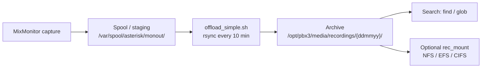
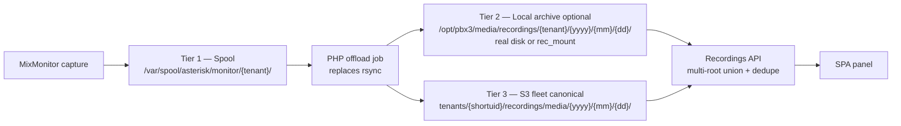

# Recordings storage & search — design

**Status:** Design (2026-07-07) — context for future R1.5 / S7 work  
**Related:** **`IMPLEMENTATION_PLAN.md`** § Phase R1 / § Phase S7 · **`TENANT_MOBILITY_FLEET_CONSOLE_DESIGN.md`** §2.6 / §2.6.1 · **`DESIGN_RULES.md`** (Rule 1 fail-safe)

This document captures the agreed **shape** of call recordings storage and search: how the legacy system worked, what **Phase R1** shipped, and how **local archive offload** (R1.5) and **S3 offload** (S7) should extend it. It is written as durable history so implementers do not have to rediscover the reasoning.

---

## 1. Current state (Phase R1 — shipped)

**Capture:** `pbx3cagi` `SetRecord` / `MixMonitor` writes finished wav files to:

```
/var/spool/asterisk/monitor/{tenant_shortuid}/{filename}.wav
```

**Filename convention** (regular call):

```
{epoch}-{tenant_shortuid}-{calledid}-{clid}.wav
```

Queue calls may add `{queue}-{extension}` tokens or a `Qexec` prefix (unswept).

**Operator UX:** `pbx3api` `RecordingIndexService` + `RecordingController` list/search/stream/download from the recordings filesystem disk (`PBX3_RECORDINGS_ROOT`, default `/var/spool/asterisk/monitor`). `pbx3spa` Recordings panel (ported from legacy `sarkrecordings`) provides filters, inline play, and download. Tenant column shows `cluster.pkey` (display name), not shortuid.

**Principle (Rule 1):** R1 works **without S3** — same as telephony. Capture and playback do not depend on offload, NFS, or the fleet control plane.

**Gap vs legacy:** R1 reads the **spool only**. There is no offload to `/opt/pbx3/media/recordings`, no date-folder archive layout, no S3 upload, and no `recused` tally job wired to the new API path.

---

## 2. Legacy system (pre-PBX3 SPA/API)

On the previous system, recordings followed a **two-tier local** model with optional external storage.

### 2.1 Flow



| Step | Mechanism | Notes |
|------|-----------|-------|
| Capture | MixMonitor | Legacy used `monout` staging; current `pbx3cagi` writes directly to `monitor/{tenant}/` |
| Offload | `offload_simple.sh` (cron `*/10`) | `rsync --remove-source-files -a` from spool to archive |
| Archive layout | **Date-first** | `/opt/pbx3/media/recordings/{ddmmyy}/` — flat day folders |
| External storage | `rec_mount` | Tenant field: mount command for NFS/EFS/CIFS; PBX3 provides local mountpoint |
| Retention | `agerecordings.sh` (02:00), `agegracerecordings.sh` (03:00) | Per-tenant `recmaxage`; `find … -mtime +N` moves aged files to delete bin |
| Usage tally | `manageRecs.php` (03:00) | `du` per tenant → `cluster.recused` |
| Search | `find` / glob over archive tree | Filename embeds epoch + tenant pkey substring |

A rewrite stub (`rewrite-offload_simple.sh`) already notes:

> *HAS TO BE REWRITTEN FOR S3 RECORDINGS STORE — WILL MOVE TO PHP DUE TO THE INDEX MANAGEMENT*

### 2.2 Tenant config (still in schema)

| Field | Purpose |
|-------|---------|
| `rec_mount` | Optional mount command for external recording storage |
| `rec_final_dest` | Path or target after staging |
| `rec_age` / `recmaxage` | Max age in days (local retention) |
| `recused` | Display: disk usage per tenant (legacy `du` tally) |
| `callrecord_1` | Recording mode (None / compass / Both / OTR — OTR deprecated) |

See `sqlite_create_tenant.sql`, `Tenant` model, SPA tenant advanced fields.

### 2.3 What worked well

- **Spool stays small** — hot capture separate from durable archive
- **Date folders** — narrow search space for “recordings on date X”
- **`rec_mount`** — customer brings own storage without app changes
- **Filename metadata** — epoch + parties in the name enables search without a DB on POSIX filesystems

### 2.4 What does not port to S3

- **`find` / glob** — no equivalent on S3; must use **prefix listing** and/or an **index**
- **NFS mount as “the archive”** — fleet tenants move between nodes; per-node NFS does not follow
- **Date-only folders without tenant** — harder to scope per-tenant IAM and tenant moves

---

## 3. Target architecture — three tiers

**Decision (2026-07-07):** **S3-first for fleet** — S3 under `tenants/{shortuid}/recordings/` is the **canonical fleet archive**. Local `/opt/pbx3/media/recordings` (+ optional `rec_mount`) remains an **optional on-prem / legacy path**, not the fleet source of truth.



### 3.1 Tier 1 — Spool (always)

| Property | Value |
|----------|-------|
| Path | `/var/spool/asterisk/monitor/{tenant_shortuid}/` |
| Writer | Asterisk MixMonitor via `pbx3cagi` |
| Reader | R1 API (immediate operator access to recent calls) |
| Retention | Short — files move out via offload job; not the long-term store |

**Rule 1:** Calls and capture **never** depend on Tier 2 or Tier 3 being available.

### 3.2 Tier 2 — Local archive (optional)

| Property | Value |
|----------|-------|
| Default path | `/opt/pbx3/media/recordings/` (configurable via `rec_final_dest` / env) |
| Layout | **Tenant-first, then date** — `{tenant_shortuid}/{yyyy}/{mm}/{dd}/{filename}.wav` |
| External | `rec_mount` — same mount abstraction as legacy; archive root may be NFS/EFS/CIFS |
| Writer | PHP offload job (move or copy from spool after file stable) |
| Reader | Extended `RecordingIndexService` (multi-root) |
| Retention | `rec_age` / `recmaxage` — local delete; same hybrid spirit as backups option C |

**Layout change from legacy:** Legacy used **date-only** top level (`{ddmmyy}/`). New layout adds **tenant** as the first path segment to align with:

- R1 spool layout (`{tenant}/…`)
- Per-tenant retention and `du` tally
- Filename still carries epoch + parties for search

**Open (see §8):** Confirm tenant-first vs retaining date-first for customers who expect the old tree.

### 3.3 Tier 3 — S3 (fleet canonical)

| Property | Value |
|----------|-------|
| Prefix | `tenants/{shortuid}/recordings/media/{yyyy}/{mm}/{dd}/{object}.wav` |
| Writer | Async upload after local file stable — **presigned PUT** from control-plane gatekeeper (§5) |
| Reader | `ListObjectsV2` by prefix + presigned GET for play/download when local copy gone |
| Retention | S3 lifecycle from `tenants/{shortuid}/recordings/policy.json` (`maxage_days` ← `recmaxage`) |
| Move | **Unchanged on tenant move** — prefix is tenant-stable; only `meta.json.instance_id` updates |

Sidecar (recommended at upload):

```
tenants/{shortuid}/recordings/media/{yyyy}/{mm}/{dd}/{object}.txt
```

JSON or key=value: `epoch`, `callerid`, `dnid`, `queue`, `extension`, `duration`, `tenant_shortuid`, `filename`.

---

## 4. Search strategy

### 4.1 The core problem

On POSIX, operators could run `find /opt/pbx3/media/recordings … -name '*555*'`. **S3 has no find.** `ListObjects` is efficient only when the **key prefix** matches the query (tenant + date). Global caller/callee search across years of objects requires scanning many keys or maintaining an **index**.

### 4.2 By tier

| Query type | Tier 1/2 (local) | Tier 3 (S3) |
|------------|------------------|-------------|
| List newest | Directory scan + sort by epoch in filename | Prefix list + sort |
| Filter by tenant | `{tenant}/` directory or filename | `tenants/{shortuid}/recordings/` prefix |
| Filter by date range | Walk `{tenant}/{yyyy}/{mm}/{dd}/` or filter parsed epoch | `…/media/{yyyy}/{mm}/{dd}/` prefix per day |
| Search caller/callee | Filename parse + substring match on scan | Filter **after** prefix list, or **index** |
| Play / download | `response()->file()` | Local if present; else presigned GET |

### 4.3 Index tiers (documented choice)

Implement search in layers — do not jump to Athena for v1.

| Level | Mechanism | When |
|-------|-----------|------|
| **v1** | Tenant + date prefix list; filter caller/callee on returned page | S7 initial ship |
| **v2** | Monthly `manifest-{yyyy}-{mm}.jsonl` under tenant recordings prefix; optional per-node sqlite catalog | When prefix-only search is too slow |
| **v3** | Athena / OpenSearch | Compliance-scale, deferred |

### 4.4 Multi-root API

`RecordingIndexService` (or successor) becomes a **union**:

1. Scan spool root(s)
2. Scan local archive root(s)
3. If enabled, list S3 prefix(es) for requested tenant/date window
4. **Dedupe** on stable id (same encoding as R1: base64url of `{tenant}/{filename}.wav` or S3 key)
5. Expose `location`: `local` | `archive` | `s3` | `s3_only`
6. Stream: local path first; S3 presigned fallback (S7.6)

SPA: **“archived”** badge when `location === 's3_only'` (S7.7).

---

## 5. Fleet, IAM, and tenant move

Cross-reference **`TENANT_MOBILITY_FLEET_CONSOLE_DESIGN.md`** §2.6 / §2.6.1 — not re-decided here.

| Topic | Recording implication |
|-------|----------------------|
| Node IAM | Drop blanket `tenants/*` write; backups stay on `instances/{ksuid}/` |
| Upload | Gatekeeper `POST /s3/presign` — scoped PUT to `tenants/{hosted_shortuid}/recordings/*` |
| Fail-safe | Gatekeeper down → calls continue; local disk authoritative until upload succeeds |
| Tenant move | S3 recordings **stay** under `tenants/{shortuid}/recordings/`; optional `--include-recordings` only for on-node wav bundle |
| Control plane | Same service as S3 gatekeeper — not a separate recordings app |

---

## 6. Retention hybrid

Same pattern as instance backups (option C in **`DESIGN_RULES.md`**):

| Store | Policy | Mechanism |
|-------|--------|-----------|
| Spool | Hours / until offloaded | Offload job removes after stable |
| Local archive | `rec_age` / `recmaxage` (days) | PHP/cron job replaces `agerecordings.sh` |
| S3 | `policy.json` `maxage_days` | Lifecycle rule + `class=recording` tag |

Local eviction does **not** delete S3 copy until S3 lifecycle expires it.

---

## 7. Phased build plan

### Phase R1 — Call recordings management (DONE)

| # | Task | Repo | Status |
|---|------|------|--------|
| R1.1 | `GET /recordings` — tenant, date, search | pbx3api | Done |
| R1.2 | `GET /recordings/{id}/stream` / `download` | pbx3api | Done |
| R1.3 | SPA Recordings panel | pbx3spa | Done |
| R1.4 | Nav + routes | pbx3spa | Done |
| R1.5 | Golden smoke (list/play/download) | ops | Done (golden, tenant `duns`) |
| R1.6 | Tenant display name in list/filter | pbx3api + pbx3spa | Done |

**Branches:** `pbx3api` `r1`, `pbx3spa` `r1` (not yet merged to `main`).

**Out of scope (deferred):** bulk delete, legal hold, per-user listen permissions, `recordings` DB table, S3 archived badge.

---

### Phase R1.5 — Local archive offload (~1–2 weeks)

Reintroduce legacy offload semantics in PHP; keep R1 working if offload disabled.

| # | Task | Repo | Notes |
|---|------|------|-------|
| R1.5.1 | **`RecordingOffloadService`** | pbx3api | Scan spool for stable `.wav` (age > N minutes, not open); move to archive path |
| R1.5.2 | **Archive layout** | pbx3api / config | `{archive_root}/{tenant}/{yyyy}/{mm}/{dd}/{filename}.wav` |
| R1.5.3 | **`recordings_archive` disk** | pbx3api | `filesystems.php`; default `/opt/pbx3/media/recordings`; env `PBX3_RECORDINGS_ARCHIVE_ROOT` |
| R1.5.4 | **Multi-root indexer** | pbx3api | Extend `RecordingIndexService` — union spool + archive; dedupe prefer archive |
| R1.5.5 | **Cron / scheduler** | pbx3api | Artisan command every 10 min (replaces `offload_simple.sh`) |
| R1.5.6 | **`rec_mount` integration** | pbx3 / ops | Mount external FS at archive root when tenant/instance config set; document in ops runbook |
| R1.5.7 | **Retention job** | pbx3api | Per-tenant `recmaxage`; replace `agerecordings.sh` |
| R1.5.8 | **`recused` tally** | pbx3api | Replace `manageRecs.php` — sum spool + archive per tenant |
| R1.5.9 | **Golden smoke** | ops | Offload test file; verify list/play from archive path |

**Exit criteria:**

- [ ] File moves from spool to date-folder archive without operator action
- [ ] Recordings panel shows offloaded files; play/download unchanged
- [ ] Retention respects per-tenant `recmaxage`

---

### Phase S7 — Recordings S3 offload v1 (~2–3 weeks)

Mirror **`InstanceBackupDirectoryUpload`** pattern. Ship after or parallel with R1.5 once gatekeeper presign path exists.

| # | Task | Repo | Notes |
|---|------|------|-------|
| S7.1 | **`InstanceRecordingUpload`** (or shared `OrgObjectUpload`) | pbx3api | PUT to `tenants/{shortuid}/recordings/media/{y}/{m}/{d}/{object}.wav` |
| S7.2 | **Upload trigger** | pbx3api / cron | After offload or on age-eligible stable file; `PBX3_RECORDING_UPLOAD_ENABLED` |
| S7.3 | **`policy.json`** on first upload | pbx3api | `maxage_days` from `recmaxage`; schema `retention-policy.v0.json` |
| S7.4 | **Lifecycle + tag** | pbx3-directory/tools | `class=recording`; do not expire catalog/meta |
| S7.5 | **Presigned PUT** | control plane | Gatekeeper scoped to hosted tenants — not blanket node `tenants/*` |
| S7.6 | **S3 playback fallback** | pbx3api | Presigned GET or API proxy when local missing |
| S7.7 | **SPA archived badge** | pbx3spa | When row is S3-only |
| S7.8 | **Sidecar metadata** | pbx3api | `.txt` or S3 object metadata at upload |
| S7.9 | **Multi-root indexer S3 leg** | pbx3api | Prefix list for tenant + date; merge with local |

**Exit criteria:**

- [ ] Finished call recording async PUT to tenant prefix on golden
- [ ] Playback works from S3 when local file aged off
- [ ] Lifecycle aligned with tenant `recmaxage`

**Defer past S7:** `recordings.db` snapshot, monthly manifest, Athena, tenant backup zip under `tenants/…/backups/`.

---

### Phase S7+ — Scale search (deferred)

| # | Task | Notes |
|---|------|-------|
| S7+.1 | Monthly `manifest-{yyyy}-{mm}.jsonl` per tenant | Written at upload or nightly aggregation |
| S7+.2 | Optional sqlite `recordings_index` on node | Fast caller/callee search for hosted tenants |
| S7+.3 | Athena / compliance export | Large fleet / legal discovery |

---

## 8. Open questions

Record these for the next design review — do not block R1.5 kickoff on all answers.

| # | Question | Lean | Alternatives |
|---|----------|------|--------------|
| 1 | Local archive layout: tenant-first vs legacy date-first? | **Tenant-first** `{tenant}/{yyyy}/{mm}/{dd}/` | Date-first for legacy parity |
| 2 | S3 object name: keep capture filename vs normalize? | **Keep capture name** — epoch + parties visible in key | `{call_id}.wav` + sidecar only |
| 3 | Search index when prefix-list is slow? | **Manifest jsonl** (S7+) | Per-node sqlite |
| 4 | Long-term `rec_mount` (customer NFS)? | **Support** for on-prem installs | Fleet-deprecated; S3 only |
| 5 | Offload: move vs copy from spool? | **Move** (legacy `rsync --remove-source-files`) | Copy + spool retention for grace period |
| 6 | Queue `Qexec` unswept files | Offload like regular wav; parser already flags `is_queue` | Separate sweep job |

---

## 9. File reference map

| Area | Path |
|------|------|
| Capture | `pbx3cagi/.../pbx3cagi.c` — MixMonitor → `/var/spool/asterisk/monitor/{tenant}/` |
| R1 indexer | `pbx3api/app/Services/Recordings/RecordingIndexService.php` |
| R1 API | `pbx3api/app/Http/Controllers/RecordingController.php` |
| R1 SPA | `pbx3spa/src/views/RecordingsListView.vue` |
| Filesystem config | `pbx3api/config/filesystems.php` — `recordings` disk |
| Legacy offload | `pbx3/pbx3-1/opt/pbx3/scripts/rewrite-offload_simple.sh`, `etc/cron.d/pbx3` |
| Legacy retention | `pbx3/pbx3-1/opt/pbx3/scripts/agerecordings.sh` |
| Legacy usage | `pbx3/pbx3-1/opt/pbx3/php/utilities/manageRecs.php` |
| Tenant fields | `sqlite_create_tenant.sql`, `pbx3api/app/Models/Tenant.php` |
| S7 spec | **`IMPLEMENTATION_PLAN.md`** § Phase S7 |
| Fleet / IAM | **`TENANT_MOBILITY_FLEET_CONSOLE_DESIGN.md`** §2.6.1 |

---

## 10. Summary

| Era | Storage | Search |
|-----|---------|--------|
| Legacy | Spool → `/media/recordings/{ddmmyy}/` (+ optional NFS) | `find` / glob |
| R1 (now) | Spool only | Filesystem scan + filename parse |
| R1.5 (next local) | Spool → tenant/date archive | Multi-root scan |
| S7 (fleet) | + S3 `tenants/{shortuid}/recordings/media/…` | Prefix list + sidecar; index later |
| S7+ (scale) | Same | Manifest / sqlite / Athena |

**Bottom line:** Keep the **spool → archive** lifecycle. Replace **find/glob** with **date-shaped keys + prefix listing** on S3. Use **tenant-stable S3 prefixes** so recordings survive fleet moves. Implement offload and indexing in **PHP** (`pbx3api`), not shell rsync, so one service can manage local archive, metadata, and S3 upload consistently.
