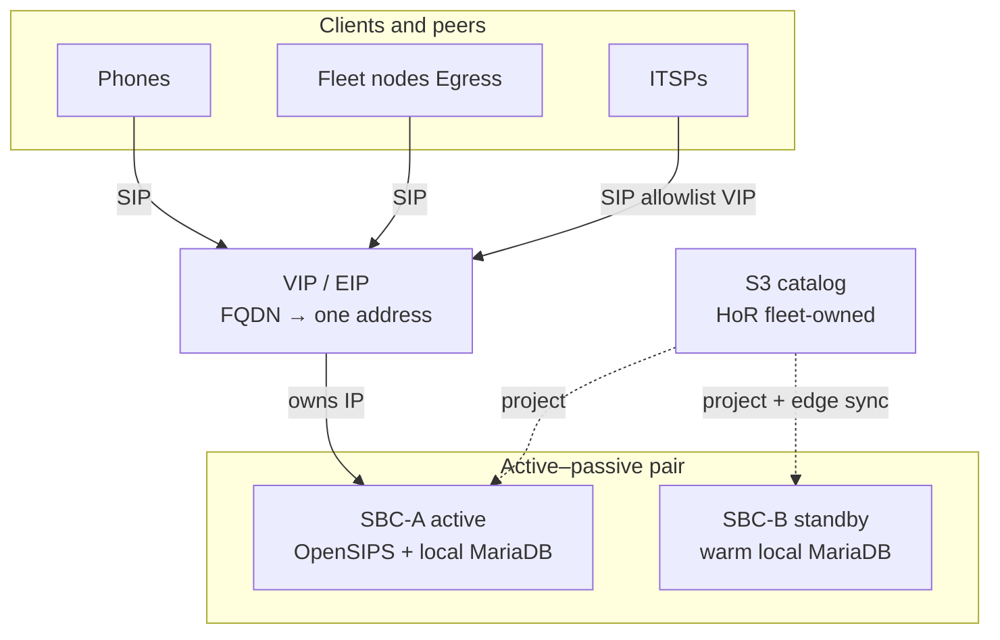
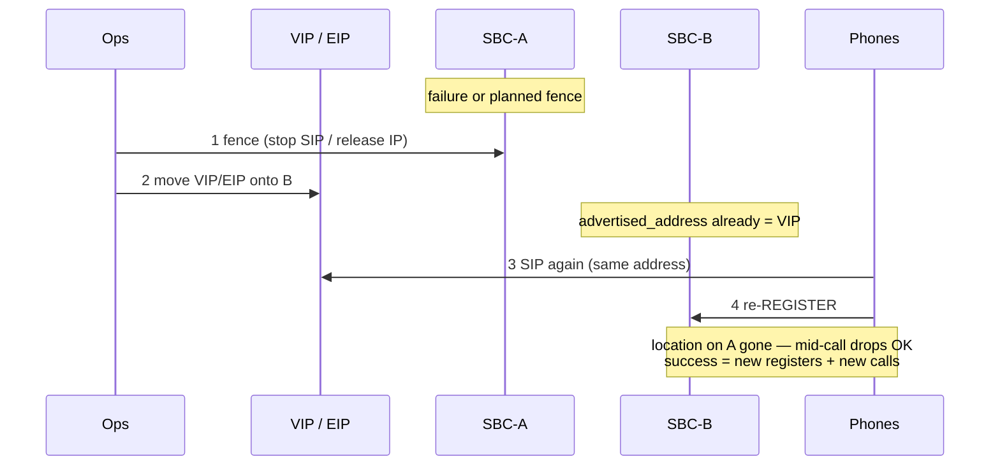

# SBC high availability — requirements (VIP/EIP + warm standby)

**Status:** **Requirements locked (2026-07-20).** Not implemented — no second lab SBC, no promote automation yet.  
**Related:** **`FLEET_TRUNK_PEERING_DECISION.md`** §6; **`SBC_BACKUP_RESTORE_REQUIREMENTS.md`** (cold DR ≠ HA promote); **`FLEET_EGRESS_AVAILABILITY_REQUIREMENTS.md`** (OPTIONS qualify / node trunk health — complementary); **`DESIGN_RULES.md`** Rule 1, Rule 13.

---

## Design principle

**Resilience of the mechanism beats chasing seconds of recovery.** Prefer the simplest path operators can rehearse and trust (warm standby + move a stable address) over cluster state-sync, phone SRV hope, or sub-minute automation that flaps. Quiet hosts that rarely fail do more for annual availability than exotic failover software.

---

## Schematic

### Notation

| Symbol | Meaning |
|--------|---------|
| **VIP / EIP** | Stable edge identity — phones, fleet `Egress`, and carrier allowlists target this address only |
| **Solid arrow** | SIP runtime (REGISTER / INVITE / outbound) |
| **Dashed arrow** | Management path — catalog project / edge-authored sync (not on the call path) |
| **SBC-A / SBC-B** | Identical members; each has **local MariaDB** (no shared live DB) |
| **S3 catalog** | Home-of-record for **fleet-owned** rows; edge-authored peers/Fail2ban stay edge-local (+ sync cadence) |

### Steady state

Standby receives **no** SIP while passive. Clients never address member-private IPs.

### Promote (RTO ≤ ~20 min)

Cold zip restore is **not** this path — see **`SBC_BACKUP_RESTORE_REQUIREMENTS.md`**.

---

## Problem

Fleet PSTN and phone registration concentrate on the SBC edge. A single box is fine for lab; **production fleet** needs a documented, drillable path when that box dies — without putting a shared live DB on the call path, and without depending on desk-phone DNS behaviour.

---

## Locked decisions (v1)

| Decision | Choice |
|----------|--------|
| **Primary HA** | **Option 3:** warm standby + **VIP or cloud equivalent** (e.g. AWS **EIP** reassociate) |
| **Topology** | Active–passive pair; identical `pbx3sbc` (+ admin) images; idle capacity is insurance |
| **Local DB** | **MariaDB per member** — no shared live routing DB |
| **Stable edge identity** | Phones, fleet `Egress`, and carrier allowlists target **FQDN → VIP/EIP**, not member-private IPs |
| **RTO bar** | Phones/PSTN usable again within **~15–20 minutes** (promote + re-register). Do not optimize further unless drills miss this bar |
| **Availability** | **~4 nines aspirational and surface-dependent** (AWS EC2 vs colo vs self-host). Met mainly by **rarity of failure** + rehearsed promote, not by sub-second HA |
| **Promote style** | Manual or scripted runbook first; Filament/auto-promote UI **deferred** |
| **Standby warmth** | Catalog **re-project** for fleet-owned rows **plus** defined cadence for **edge-authored** state (peers, Fail2ban, Filament admins) — not ad-hoc on failure day |

### Surface → how the address moves

| Surface | Mechanism | Notes |
|---------|-----------|--------|
| **AWS** | Elastic IP (or NLB target) onto standby | Likely fleet production shape; no classic VRRP |
| **Colo / same L2** | keepalived / VRRP VIP | Fine where L2 is shared |
| **DNS A flip only** | Break-glass | TTL/client cache; **not** preferred primary |

---

## Soft state (honest)

Promote moves the address. Standby **local** MariaDB does **not** inherit live `location` / `dialog` (hot soft-state is excluded from backup zips too).

| After promote | Expectation |
|---------------|-------------|
| In-flight calls on dead member | Drop — **non-goal** to preserve |
| Registrations | Phones **re-REGISTER** to the same VIP/EIP now on standby |
| Success metric | New registers + new calls inside **RTO** — not zero re-reg |

**Cold backup/restore** (`SBC_BACKUP_RESTORE_REQUIREMENTS.md`) remains box-loss / rebuild DR. **Do not** treat “restore zip onto standby” as the HA promote path.

---

## In / out of scope

| In (v1 requirements) | Out / deferred |
|----------------------|----------------|
| Documented promote runbook + timed drill | OpenSIPS usrloc/dialog replication / cluster |
| Warm standby sync policy (catalog + edge-authored) | Geo dual-POP / multi-region active–active |
| VIP/EIP (or colo VRRP) as primary address move | DNS **SRV** as primary phone HA |
| Fence old active (lose IP / stop SIP) before/with promote | Shared live MySQL/RDS behind a pool |
| Multi-ITSP drouting (carrier path) as **complement** | Node `EgressFailover` as sole edge HA (optional belt later) |

**Rejected as primary:** phone SRV multi-target; shared-DB SRV “identical pool”; cold-only restore as the HA story; complexity that only buys seconds.

---

## Complement (other legs)

| Leg | Mechanism | Doc |
|-----|-----------|-----|
| **Edge box death** | This file — VIP/EIP + warm standby | — |
| **Carrier / ITSP path** | SBC drouting `DR_FAILOVER` / multi-gateway | `PEERING-PLAN.md` Phase 2 |
| **Node → edge visibility** | OPTIONS qualify on `Egress`; optional `EgressFailover` break-glass | `FLEET_EGRESS_AVAILABILITY_REQUIREMENTS.md` |

---

## Production gate

Before claiming **production fleet** edge SLA:

1. Second SBC member exists and stays **warm** (project + edge-authored sync cadence defined and running).
2. Timed **promote drill:** fence A → move VIP/EIP → confirm OpenSIPS → first good register / inbound **≤ 20 minutes**.
3. Carriers allowlist the **stable** edge address; `advertised_address` (and TLS/admin as needed) already match VIP/EIP on standby.

Until that passes, single-SBC lab remains valid; do not market multi-SBC HA.

---

## Suggested implementation order (future)

1. Requirements (this file) + cross-links — **done 2026-07-20**.
2. Standby member + sync cadence (catalog project + edge-authored copy policy).
3. Surface-specific address move (EIP or VRRP) + fence steps in a runbook.
4. Promote drill; record wall-clock.
5. Optional later: scripted promote; node OPTIONS qualify (egress availability); `EgressFailover` belt; usrloc sync only if product explicitly reopens RTO.

---

## References

| Doc | Role |
|-----|------|
| **`FLEET_TRUNK_PEERING_DECISION.md`** §6 | Architecture lock (active–passive, no shared DB) |
| **`SBC_BACKUP_RESTORE_REQUIREMENTS.md`** | Cold DR; HA promote ≠ zip restore |
| **`FLEET_EGRESS_AVAILABILITY_REQUIREMENTS.md`** | Qualify / trunk health / optional EgressFailover |
| **`TENANT_MOBILITY_FLEET_CONSOLE_DESIGN.md`** | Phone registrar = stable SBC VIP |

---

*Last updated: 2026-07-20 — requirements lock from design session (option 3; Occam over seconds).*
