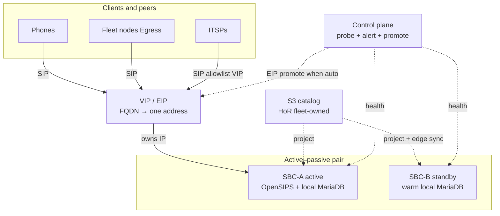
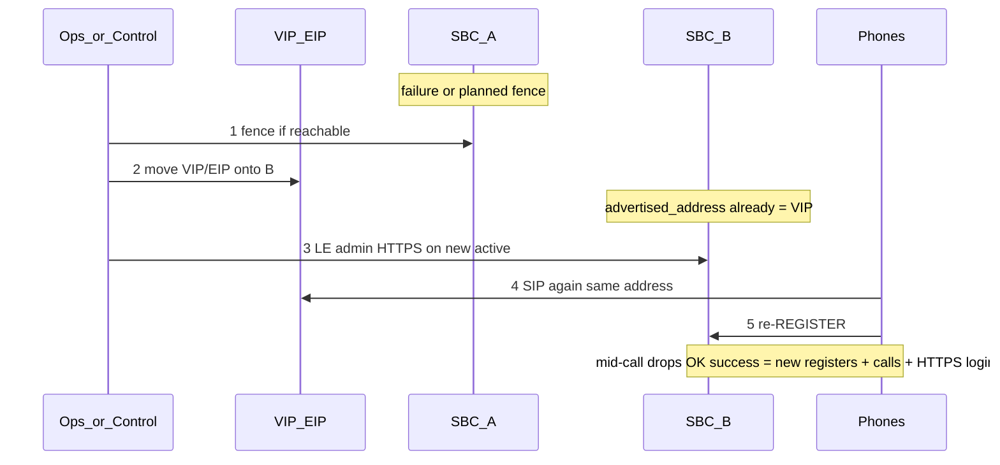

# SBC high availability — requirements (VIP/EIP + warm standby)

**Status:** **Requirements reopened (2026-07-21)** for **control-plane promote modes**. Topology / VIP / local-DB / RTO locks from **2026-07-20** stand. Lab **FO pair** + warm sync + manual EIP promote: SIP ~**6 s**; LE + HTTPS login on new active closed same day. Cast-iron **managed** checklist: **`pbx3-docs`** `fleet/sbc-ha-promote.md`. Live Magrathea / `sbc.pbx3.com` not pointed at FO EIP.  
**Related:** **`FLEET_TRUNK_PEERING_DECISION.md`** §6; **`SBC_BACKUP_RESTORE_REQUIREMENTS.md`** (cold DR ≠ HA promote); **`FLEET_EGRESS_AVAILABILITY_REQUIREMENTS.md`**; **`FLEET_OPS_NOTIFICATION_REQUIREMENTS.md`**; **`DESIGN_RULES.md`** Rule 1, Rule 9, Rule 13.

---

## Design principle

**Resilience of the mechanism beats chasing seconds of recovery.** Prefer warm standby + move a stable address over cluster state-sync or phone SRV hope. Quiet hosts that rarely fail still matter — but **failures happen when no one is looking**, so detection and (optionally) promote belong on the **control plane**, not on hope that an operator is awake.

---

## Schematic

### Notation

| Symbol | Meaning |
|--------|---------|
| **VIP / EIP** | Stable edge identity — phones, fleet `Egress`, and carrier allowlists target this address only |
| **Solid arrow** | SIP runtime (REGISTER / INVITE / outbound) |
| **Dashed arrow** | Management path — catalog project / edge sync / **edge health + promote** (not on the call path) |
| **SBC-A / SBC-B** | Identical members; each has **local MariaDB** (no shared live DB) |
| **Control plane** | Gatekeeper / control host — probes, alerts, optional auto-promote (Rule 1: not on call path) |
| **S3 catalog** | Home-of-record for **fleet-owned** rows; edge-authored peers/Fail2ban stay edge-local (+ sync cadence) |

### Steady state

Standby receives **no** SIP while passive. Clients never address member-private IPs. Control plane never carries media or SIP signalling.

### Promote (RTO ≤ ~20 min)

Cold zip restore is **not** this path — see **`SBC_BACKUP_RESTORE_REQUIREMENTS.md`**.

---

## Problem

Fleet PSTN and phone registration concentrate on the SBC edge. A single box is fine for lab; **production fleet** needs a drillable path when that box dies — without a shared live DB on the call path, without desk-phone DNS HA, and **without requiring a human to notice at 03:00** unless the fleet operator explicitly chose managed mode.

---

## Locked decisions

| Decision | Choice |
|----------|--------|
| **Primary HA** | **Option 3:** warm standby + **VIP or cloud equivalent** (e.g. AWS **EIP** reassociate) |
| **Topology** | Active–passive pair; identical `pbx3sbc` (+ admin) images; idle capacity is insurance |
| **Local DB** | **MariaDB per member** — no shared live DB |
| **Stable edge identity** | Phones, fleet `Egress`, and carriers target **FQDN → VIP/EIP**, not member-private IPs |
| **RTO bar** | Phones/PSTN usable again within **~15–20 minutes** (promote + re-register + admin HTTPS). Do not optimize further unless drills miss this bar |
| **Availability** | **~4 nines aspirational and surface-dependent**. Met by rarity of failure + **rehearsed promote** + **control-plane detection** (and auto-promote when enabled) |
| **Who promotes** | **Control plane** owns health probe, alerting, and the promote *action* (EIP/VIP move + post-promote LE). Same mechanics whether a human or automation pressed go (**Rule 1**, management path only) |
| **Promote mode (operator choice)** | Fleet/org operator selects per edge pair: **`managed`** or **`auto`**. Default for new pairs: **`managed`** until auto is lab-proven. Not a desk-phone / tenant end-user toggle |
| **`managed`** | Control plane **alerts** (page/email) on active-edge failure; operator runs cast-iron checklist (or “Promote now” in Fleet UI later). No EIP move without human confirm |
| **`auto`** | After **N consecutive probe failures** + **cooldown**, control plane fences (if reachable), reassociates EIP/VIP, runs LE on new active, then **alerts that promote completed** (or failed) |
| **Control-plane SPOF** | Automation SPOF only — not on the call path. If control is down, **auto does not promote**; telephony already depends on the edge VIP |
| **Control-down promote (locked)** | EIP/VIP move **must** remain possible **without** gatekeeper / Fleet UI. `fleet_admin` with cloud credentials runs the cast-iron checklist (CLI or **AWS Console → Elastic IPs → Associate**) onto the warm standby. Control catches up audit/alerts when it returns |
| **Cloud EIP move** | Via **cloud adapter** (Rule 9) when control is up; lab/break-glass may use AWS CLI or **Console** until adapter exists |
| **Standby warmth** | Catalog **re-project** for fleet-owned rows **plus** defined cadence for **edge-authored** state — not ad-hoc on failure day. Warmth is what makes console-only EIP move safe |
| **Still rejected** | OpenSIPS usrloc/dialog cluster as primary; phone **SRV** as primary; shared live DB pool; standby “stealing” VIP without a control-plane **or** human decision |

### Reopen note (2026-07-21)

Earlier lock said “manual runbook first; Filament/auto-promote **deferred**.” That forbade sleeping through edge death. **Reopened:** auto-promote is **in-scope for requirements**; implementation follows cast-iron managed path + probe design. Filament/Fleet UI for mode + “Promote now” can ship with or after the control-plane worker.

### Surface → how the address moves

| Surface | Mechanism | Notes |
|---------|-----------|--------|
| **AWS** | Elastic IP (or NLB target) onto standby | Fleet production shape; control plane / adapter calls reassociate |
| **Colo / same L2** | keepalived / VRRP VIP | Fine where L2 is shared; control plane may still own *decision* + alert |
| **DNS A flip only** | Break-glass | TTL/client cache; **not** preferred primary |

---

## Soft state (honest)

Promote moves the address. Standby **local** MariaDB does **not** inherit live `location` / `dialog`. Admin **TLS certs are per member** — issue Let’s Encrypt on whoever newly owns the VIP (`le-admin-cert.sh setup`); auto mode must include this step (or documented short HTTP break-glass + retry).

| After promote | Expectation |
|---------------|-------------|
| In-flight calls on dead member | Drop — **non-goal** to preserve |
| Registrations | Phones **re-REGISTER** to the same VIP/EIP now on standby |
| Admin HTTPS | Broken until LE on new active — HTTP break-glass only |
| Success metric (SIP) | New registers + new calls inside **RTO** |
| Success metric (admin FQDN) | `https://<FQDN>/admin/login` returns login page |

**Cold backup/restore** remains box-loss / rebuild DR — **`SBC_BACKUP_RESTORE_REQUIREMENTS.md`**.

---

## Control-plane behaviour (requirements)

| Concern | Requirement |
|---------|-------------|
| **Probe target** | Active member’s **VIP/EIP** (SIP OPTIONS and/or admin `/up`-style check) — not only private IP |
| **Probe source** | Control host (or equivalent) — independent of either SBC member |
| **Failure threshold** | Configurable **N** misses + interval; default conservative (favour avoiding flaps over shaving minutes) |
| **Cooldown / anti-flap** | No second auto-promote within cooldown; record promote job / audit trail |
| **Fence** | Stop OpenSIPS on old active if SSH/API reachable; if unreachable, still move EIP (accept split until old box dies or is fenced later) |
| **Alerts** | Always on failure detection; on auto promote success/failure; reuse ops-notify delivery where practical |
| **Mode storage** | Fleet/catalog fact for the edge pair (`managed` \| `auto`) — HoR outside either SBC DB |
| **Managed confirm** | Human (or future Fleet “Promote now”) required before EIP move |
| **Auto confirm** | None beyond thresholds; human gets post-facto alert |

---

## Control down + lead SBC down (double failure)

Worst case: **active edge dead** and **control plane dark** (or unreachable). Auto-promote will not run. VIP still points at the dead lead → phones/PSTN are already down.

| Still true | Action |
|------------|--------|
| Standby is up and **warm** (same edge-authored + projected data as last sync; `advertised_address` = EIP) | Human promotes **without** control |
| Gatekeeper / Fleet UI unavailable | **Not a blocker** for the address move |

**Break-glass promote (no control plane):**

1. Notice outage (customers, external monitor, “can’t register”) — not gatekeeper mail.
2. **Move the EIP/VIP onto the standby** by any of:
   - Ops laptop: `aws ec2 associate-address … --allow-reassociation`
   - **AWS Console:** Elastic IPs → select the edge EIP → **Associate** → standby instance  
   - Colo: equivalent VIP move
3. Fence old active if still reachable (stop OpenSIPS); if not, accept until it is powered off.
4. Phase D: LE on new active when DNS/SG allow; confirm SIP OPTIONS + `https://<FQDN>/admin/login`.
5. When control returns: record the promote in audit / clear false “active” health; no need to undo a good EIP move.

**Why warmth matters:** Console-only EIP reassociate is enough for SIP **only if** the standby already had shared `advertised_address` and matching routing/peer data. A cold empty standby is not this path — that is rebuild/DR (`SBC_BACKUP_RESTORE_REQUIREMENTS.md`).

**Product copy:** Installers and on-call follow the cast-iron checklist (**`pbx3-docs`** `fleet/sbc-ha-promote.md`) — pair card + phases in order; **no improvisation**. They are **not** stuck waiting for `control.*` to come back.

---

## In / out of scope

| In (requirements) | Out / deferred |
|-------------------|----------------|
| Documented managed promote + timed drill | OpenSIPS usrloc/dialog replication / cluster |
| Warm standby sync policy | Geo dual-POP / multi-region active–active |
| VIP/EIP (or colo VRRP) as primary address move | DNS **SRV** as primary phone HA |
| Control-plane probe + alert | Shared live MySQL/RDS behind a pool |
| Operator choice **managed \| auto** + auto-promote worker | Instant/sub-second HA; Filament-only promote without control plane |
| Post-promote LE on new active | Node `EgressFailover` as sole edge HA |
| **Control-down break-glass** (CLI / Console EIP → warm standby) | Requiring gatekeeper online to move the VIP |

**Rejected as primary:** phone SRV multi-target; shared-DB pool; cold-only restore as the HA story; complexity that only buys seconds.

---

## Complement (other legs)

| Leg | Mechanism | Doc |
|-----|-----------|-----|
| **Edge box death** | This file — VIP/EIP + warm standby + control-plane modes | — |
| **Carrier / ITSP path** | SBC drouting `DR_FAILOVER` / multi-gateway | `PEERING-PLAN.md` Phase 2 |
| **Node → edge visibility** | OPTIONS qualify on `Egress`; optional `EgressFailover` | `FLEET_EGRESS_AVAILABILITY_REQUIREMENTS.md` |
| **Ops notify** | Probe/SMTP / lifecycle — extend for edge-down + promote events | `FLEET_OPS_NOTIFICATION_REQUIREMENTS.md` |
| **Instance shadowing (SKU)** | Same promote mechanics on a paid PBX twin — framing only | `INSTANCE_SHADOWING_REQUIREMENTS.md` |

---

## Production gate

Before claiming **production fleet** edge SLA:

1. Second SBC member exists and stays **warm**.
2. Timed **managed** promote drill ≤ 20 minutes (SIP + HTTPS login).
3. Control-plane **edge health probe + alert** live (even if mode = `managed`).
4. If mode = `auto`: separate drill — kill/block active, confirm auto promote + alert without operator EIP step.
5. Carriers allowlist the stable edge address; `advertised_address` = VIP/EIP on both members.
6. **Control-down** path documented and rehearsed once: EIP to warm standby via CLI or Console **without** gatekeeper.

Until that passes, single-SBC lab remains valid; do not market multi-SBC HA.

---

## Suggested implementation order

1. Requirements (VIP/warm) + managed cast-iron runbook + lab drill — **done 2026-07-20/21**.
2. **Reopen:** control-plane modes (`managed` \| `auto`) — **this revision**.
3. Edge health probe + alert on control (no EIP move yet).
4. Catalog/Fleet setting for promote mode + audit log.
5. Auto-promote worker (fence → EIP via adapter → LE → alert); lab drill with mode=`auto`.
6. Fleet UI: mode toggle + “Promote now” (managed).
7. Optional later: node OPTIONS qualify; `EgressFailover` belt; usrloc sync only if product reopens RTO.

---

## References

| Doc | Role |
|-----|------|
| **`FLEET_TRUNK_PEERING_DECISION.md`** §6 | Architecture lock (active–passive, no shared DB) |
| **`SBC_BACKUP_RESTORE_REQUIREMENTS.md`** | Cold DR; HA promote ≠ zip restore |
| **`FLEET_EGRESS_AVAILABILITY_REQUIREMENTS.md`** | Qualify / trunk health / optional EgressFailover |
| **`FLEET_OPS_NOTIFICATION_REQUIREMENTS.md`** | Alert delivery |
| **`TENANT_MOBILITY_FLEET_CONSOLE_DESIGN.md`** | Phone registrar = stable SBC VIP |
| **`INSTANCE_SHADOWING_REQUIREMENTS.md`** | Paid PBX twin — same mechanics, later |
| **`pbx3-docs` `fleet/sbc-ha-promote.md`** | Cast-iron **managed** installer checklist |

---

*Last updated: 2026-07-21 — control-down break-glass (CLI/Console EIP); auto vs managed reopen.*
