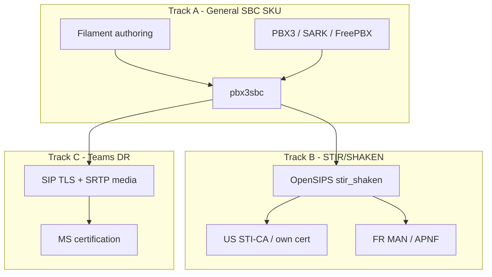

# SBC product tracks & roadmap

**Status:** **2026-07-28** — WebRTC/WSS promoted to **#1 near-term** (golden demo, few weeks). Teams C1 + STIR vendors + capability gaps remain. Recovery tag: **`pre-webrtc-wss-20260728`**.

### Product posture locked (2026-07-28)

| Track | Decision |
|-------|----------|
| **C — Teams** | **Do not** build or certify Direct Routing on pbx3sbc. Customer ask → **C1** answer (rent/peer Microsoft-approved SBC ahead, or Operator Connect). No C2/C3 investment. |
| **B — STIR/SHAKEN** | **Pragmatic / Peer-shaped.** Near-term: continue **Twilio** lab (shape **A** — low cost, low obligation). Escalate to Bandwidth Hosted Signing (B) or OpenSIPS AS (C) only when circumstance requires. Append vendors over time. |
| **A — General SBC** | Still valid SKU intent. **Lab next:** stand up a **SARK** box (and optionally **FreePBX**) behind Magrathea / scratch SBC — domain, dispatcher, phone registrar = SBC, one DID path — prove proxy-registrar without GenAst. |
| **WebRTC / WSS (S8.11 / W1)** | **#1 near-term — Magrathea lab green 2026-08-03.** Browser **WSS only on SBC** (`wss://sbc.pbx3.com:8089/ws`); SBC → home is **ordinary SIP UDP**; RTP bypass; **home instance TCP 8089 not required** (golden closed 8089, calls OK). Home WebRTC PJSIP = UDP + `outbound_proxy` + `webrtc=yes`. Spec: **`FLEET_TRUNK_PEERING_DECISION.md`** §6.1 · **`WEBRTC_WSS_LAB.md`** · checklist **`pbx3sbc/workingdocs/WEBRTC_W1_MAGRATHEA.md`**. |

**Related:** **`DESIGN_RULES.md`** Rules **7** + **13**; **`EDGE_PORTABILITY_SCORECARD.md`**; **`NUMBER_DIALECT_REQUIREMENTS.md`**; **`DOWNSTREAM_PEER_REGISTRATION_REQUIREMENTS.md`**; **`FLEET_TRUNK_PEERING_DECISION.md`** §6.1 (WebRTC WSS); pbx3sbc proxy-registrar architecture; **`PEERING-PLAN.md`**; living research **`TELEPHONE_FRAUD_RESEARCH.md`** §5–§6 (peer STIR postures; ClearIP/Sansay bolt-on effort/cost/value).

---

## Capability gaps & roadmap

**Committed / active:** **WebRTC / WSS on the edge** — Magrathea terminates WSS; homes speak SIP UDP (see §6.1 / W1 lab). Instance `:8089` optional for singleton-direct only. See **`FLEET_TRUNK_PEERING_DECISION.md`** §6.1 · IMPLEMENTATION_PLAN **S8.11** / **W1**.

**Excluded by posture (not gaps to build on Magrathea):** Teams Direct Routing on OpenSIPS; first-party STI-AS on every Peer; door-knock SIP header capture; control-plane HA homed on the SBC; OpenSIPS rename-for-purity; competitor-style media termination for the few-week demo.

### Product direction — retire Filament DID aliases (2026-07-29)

**Status 2026-07-30:** Lab aliases cleared by operator; Filament **DID aliases** panel **hidden** (`DbAliasResource` nav + `canViewAny` false). OpenSIPS `alias_db_lookup` fallthrough still in template until inerted (step 3).

| Keep | Drop |
|------|------|
| **Number routes** (`dr_rules` group 1) — Fleet DIDs project here: DID → tenant home Asterisk | **DID aliases** — rewrite DID → `user@tenant.fqdn` at the edge |

**Why:** Aliases only compress what operators already do as **SBC DID→tenant** (Number route / Fleet DIDs) + **PBX DID→endpoint** (inroutes / dialplan). A second inventory that runs only when Number routes miss is easy to misunderstand. Fleet HoR is catalog `dids.json` → Number routes; aliases are not projected.

**Remaining (review later):** leave `alias_db_lookup` in `FROM_CARRIER` for now (harmless with empty table); decide inert vs remove when reviewing.

**Do not confuse with** tenant **short dial** aliases (`TENANT_SHORT_DIAL_REQUIREMENTS.md`) — different feature.

**Filament naming (2026-07-29):** nav label **Call Routes** → **Domain Routes** (same `domain` table; clearer vs Number routes). Branch **`rename-domain-routes`** on pbx3sbc-admin.

---

### Material (general SBC / fleet edge)

| # | Gap | Notes | Trigger |
|---|-----|--------|---------|
| **0** | **WebRTC / WSS** (W1) | Near-term: **golden `:8089`** (no Magrathea UDP impact). Later: SBC `proto_wss` + TLS; domain→dispatcher; **RTP bypass**. | **Demo / now (golden)** |
| **1** | **SIP TLS** (and SRTP when media is touched) | Admin HTTPS done; phone/carrier path still largely UDP + RTP bypass. Sibling to WebRTC TLS/WSS. | WebRTC work; enterprise / cloud Peer demand |
| **2** | **Optional media plane** (rtpengine-class) | RTP bypass stays default. **Parked** — not for try-it/adoption. Trigger only: LAN-edge, Track A legacy, Peer forbids bypass. Try-it ease/cost is a **separate** track: **`../../workingdocs/FLEET_TRYIT_DEPLOYMENT_REQUIREMENTS.md`**. | LAN-edge / Track A / Peer forbids bypass |
| **3** | **Downstream trunk REGISTER** | IP-trusted Peers + outbound `uac_registrant` exist. Dynamic inbound trunks that REGISTER → **separate registration-edge** instance class (not bolt-on). Spec: **`DOWNSTREAM_PEER_REGISTRATION_REQUIREMENTS.md`**. | Customer ITSP that only REGISTERs |
| **4** | **Fail2ban Peer auto-whitelist** | Auto-sync carrier inbound Peer IPs on save/delete; site NATs stay manual. TODO already. | Next carrier onboard |
| **5** | **Standalone SKU polish** | Installer/docs without Gatekeeper; SARK/FreePBX-behind-SBC recipe (Track A lab). Capability exists; packaging lags. | Track A lab |
| **6** | **Dial-alias usrloc-miss → dispatcher** | OpenSIPS miss path for `ext@tenant.fqdn` when alias ships. Call-path, not vanity. Spec: **`TENANT_SHORT_DIAL_REQUIREMENTS.md`**. | Dial-alias schedule |

### Second-tier

| # | Gap | Notes |
|---|-----|--------|
| **7** | Filament **restore** | Backup list/upload exists; restore stays CLI. |
| **8** | CPS / ratelimit / mid-registrar | Pike-ish pieces exist; serious shaping deferred until volume/abuse. |
| **9** | DID **regex** / richer LCR | Prefix drouting shipped; regex DID groups deferred (`PEERING-PLAN`). |
| **10** | Observability | CDR/geo/door-knock improved; thin vs commercial (metrics, call-trace UI, verstat dashboards). |

### Roadmap order (SBC-owned)

1. **WebRTC / WSS** (active) — **golden `:8089` first** (webphone demo; no Magrathea UDP impact) → later SBC WSS (scratch or VIP booked window); RTP bypass  
2. **Track A lab** — SARK (± FreePBX) behind SBC; document recipe  
3. **SIP TLS** for hardphones / Peers (align with WebRTC cert story where possible)  
4. **Optional rtpengine path** when bypass is insufficient (or competitor-parity demand) — **parked**; see gap #2. **Try-it deploy** (2-box / tailor script) is separate — **`../../workingdocs/FLEET_TRYIT_DEPLOYMENT_REQUIREMENTS.md`**.  
5. **Fail2ban Peer auto-whitelist** at next carrier onboard  
6. **Registration-edge** only on customer demand (own image)  
7. Dial-alias OpenSIPS slice when alias lab starts (owned with call-path track)  
8. Second-tier polish (restore UI, CPS, regex DID, observability) on ask  

---

## Settled context (do not re-litigate)

- **Standalone SBC is a first-class persona** — Rule **13**: Filament / scripts author edge tables; no directory / Gatekeeper required; “any Asterisk backends.” PBX3 fleet optionally projects the **same** tables via **`SbcFleetAdapter`**.
- **Proxy-registrar already** — phones REGISTER via SBC → PBX authenticates → OpenSIPS `save("location")` on 200 OK. Same path for SARK / FreePBX if domain → dispatcher and PBX AoRs are configured.
- **Rule 7 escape hatch** — prefer **peer / cascade** a commercial SBC over rewriting OpenSIPS vocabulary or full BYO-edge (**`EDGE_PORTABILITY_SCORECARD.md`**).
- **No STIR/SHAKEN or Teams Direct Routing code** in tree today. Number dialect already has a Teams-style **`+E.164`** preset (`strict-plus-e164`).



---

## Track A — General SBC (standalone / foreign PBX)

**Goal:** Sell / run **pbx3sbc** in front of PBX3, SARK, FreePBX, or mixed backends with the same edge role (proxy-registrar, DID / Peers, Fail2ban, backups / HA).

**Already true:** SIP runtime + Filament authorship; fleet projection optional.

**Gaps (productization, not architecture):**

- Installer / docs path that does **not** assume Gatekeeper / fleet token
- Lab recipe: one FreePBX or SARK behind Magrathea VIP (or scratch SBC) — domain, dispatcher, phone registrar = SBC, one DID, one Peer
- Explicit “foreign PBX must configure SIP itself” wording (no GenAst / CAGI)
- Keep fleet-owned row tagging so mixed fleet + hand-authored backends do not clobber each other (Rule **13** already states this)

**Effort:** **S–M** (docs + lab prove). Almost no new OpenSIPS features.

**Rank / near-term:** Operator will stand up **SARK** (± **FreePBX**) and attempt SBC interconnect — that is the Track A proof. Capture recipe gaps here; SIPp against foreign UAS: **[sipplab](https://github.com/aelintra/sipplabs)** `targets/sark/` + `docs/ADDING_A_TARGET.md`.

---

## Track B — STIR/SHAKEN (US + France)

**Goal:** Jurisdiction-aware SIP **Identity** sign / verify on the edge; Peer-gated like number dialects.

**Engine (when we sign/verify):** OpenSIPS **`stir_shaken`** — hook outbound after `DIALECT_OUTBOUND_RENDER` in **`pbx3sbc/config/opensips.cfg.template`**; inbound in `FROM_CARRIER`.

**Why now (not US-only deferral):**

- France **MAN** (mécanisme d’authentification des numéros) — STIR/SHAKEN-based; operator duties from **2026-01-01**; APNF trust chain
- US FCC **own-certificate / third-party rule** (~**2025-09-18**): obligated VSPs cannot rely on upstream signing with *someone else’s* certificate; hosted crypto OK only with **your** cert + **your** attestation decisions
- Commercial Peers already in these markets: Twilio ([Trusted calling with SHAKEN/STIR](https://www.twilio.com/docs/voice/trusted-calling-with-shakenstir) — US + France); Bandwidth (US Hosted Signing — see below); **DIDWW** ([outbound STIR/SHAKEN](https://doc.didww.com/voice/outbound-trunks/technical-data/stir-shaken.html) — default carrier attestation + optional Identity relay; may be **winding down**)

**Shared vs jurisdiction-specific:**

| Layer | Shared? |
|-------|---------|
| PASSporT / `Identity` / OpenSIPS module | Yes |
| Attestation A / B / C idea | Mostly yes |
| Cert issuer / trust (STI-CA vs APNF) | **No** — separate packs |
| Fail / block / mask policy | **No** — Peer / jurisdiction plug-in |

### Peer / signing shapes (do not conflate)

| Shape | Who’s cert / who attests | What pbx3sbc does |
|-------|--------------------------|-------------------|
| **A. Carrier signs as SP** (Twilio; **DIDWW default**) | Carrier’s identity; their policy / TNs | `+E.164` CLI; customer `Identity` often **dropped** (DIDWW default). Optional verstat where offered (Twilio). `stir=off` |
| **A′. Carrier relays our Identity** (DIDWW opt-in; Twilio passthrough variants) | **Our** PASSporT on the wire; carrier does not replace it | We must produce valid `Identity` first (shape **C**). Peer/trunk flag for relay. `stir=passthrough` |
| **B. Hosted STI-AS with our cert** (e.g. **Bandwidth Hosted Signing**) | **Our** SPC / STI-CA cert; **we** choose A/B/C; carrier only performs crypto | Often little/no OpenSIPS AS for that Peer; TN + attestation policy still ours. FCC Third Party Authentication Order–aligned |
| **C. Edge STI-AS on pbx3sbc** | **Our** cert on Magrathea; OpenSIPS signs | Full Track B engine. `stir=us` / `stir=fr` — then use **A′** on Peers that only relay |

Lab Twilio egress Peer remains useful as an **observer** for shape A before STI-PA spend.

### DIDWW outbound STIR/SHAKEN

Source: [DIDWW outbound STIR/SHAKEN](https://doc.didww.com/voice/outbound-trunks/technical-data/stir-shaken.html) (thin; outbound trunks).

| Mode | Behaviour | Our posture |
|------|-----------|-------------|
| **Default** | DIDWW applies attestation; **customer `Identity` is not preserved** | Shape **A** — no OpenSIPS AS for that Peer; no config |
| **Relay** (opt-in) | Customer supplies valid `Identity`; DIDWW relays unchanged; **per-trunk**; request via sales/care; **tech + compliance review**; separate trunk recommended | Shape **A′** — only useful with our AS (shape **C**); skip if exiting DIDWW |

Operator belief (2026-07-28): **moving away from DIDWW** — do not invest in relay enablement unless that changes. Still a clean example of carrier-AS-by-default vs relay-on-ask.

### Bandwidth Hosted Signing (US) — checklist summary

Source: Bandwidth *STIR/SHAKEN Implementation Checklist* (fact sheet; US-focused; not legal advice). Explicitly solves for the FCC order that obligated VSPs must use **their own** certificate(s) and control attestation (guide cites **June 20, 2025** for that obligation; later Federal Register timing settled ~**Sep 2025** for the third-party rule — treat dates as order-specific).

**Pre-reqs / steps (heavy = compliance, not OpenSIPS):**

1. **Prereqs** — OCN (NECA company code); FCC Form **499-A**; valid **RMD** registration (Bandwidth notes VSP customers should already be in RMD — verify)
2. **STI-PA (iConectiv)** — register → approval (~2–3 business days) → staging readiness test → activate account → obtain **SPC token** (short validity window — move to CA promptly); annual STI-PA fees
3. **STI-CA** — pick approved CA; issue cert(s) using SPC token; prefer CA with support + cert lifecycle tooling
4. **Sign via Bandwidth Hosted Signing** — use **your** digital certificate; **you** control attestation; Bandwidth supplies signing tech so you need not build STI-AS in-house

**Product implication:** For a **Bandwidth Peer**, prefer shape **B** over building OpenSIPS AS first. OpenSIPS AS (shape **C**) still matters for Peers that do not offer hosted signing, FR APNF paths, or “we are the edge for any backend” SKU.

**Divert / forward (under-weighted):** Twilio’s CallToken / DIV PASSporT / immutable CLI forwarding shows attestation + CF / divert is harder than first-INVITE signing. Track B must plan **DIV / passthrough** for CFIM and similar, not only AS on fresh originations. Confirm Bandwidth’s forward / CLI rules separately when that Peer is live.

**Slices (build in order):**

1. **Lab spike (S)** — Twilio (or Bandwidth) Peer as observer *and/or* module load with test cert; sign one outbound; verify one inbound; no Filament. Skip DIDWW relay work if exiting that Peer.
2. **AS v1 Peer-gated (M–L)** — either OpenSIPS cert / key / `x5u` **or** Peer-hosted signing (Bandwidth); TN → attest A/B/C policy; Peer attr e.g. `stir=us|fr|passthrough|hosted|off`; dialect interaction (`+E.164` orig / dest)
3. **VS v1 (+M)** — fetch / cache `x5u`; fail vs soft-fail policy per Peer / jurisdiction; optional map to verstat-like tags for nodes
4. **Divert / DIV (+M)** — preserve or re-attest correctly on forward; align with carrier CallToken-style rules where Peer requires it
5. **Product pack (L)** — Filament cert / TN inventory; HA promote + companion `x5u` (if edge-signed); ops notify; US STI-CA **and** FR APNF as separate packs; document Bandwidth hosted path as US shortcut
6. **Compliance (XL, mostly non-code)** — OCN / 499-A / RMD / STI-PA / SPC / STI-CA (Bandwidth checklist) or French operator role; legal; carrier interconnect

**Escape hatch:** shape **A** (Twilio / DIDWW default) when you are not the obligated originator and the carrier signs under *their* obligation — but do **not** plan the US *own-TN / own-VSP* product on borrowed Identity. For own-VSP US, prefer shape **B** (Bandwidth) or **C** (OpenSIPS), never “Peer’s cert pretending to be ours.”

**Rank / near-term:** Continue **Twilio** testing (shape **A**). Do **not** start Filament / STI-PA / OpenSIPS AS unless a Peer or legal circumstance requires B or C. Bandwidth shape **B** still means compliance steps **1–3** gate production own-cert US signing when that path is chosen.

**ClearIP / Sansay bolt-on:** Effort/cost/value captured in **`TELEPHONE_FRAUD_RESEARCH.md` §6** — do not schedule while on shape **A**; if own-cert forced prefer Bandwidth **B** before ClearIP/Sansay/OpenSIPS **C**; Sansay Express = alternate SBC SKU, not Magrathea plugin.

---

## Track C — Microsoft Teams Direct Routing

**Goal:** Teams Phone connectivity without making **pbx3sbc** the Microsoft-certified edge (default), or certify ourselves only on explicit SKU / customer ask.

**Hard requirements if *we* were the Direct Routing SBC (today’s gap):**

| Need | Current pbx3sbc |
|------|-----------------|
| Microsoft-**certified** SBC | Not on list; OpenSIPS blog ≠ certification |
| SIP **TLS 1.2+** + public FQDN Contact / Record-Route | UDP SIP; admin LE ≠ SIP TLS |
| **SRTP** / media handling | RTP bypass dominant |
| OPTIONS keepalive + Teams header rules | Not present |
| `+E.164` | Dialect preset exists |

**Paths:**

| Path | What | Effort |
|------|------|--------|
| **C1** Peer / cascade certified SBC (**default**) | Rent or buy a Microsoft-approved SBC **ahead of** pbx3sbc; Teams never hits our OpenSIPS | **S–M** — Rule **7** escape hatch |
| **C2** Lab Direct Routing (uncertified) | TLS + rtpengine / SRTP + Teams choreography on our box | **L** — learning only |
| **C3** Certified product | Microsoft program + retests + HA / FQDN on pbx3sbc | **XL** |

### C1 default topology (locked preference 2026-07-28)

```text
Teams Phone  ↔  Microsoft-certified SBC  ↔  pbx3sbc  ↔  PBX / carrier Peers
```

- **Certified SBC owns** Teams TLS / SRTP / OPTIONS / FQDN / certification.
- **pbx3sbc** treats that box as another SIP Peer (same posture as Magrathea): registrar + PBX backends + PSTN Peers stay on our edge.
- Prefer **ahead of us**, not “Teams → certified SBC → PBX only” while PSTN stays on Magrathea in a parallel path (harder ops, split identity).

**Vendor examples** (Microsoft-listed class; Twilio and others commonly cite): **AudioCodes**, **Oracle Communications**, **Ribbon Communications**. Deploy as appliance or **VM on Azure or AWS** (rent / purchase / BYO license — commercial choice, not a pbx3sbc feature).

**Also fine:** **Operator Connect** (carrier brings Teams) — still no certification work on our OpenSIPS.

**Rank:** **Parked.** Customer wants Teams → quote/deploy **C1**. No OpenSIPS Teams work; no certification program.

---

## Recommended backlog order

1. Keep **tenant dial-alias** (and other call-path TODO #1) as the *call-path* priority  
2. **A — SARK (± FreePBX) behind SBC** — operator lab prove; document gaps  
3. **B — continue Twilio STIR lab** (shape A); escalate B/C only on circumstance; append vendors over time  
4. **C — parked**; customer Teams ask → **C1** commercial answer only  
5. **Capability roadmap** (above) — WebRTC committed; then SIP TLS / optional media / Fail2ban whitelist / registration-edge on demand  

---

## Out of scope until asked

OpenSIPS production STIR / Teams code; Filament STIR UI; STI-CA / APNF / Bandwidth Hosted Signing signup; Microsoft Direct Routing certification or uncertified lab DR; renaming OpenSIPS vocabulary for Rule **7** purity.

---

*Last updated: 2026-07-28 (capability gaps / roadmap added).*
