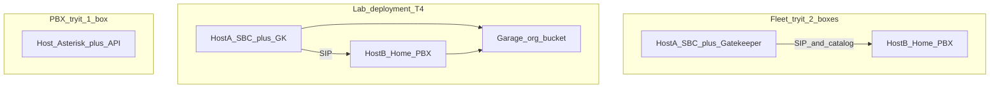

# Fleet try-it deployment (requirements)

**Status:** **Requirements locked** (2026-08-08). **D1 / A9a install path lab green** on reverted snapshots. **Lab SIP edge lab green** (amd64 SBC + Provision edge + Egress Avail). **Next:** installer polish + call smoke.  
**Project bound (primary):** **Quick-deploy LAN Lab** — a curious user with a **VM manager** stands up a few **Ubuntu or Debian** guests and gets a working fleet evaluation stack (near-zero cloud bill). Topology **T4**; advertise as **Lab deployment**. Operator workstation may be **Linux, Windows, or macOS** — do **not** assume a Mac or any particular host OS for docs/scripts.  
**Primary goal:** **Ease and cost of initial deployment** — fewer boxes, fewer steps.  
**Audience bar (locked 2026-08-17):** A **Windows-shop tech** who can create VMs and paste a few Linux commands — **not** an AWS/CLI operator. Happy path = **one prompted installer per box**, then **browser panels**. Hide Garage keys, AWS CLI, and Mac onboard scripts.  
**Also this track:** Org-bucket / directory spin-up (**Appendix B**, Garage on LAN for Lab).  
**Follow-on (same artifacts, not the first milestone):** Cloud 2-box (**T2**), optional AMI skin, Packer.  
**Not this track:** LAN-behind-edge media anchoring (rtpengine) — **Appendix A** (parked).

**Related:** **`DESIGN_RULES.md`** Rules **6**, **7**, **9**, **13** · **`OPS_S3_RUNBOOK.md`** · **`GREENFIELD_FLEET_INSTANCE_INSTALL.md`** · **`INSTALL_NODE_SIMPLE.md`** · **`SBC_PRODUCT_TRACKS.md`** · **`FLEET_TRUNK_PEERING_DECISION.md`** §6.1 (RTP bypass default) · **`LAB_INSTALL_AUTOMATION_HARNESS.md`** (local VM snapshot loop — install only, no calls).

**Lab MkDocs sequence (locked 2026-08-18):** **Gatekeeper → SBC → home PBX → SPA → adopt → Provision edge**. Goal is two phones and a call (not a no-SIP stop after adopt). D1/A9a “install without SIP” remains historically green; the published Lab pack is the phone path.

**Operator sequencing (2026-08-17):** Prefer finishing **install automation** (installers that absorb Garage/bootstrap; Gatekeeper S3 endpoint; Fleet-panel adopt) and proving it on **local VM snapshots**. Cloud AWS lab keeps carrier proof separate.

---

## UX bar — Windows tech, panels first (locked 2026-08-17)

**Persona:** MS Windows desktop, hypervisor GUI (Hyper-V / VirtualBox / VMware / Parallels), **basic** Linux CLI (SSH, paste a command, answer prompts). No AWS console, no `aws s3`, no Mac, no Homebrew.

| They do | They never do (happy path) |
|---------|----------------------------|
| Create 2 Ubuntu VMs; note LAN IPs | Write netplan, IAM, or Garage `rpc_secret` |
| SSH in; run **one** `sudo ./install.sh` (or copy-paste from MkDocs) and answer prompts | Chain Mac registrar scripts / `onboard-fleet-instance.sh` |
| Open **SPA / Fleet / SBC admin** in a browser for names, adopt home, tokens, health | Paste S3 keys, catalog JSON, or `--endpoint-url` |
| Optional: hosts file **or** just use IPs the installer printed | Become an S3 dialect expert |

**CLI budget (Lab T4):** two SSH sessions, one installer each, then browsers. A third “bootstrap-org-bucket” command on the laptop is a **fail** for this persona — that work belongs **inside** the control-host installer (start Garage, mint keys, seed catalog, write Gatekeeper `.env`).

**Aelintra ops** may keep Mac AWS CLI + `onboard-fleet-instance.sh` for EC2 greenfield. That is **not** the Lab/try-it story and must not leak into Lab MkDocs.

**Panels own after first boot:** Fleet adopt / instance register (when shipped), sitename, tokens, health. Installers only do what a panel cannot yet (packages, Garage process, first admin user).

---

## Outcome (short)

| Topic | Outcome |
|-------|---------|
| **Lab deployment (primary / advertise)** | **T4** — curious user + hypervisor → few **Ubuntu/Debian** VMs + **Garage** → full fleet stack on a LAN. Near-zero recurring cost. |
| **Try PBX only** | **T1** — **1** VM, Asterisk + API (singleton-direct). No SBC, no Gatekeeper, no catalog (Rule **6**). |
| **Try fleet (cloud)** | **T2** — same packages as Lab; Host A SBC+GK, Host B home; org bucket on AWS/R2/etc. **Follow-on** after Lab path works. |
| **Prod split (optional)** | **T3** — same packages; GK and SBC on separate hosts when blast radius matters. |
| **Portable core** | Versioned **debs** / release tags + **prompted installers on the guests** (control installer starts Garage + seeds catalog). |
| **AWS AMI** | Optional **skin** later — preinstalled packages; **same** tailor. Not required for Lab. |
| **Docker** | Optional for **Gatekeeper ± SBC ± Garage** only. **Never** Asterisk-in-Docker. |
| **Org directory (Lab / T2+)** | **`bootstrap-org-bucket`** — Lab default = **Garage**; cloud = S3/R2/etc. **Appendix B**. |
| **RTP** | **Bypass** (media → home Asterisk). Do **not** add rtpengine to shrink deploy. |

---

## Why

Fleet bring-up today is still too complex for a prospect: typically **three** cloud VMs plus a cloud object store and multi-step install. That raises cost and drop-off.

**This project bounds the first win:** a **Lab deployment** — someone who can create Ubuntu/Debian VMs in VirtualBox, Proxmox, VMware, Hyper-V, etc. follows a short path and runs SBC + Gatekeeper + home PBX + Garage on their LAN. No AWS account required. Cloud 2-box and AMI reuse the same tailor/packages later.

---

## Non-goals

- Solving deploy ease via **rtpengine** / media through the SBC (**Appendix A**).
- **Asterisk in Docker** as a recommended path.
- Baking **SPA** into instance or edge images (operator browser → LAN SPA or optional local Vite — see T4 SPA subsection).
- Assuming a **Mac** (or any single OS) for the operator workstation — Lab docs must work for **Linux / Windows / macOS** users; **Windows + hypervisor + browser** is the design persona.
- Asking the Lab user to run **AWS CLI**, paste Garage keys, or use **`onboard-fleet-instance.sh`** from a laptop.
- Merging Gatekeeper and SBC into one codebase or one HoR (Rule 13).
- Requiring **cloud** or **AMI** for the first Lab milestone.
- Multi-cloud Packer on day one.
- Replacing greenfield/Mode 4 rebuild runbooks — this track is **quick Lab spin-up**, not every ops path.
- Supporting non-Debian-family guest OS for Lab (Ubuntu/Debian long-haul).

---

## Topologies



### T1 — Solo PBX (1 box)

- Install **pbx3** + **pbx3api** (+ cagi as today) on one VM.
- No SBC, no Gatekeeper, no org catalog required for basic panels (**Rule 6** — no S3).
- Optional instance WSS / singleton-direct for webphone lab.
- **Marketing default** for “try the PBX.” Works on cloud or a single LAN VM.

### T2 — Fleet try-it (2 boxes, cloud bucket)

- **Host A:** SBC (OpenSIPS + Filament admin) **and** Gatekeeper (control API, auth DB, catalog jobs) on the **same** VM — systemd co-install and/or Compose for GK+SBC only.
- **Host B:** normal home instance (Asterisk + API) — **native/deb**, not Docker.
- **Before or with tailor:** run **Appendix B** bootstrap once (fleet slug → org bucket + catalog URL); paste outputs into tailor / Gatekeeper / SPA env.
- Org bucket typically **AWS S3 / R2 / similar** (public HTTPS catalog URL for SPA).
- Tailor script (or compose env) sets: public names (`sbc` / `control` vhosts or paths), org bucket, fleet token/bootstrap user, dispatcher/home registration toward Host B.
- **Rule 13:** Filament/scripts still author edge tables; Gatekeeper still owns catalog/control APIs — co-location is **process/host**, not product merge.

### T3 — Split control / edge (3+ boxes)

- Same artifacts as T2; enable only SBC on one host and only Gatekeeper on another.
- Deploy-time choice (compose profiles / unit sets). Preferred when shared blast radius is unacceptable.

### T4 — Lab deployment (primary milestone; advertise)

**Audience:** Curious user with access to a **VM manager** who can create a few **Ubuntu or Debian** instances on a LAN (or VPN). Their day machine may be **Linux, Windows, or macOS** — install docs and examples must not assume macOS, Homebrew, or Mac-only SSH key paths.

**Marketing name:** **Lab deployment** — full fleet stack for evaluation, near-zero recurring cost. Same portable packages later used for cloud; not a separate product binary.

| Box | Role |
|-----|------|
| **VM A** | SBC + Gatekeeper (same as T2 Host A) + **Garage** Compose (default) |
| **VM B** | Home PBX 1 (Asterisk + API) |
| **VM C** | Home PBX 2 (optional — preferred when proving multi-home / Site Groups) |

**Locked box count (2026-08-10):** Prefer **three** guests for a two-home Lab — **do not** split Gatekeeper onto a fourth box for T4. Garage stays on VM A (or a tiny LXC) unless ops wants isolation. One-home Lab = VM A + VM B only.

- All SIP, RTP, catalog, and SPA↔API traffic stays **on the LAN** (or VPN) for the core Lab story. SPA: prefer a **LAN-hosted static build** (any browser on the operator machine); optional local Vite for contributors who have Node. Catalog URL points at Garage (HTTP on LAN is fine for lab).
- **No cloud bill** beyond electricity / existing hypervisor.
- Tailor env uses private DNS or `/etc/hosts` names (`sbc.lab`, `control.lab`, `home1.lab`, `home2.lab`, Garage endpoint). Topology flag: `lab` (alias `fleet_lan`).
- RTP **bypass** still applies on-LAN; phones/webphones on the same LAN talk to home Asterisk. This is **not** Appendix A (rtpengine).
- Onboard still registers each home into the Garage-backed catalog; no EC2 instance profiles — static keys from bootstrap.
- **Positioning:** lab / evaluation only in copy; production fleets may still prefer a durable cloud or multi-site object store.

#### Optional — public carrier into a NATed Lab (ops pilot)

**Not** part of D1 acceptance. When a Lab needs an **external carrier** while homes stay private:

1. **First try — chunked RTP port-forwards** (2026-08-10 stance): partition public RTP ranges per home (e.g. `10000–10099` → Ast1, `11000–11099` → Ast2); WAN DNAT each chunk; set each Asterisk `rtpstart`/`rtpend` to its chunk; SDP **`externip`** = public WAN IP. SIP may still terminate on the SBC (DID → home). Outbound from NATed Asterisk usually works via hole-punch without relying on the forwards.
2. SBC adds little for **carrier media** in that pattern (one Peer face + DID fan-out still useful for fleet practice). Solo **T1** is enough if the goal is only “one PBX + carrier.”
3. If chunked NAT does not scale or is too brittle → unpark **Appendix A** (rtpengine) for a single public media face.

Do **not** invent product RTP-slot allocation UI for this pilot — router + `rtp.conf` / externip is enough.

#### SPA in Lab deployment

The SPA does **not** need public DNS. It is a static app: the browser follows whatever URLs are in the catalog and Gatekeeper env. Lab just uses **LAN** values in those same fields.

**Operator workstation:** Linux, Windows, or macOS — anything with a browser that can reach the LAN VMs. Do not write Lab runbooks that require a Mac.

```text
Browser (any OS on the LAN/VPN)
  ├─ GET catalog     → Garage (LAN URL; or Vite /dev-catalog proxy if using local Node)
  ├─ pick instance   → row.api_base_url  e.g. https://home.lab:44300/api
  ├─ Sanctum + panels → that api_base_url only
  └─ Fleet mode      → Gatekeeper LAN URL (or /fleet-gk proxy when using local Vite)
```

| Path | How SPA runs | Catalog | Instance / Gatekeeper |
|------|--------------|---------|------------------------|
| **A — LAN static (recommended for Lab docs)** | `npm run build` once (any OS with Node, or CI); serve static files from VM A / any lab host (nginx). Operator opens `http://spa.lab` (or IP) from **any** browser. | Bake `VITE_INSTANCE_DIRECTORY_URL` to Garage catalog URL | Catalog + each API + Gatekeeper CORS allow that SPA origin. No Node required on the operator day machine. |
| **B — Local Vite (optional, contributors)** | `npm run dev` on the operator machine → `http://localhost:5173` (Linux/macOS native; Windows via Node or WSL). | `VITE_CATALOG_PROXY_TARGET` → Garage + `/dev-catalog/…`, **or** Garage CORS allow localhost | Each `pbx3api` CORS allows `http://localhost:5173`. Gatekeeper: `/fleet-gk` Vite proxy (see **pbx3spa** `.env.development.example`). |
| **C — Solo (T1 on LAN)** | Same SPA; no directory | Omit `VITE_INSTANCE_DIRECTORY_URL` | Type/paste LAN API URL or `VITE_DEFAULT_API_BASE_URL` (Rule **6**). |

**Must be true:**

1. **Reachability** — browser host is on the same LAN/VPN as the VMs (OS of that host irrelevant).
2. **Catalog content** — onboard writes LAN `api_base_url` / `fqdn` (not public cloud FQDNs).
3. **CORS** — SPA origin allowed on Garage (if not proxied), each instance API, and Gatekeeper (if not proxied).
4. **TLS** — lab may use HTTP or hosts-file names; document HTTP or a trust path for `*.lab` (browsers reject bad HTTPS).
5. **Scripts** — Lab bootstrap/tailor examples use portable shell (bash on the **guest** VMs) or document Windows equivalents; avoid Mac-only tooling in the happy path. Internal ops may still use **`OPERATOR_MAC_SETUP.md`** — that is **not** the Lab user story.

No SPA feature fork for Lab vs cloud — same picker, same fleet mode; only env + catalog URL strings change. Pointers: **`DESIGN_RULES.md`** (central SPA / CORS) · **pbx3spa** `.env.development.example`.

---

## Packaging contract

### Portable core (required)

1. **Packages / release tags** — instance **pbx3** + **pbx3cagi** debs; SBC/SBC and Gatekeeper via public release tag + install script (or package when available); **pbx3api** clone-at-tag OK once repos are public (deb still nice-to-have — see below).
2. **`bootstrap-org-bucket`** (Appendix B) — **library used by the control installer**, not a laptop ritual. Fleet slug → layout; writes Gatekeeper env on the box.
3. **Prompted guest installers** (control + home). Optional env/file for unattended / AMI later:
   - Topology: `solo` | `fleet_colocated` | `fleet_split` | `lab` (T4 Lab deployment — private names + Garage; alias `fleet_lan`)
   - FQDNs / public IPs **or** LAN names / private IPs
   - Org bucket endpoint + credentials (S3-compatible) — from Appendix B output when greenfield
   - Bootstrap fleet admin / break-glass handling
   - Home instance id / API URL / setid hints as needed
4. **Idempotent** where practical; safe to re-run with same inputs.
5. **No AWS SDK** in the tailor / bootstrap happy path beyond optional “detect IMDS” — bucket access via S3-compatible config (Rule 9).

### Public GitHub org vs packages

**Assumption:** When the project moves to the **PBX3** GitHub org/account, product repos are **public** (no deploy keys / private-clone friction on new VMs). On-node `git clone` + tag/checkout becomes a valid Lab/try-it path (GREENFIELD’s “scp debs because private” rationale drops).

**Packaging posture (locked 2026-08-11) — pragmatic middle:**

| Artifact | Stance |
|----------|--------|
| **pbx3cagi** | **Deb-first.** Historically AGI changed rarely once stable; apt version pins are the right shape. Prefer shipping fixes as a new cagi floor when the binary actually moves. |
| **pbx3** | Keep **release/AMI/try-it `.deb`s** as **stable floors** (known-good pin + Depends). Between floors, **tip / rsync of `/opt/pbx3` is first-class** for lab and hotfixes — do **not** force every biggish patch through a new main deb version (historical pain). Deb = floor artifact, not the only way code lands on a box. |
| **pbx3api** | **Clone-at-tag / tip** — no deb required for Lab or current fleet. Optional `.deb` later for long-haul apt parity (D6); not a try-it blocker. |
| **Gatekeeper** | Public clone at tag + install script / Compose; thin deb later for polish. |
| **SBC / SBC** | Overlay install from public tag (plus distro OpenSIPS packages); meta-deb when packaging effort allows. |
| **SPA** | LAN static build (Lab default) or Pages / local Vite; not an on-node package. |

**Still prefer versioned floor artifacts where they already help** (cagi always; pbx3 for AMI / advertised Lab pin). Tip/`main` between floors is for operators chasing HEAD or lab hotfix — record tip SHAs in ops (**`TODO_OPS.md`**), not by inventing a new `0.0.x-N` for every patch.

**License (gate before public):** Product license **Apache License 2.0** on all product repos — root `LICENSE` landed. Migrate tooling stripped from pbx3 (2026-08-09). Remaining public/org-transfer work: create OSS org + transfer. Garage remains upstream AGPL (companion only). See **`OPEN_SOURCE_GITHUB_SETUP.md`**.

### AWS AMI skin (optional, phase after script)

- Prebuilt AMI with packages already installed.
- First boot runs **the same** tailor script (user-data or documented one-liner).
- Document as **AWS convenience**, not the portable definition of the product.

### Multi-cloud images (later)

- Packer (or cloud-adapter `BuildImage`) consumes the same install + tailor inputs → AMI / GCP / Azure / qcow2.
- Do not hand-maintain divergent per-cloud bake scripts.

### Docker (optional, GK + SBC ± Garage)

- Compose can run Gatekeeper + SBC on one host (**T2** / **T4**) or split (**T3**).
- **T4:** add Garage to that Compose (or a tiny third guest) as the org bucket.
- SBC may need **host networking** for SIP; document that.
- **Asterisk stays out of Compose** for try-it and lab appliance.

---

## Acceptance (when implemented)

**Primary milestone = Lab (T4).** Cloud/AMI checks are follow-on.

| # | Check |
|---|--------|
| A9 | **Lab:** Doc’d path — VM manager → few Ubuntu/Debian guests → Garage + GK+SBC + home → Fleet login + catalog + lab SIP; SPA = **LAN static** (any OS browser) or optional local Vite; **no Mac assumption**. Marketing: **Lab deployment**. |
| A9a | **Install harness (subset of A9):** Local VM **snapshots** + checklist in **`LAB_INSTALL_AUTOMATION_HARNESS.md`** — Garage + GK+SBC + home + catalog + SPA login; **no SIP/calls** required to accept D1. |
| A1 | Doc’d **T1**: one Ubuntu/Debian VM → packages/tailor → SPA hits instance API (solo; no Garage). |
| A2 | Doc’d **T2** (follow-on): two cloud VMs + cloud bucket → Fleet + SIP (RTP bypass). |
| A3 | Tailor script runs from a **checked-in** Lab env example; no undocumented AMI-only steps for Lab. |
| A4 | **T3** documented as “same packages, split hosts.” |
| A5 | Explicit **non-recommendation** of Asterisk-in-Docker. |
| A6 | AMI (if shipped later) is skin over packages + tailor — rebuildable; not required for A9. |
| A7 | **Appendix B:** bootstrap creates `{slug}-pbx3` layout on **Garage** (Lab) / S3-compatible; prints env; T1 says “no bucket.” |
| A8 | Bootstrap works against **S3-compatible** endpoint (Garage first for Lab), not AWS console-only. |

---

## Phased build effort (estimate)

| Phase | Scope | Effort |
|-------|--------|--------|
| **D0** | This requirements doc + TODO link | Done when committed |
| **D1** | **Lab milestone:** control installer absorbs Garage + catalog seed; home installer stays prompted; Gatekeeper S3 endpoint; Lab MkDocs = copy-paste + panels. Prove on **A9a**. Mac onboard scripts stay ops-only. | ~3–7 days |
| **D2** | Polish Compose for GK+SBC+Garage; SPA Lab CORS/.env examples | ~2–3 days |
| **D3** | Cloud **T2** doc path + optional AWS AMI skin | Later |
| **D4** | Packer multi-cloud | Later |
| **D5** | Gatekeeper “create fleet” wrapping bootstrap | Later |
| **D6** | **pbx3api `.deb`** — optional long-haul polish; **deferred** (clone-at-tag / tip is enough). See packaging posture above. | When packaging week |

---

## Appendix A — Optional media plane (parked)

**Not part of try-it.** RTP **bypass** remains product default: endpoint ↔ **home Asterisk** (Asterisk always in media path); SIP via the SBC.

**rtpengine** only if a real trigger appears: LAN home + public remote where **chunked RTP DNAT** is insufficient, explicit relay mode, or legacy WebRTC↔non-WebRTC gateway. Selective engage; no PBX product mods; HA media deferred. Design research: **`pbx3-directory/docs/RTPENGINE_SELECTIVE_ENGAGE.md`** (load model, engage matrix — not locked).

- Spec trigger: Track A / Peer forbids bypass / LAN-edge pilot after chunked-NAT pilot fails or is rejected for ops.
- Prefer **chunked RTP port-forwards** first for small-N Lab (see T4 optional carrier subsection).
- Effort if built: ~1–2 weeks SBC MVP (see prior design discussion).
- Gap pointer: **`SBC_PRODUCT_TRACKS.md`** #2 · **`FLEET_TRUNK_PEERING_DECISION.md`** §6.1.

**Do not** implement media plane to reduce instance count or simplify first deploy (D1).

---

## Appendix B — Org directory / S3 spin-up (try-it)

**Part of try-it for T2+ / T4.** Goal: replace the multi-step console checklist in **`OPS_S3_RUNBOOK.md`** with one portable bootstrap so prospects are not blocked on IAM/CORS/catalog choreography.

**Rule 6:** **T1 solo never requires** an org bucket, catalog URL, or this script.

### Outcome

| Topic | Outcome |
|-------|---------|
| **Greenfield fleet catalog** | **Control installer** (Lab) or cloud bootstrap library runs **`bootstrap-org-bucket`** with a **neutral fleet slug** (e.g. `acme` → `acme-pbx3`). Tech never pastes keys. |
| **What it does** | Create org bucket; allow GET on **`catalog/*`**; CORS for SPA; seed `catalog/instance-index.json`; **write** Gatekeeper/SPA env on the control host (print is debug-only). |
| **Portability** | S3-compatible API (AWS CLI / `rclone` / etc.). AWS is one backend; self-hosted default **Garage** (**Lab / T4** natural fit); also R2/B2/Wasabi-class (Rule **9**). |
| **What it does *not* do** | Per-node IAM / instance profiles, recordings bucket lifecycle, backup lifecycle — those stay on **`onboard-fleet-instance.sh`** / later ops. |
| **HoR** | Org object store remains home of record (Rule **13**). Do not invent a Gatekeeper-DB catalog as substitute HoR. |

### Operator flow (T2 cloud / T4 Lab)

```text
1. Choose fleet slug (not first-instance shortuid — see OPS_S3_RUNBOOK design note)
2. Lab (T4): control installer on VM A starts Garage, bootstraps bucket, writes Gatekeeper env
   Cloud (T2): same library against AWS/R2/etc. (ops may still use AWS console once)
3. Home installer on VM B (prompts)
4. Adopt home from **Fleet panel** (fallback CLI until that panel exists). Lab: static keys written by installer/panel — not the tech.
```

### Garage “directory in a box” (preferred self-host; **Lab / T4** default)

**Why not MinIO as the doc’d companion:** MinIO’s community edition has moved hard into a corporate / commercial posture (console stripped from CE, prebuilt images/binaries curtailed, project maintenance mode / archive trajectory through 2025–2026). Fine if an operator already has it; **do not** make MinIO the try-it recommendation.

**Prefer [Garage](https://garagehq.deuxfleurs.fr/)** (Deuxfleurs, AGPLv3, Rust):

- Built for small-to-medium self-host; single binary; official Docker image (`dxflrs/garage`); low RAM — ideal for a LAN lab with a few VMs and almost no recurring cost.
- S3 API on a dedicated port; works with AWS CLI / SDKs / `rclone` (and even `mc` as a client).
- Single-node mode for try-it / lab; multi-node later if wanted — not required for first spin-up.
- Compose may sit beside GK+SBC (**D2** / **T4**). Still **not** Asterisk-in-Docker.
- Same layout + printed env contract as AWS (`endpoint` + keys + bucket + catalog URL). LAN catalog may be `http://garage.lab:3900/...` (lab only).

**Implementation notes (when building D1/D2):**

- Bootstrap against Garage admin/`garage` CLI + S3 endpoint — not AWS console steps.
- Confirm SPA **GET** for `catalog/*` (Garage website endpoint and/or bucket allowlist) and CORS; Gatekeeper write path uses access keys. On LAN, Vite `/dev-catalog` proxy remains a fine escape hatch.
- AGPL applies to **Garage itself** as an optional companion process — we do not embed/fork it into pbx3 packages; product talks S3 API only (Rule **9**).

**Also fine:** Cloudflare R2, Backblaze B2, Wasabi, etc. — same bootstrap inputs, different endpoint (**T2**).

### Explicit non-goals

- Static-only hosting of `instance-index.json` (Pages/raw file) as a **real** fleet HoR — OK only as read-only picker demo; Gatekeeper still needs a writable S3-compatible bucket for meta/backups/moves.
- Browser holding ops IAM to create buckets.
- Renaming lab `08jzwn-*` buckets as part of this work.
- Documenting MinIO as the preferred self-host path (legacy ops only).

### Later (not try-it blocker)

- Gatekeeper **`create fleet`** (or equivalent) wrapping the same bootstrap — product path once control-plane UX exists (**D5**).

### Acceptance (Appendix B)

Covered by **A7** / **A8** above. Point MkDocs / install docs at the script; keep **`OPS_S3_RUNBOOK.md`** as the detailed ops reference for edge cases.

---

## Revision

| Date | Note |
|------|------|
| 2026-08-08 | Requirements locked from plan discussion: ease/cost primary; 2-box fleet; portable core + AMI skin; rtpengine parked. |
| 2026-08-08 | **Appendix B** — org directory / `bootstrap-org-bucket` for T2+; T1 still no S3 (Rule 6). |
| 2026-08-08 | Appendix B: prefer **Garage** over MinIO for self-hosted “directory in a box.” |
| 2026-08-08 | **T4** advertised as **Lab deployment** — few LAN VMs + Garage; near-zero cost; not Appendix A rtpengine. |
| 2026-08-08 | T4 **SPA in Lab deployment** — catalog/API/Gatekeeper LAN URLs; laptop Vite vs LAN static; CORS/TLS notes. |
| 2026-08-08 | Packaging: public org → clone-at-tag OK for try-it; Ubuntu/Debian long-haul → API `.deb` natural (not blocker). |
| 2026-08-08 | **Project bound:** primary = quick-deploy **LAN Lab** (VM manager + Ubuntu/Debian); cloud/AMI follow-on. |
| 2026-08-08 | Lab operator workstation = Linux/Windows/macOS; prefer LAN static SPA; no Mac-only happy path. |
| 2026-08-08 | **LICENSE TBD** — gate before public repos / stranger Lab clone docs. |
| 2026-08-08 | Product license **locked: Apache-2.0** (all product repos); add `LICENSE` files before public. |
| 2026-08-09 | Apache-2.0 root `LICENSE` on product repos (clean text; httpd composite removed). |
| 2026-08-09 | Customer migrate stripped from pbx3 package; private ETL under Aelintra. Public gate = org transfer when scheduled. |
| 2026-08-10 | T4 prefer **3 boxes** for two homes (GK co-located on the SBC+Garage). Optional LAN+carrier: **chunked RTP DNAT** before rtpengine. |
| 2026-08-17 | **A9a** install harness: local VM snapshots test automation without calls; see **`LAB_INSTALL_AUTOMATION_HARNESS.md`**. Sequencing: automation before LAN carrier. |
| 2026-08-17 | **UX bar:** Windows tech, basic CLI, **panels after one installer per box**. Garage/bootstrap inside control installer; no AWS CLI happy path. |
| 2026-08-17 | **D1 / A9a** install path **lab green**: control + home + catalog pick + Sanctum + Fleet. One home wrapper **`pbx3/scripts/install-home-host.sh`**. Probe timer on Lab control. Next: snapshot revert + MkDocs re-walk when asked. |
| 2026-08-11 | Packaging posture: **cagi deb-first**; **pbx3** release floors + tip between; **api** clone/tip (D6 deferred). |
