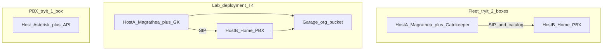

# Fleet try-it deployment (requirements)

**Status:** **Requirements locked** (2026-08-08). Implementation not started.  
**Project bound (primary):** **Quick-deploy LAN Lab** — a curious user with a **VM manager** stands up a few **Ubuntu or Debian** guests and gets a working fleet evaluation stack (near-zero cloud bill). Topology **T4**; advertise as **Lab deployment**. Operator workstation may be **Linux, Windows, or macOS** — do **not** assume a Mac or any particular host OS for docs/scripts.  
**Primary goal:** **Ease and cost of initial deployment** — fewer boxes, fewer steps, documented packages + tailor.  
**Also this track:** Org-bucket / directory spin-up (**Appendix B**, Garage on LAN for Lab).  
**Follow-on (same artifacts, not the first milestone):** Cloud 2-box (**T2**), optional AMI skin, Packer.  
**Not this track:** LAN-behind-edge media anchoring (rtpengine) — **Appendix A** (parked).

**Related:** **`DESIGN_RULES.md`** Rules **6**, **7**, **9**, **13** · **`OPS_S3_RUNBOOK.md`** · **`GREENFIELD_FLEET_INSTANCE_INSTALL.md`** · **`INSTALL_NODE_SIMPLE.md`** · **`SBC_PRODUCT_TRACKS.md`** · **`FLEET_TRUNK_PEERING_DECISION.md`** §6.1 (RTP bypass default).

---

## Outcome (short)

| Topic | Outcome |
|-------|---------|
| **Lab deployment (primary / advertise)** | **T4** — curious user + hypervisor → few **Ubuntu/Debian** VMs + **Garage** → full fleet stack on a LAN. Near-zero recurring cost. |
| **Try PBX only** | **T1** — **1** VM, Asterisk + API (singleton-direct). No Magrathea, no Gatekeeper, no catalog (Rule **6**). |
| **Try fleet (cloud)** | **T2** — same packages as Lab; Host A Magrathea+GK, Host B home; org bucket on AWS/R2/etc. **Follow-on** after Lab path works. |
| **Prod split (optional)** | **T3** — same packages; GK and Magrathea on separate hosts when blast radius matters. |
| **Portable core** | Versioned **debs** / release tags + **one tailor script** (env file) on Ubuntu/Debian. |
| **AWS AMI** | Optional **skin** later — preinstalled packages; **same** tailor. Not required for Lab. |
| **Docker** | Optional for **Gatekeeper ± Magrathea ± Garage** only. **Never** Asterisk-in-Docker. |
| **Org directory (Lab / T2+)** | **`bootstrap-org-bucket`** — Lab default = **Garage**; cloud = S3/R2/etc. **Appendix B**. |
| **RTP** | **Bypass** (media → home Asterisk). Do **not** add rtpengine to shrink deploy. |

---

## Why

Fleet bring-up today is still too complex for a prospect: typically **three** cloud VMs plus a cloud object store and multi-step install. That raises cost and drop-off.

**This project bounds the first win:** a **Lab deployment** — someone who can create Ubuntu/Debian VMs in VirtualBox, Proxmox, VMware, Hyper-V, etc. follows a short path and runs Magrathea + Gatekeeper + home PBX + Garage on their LAN. No AWS account required. Cloud 2-box and AMI reuse the same tailor/packages later.

---

## Non-goals

- Solving deploy ease via **rtpengine** / media through the SBC (**Appendix A**).
- **Asterisk in Docker** as a recommended path.
- Baking **SPA** into instance or edge images (operator browser → LAN SPA or optional local Vite — see T4 SPA subsection).
- Assuming a **Mac** (or any single OS) for the operator workstation — Lab docs must work for **Linux / Windows / macOS** users.
- Merging Gatekeeper and Magrathea into one codebase or one HoR (Rule 13).
- Requiring **cloud** or **AMI** for the first Lab milestone.
- Multi-cloud Packer on day one.
- Replacing greenfield/Mode 4 rebuild runbooks — this track is **quick Lab spin-up**, not every ops path.
- Supporting non-Debian-family guest OS for Lab (Ubuntu/Debian long-haul).

---

## Topologies



### T1 — Solo PBX (1 box)

- Install **pbx3** + **pbx3api** (+ cagi as today) on one VM.
- No Magrathea, no Gatekeeper, no org catalog required for basic panels (**Rule 6** — no S3).
- Optional instance WSS / singleton-direct for webphone lab.
- **Marketing default** for “try the PBX.” Works on cloud or a single LAN VM.

### T2 — Fleet try-it (2 boxes, cloud bucket)

- **Host A:** Magrathea (OpenSIPS + Filament admin) **and** Gatekeeper (control API, auth DB, catalog jobs) on the **same** VM — systemd co-install and/or Compose for GK+SBC only.
- **Host B:** normal home instance (Asterisk + API) — **native/deb**, not Docker.
- **Before or with tailor:** run **Appendix B** bootstrap once (fleet slug → org bucket + catalog URL); paste outputs into tailor / Gatekeeper / SPA env.
- Org bucket typically **AWS S3 / R2 / similar** (public HTTPS catalog URL for SPA).
- Tailor script (or compose env) sets: public names (`sbc` / `control` vhosts or paths), org bucket, fleet token/bootstrap user, dispatcher/home registration toward Host B.
- **Rule 13:** Filament/scripts still author edge tables; Gatekeeper still owns catalog/control APIs — co-location is **process/host**, not product merge.

### T3 — Split control / edge (3+ boxes)

- Same artifacts as T2; enable only Magrathea on one host and only Gatekeeper on another.
- Deploy-time choice (compose profiles / unit sets). Preferred when shared blast radius is unacceptable.

### T4 — Lab deployment (primary milestone; advertise)

**Audience:** Curious user with access to a **VM manager** who can create a few **Ubuntu or Debian** instances on a LAN (or VPN). Their day machine may be **Linux, Windows, or macOS** — install docs and examples must not assume macOS, Homebrew, or Mac-only SSH key paths.

**Marketing name:** **Lab deployment** — full fleet stack for evaluation, near-zero recurring cost. Same portable packages later used for cloud; not a separate product binary.

| Box | Role |
|-----|------|
| **VM A** | Magrathea + Gatekeeper (same as T2 Host A) |
| **VM B** | Home PBX (Asterisk + API) |
| **Garage** | Org directory / HoR — Compose on VM A, or a tiny third guest / LXC |

- All SIP, RTP, catalog, and SPA↔API traffic stays **on the LAN** (or VPN). SPA: prefer a **LAN-hosted static build** (any browser on the operator machine); optional local Vite for contributors who have Node. Catalog URL points at Garage (HTTP on LAN is fine for lab).
- **No cloud bill** beyond electricity / existing hypervisor.
- Tailor env uses private DNS or `/etc/hosts` names (`sbc.lab`, `control.lab`, `home.lab`, Garage endpoint). Topology flag: `lab` (alias `fleet_lan`).
- RTP **bypass** still applies; phones/webphones on the same LAN talk to home Asterisk. This is **not** Appendix A (LAN-behind-edge + public remotes / rtpengine).
- Onboard still registers the home instance into the Garage-backed catalog; no EC2 instance profiles — static keys from bootstrap.
- **Positioning:** lab / evaluation only in copy; production fleets may still prefer a durable cloud or multi-site object store.

#### SPA in Lab deployment

The SPA does **not** need public DNS. It is a static app: the browser follows whatever URLs are in the catalog and Gatekeeper env. Lab just uses **LAN** values in those same fields.

**Operator workstation:** Linux, Windows, or macOS — anything with a browser that can reach the LAN VMs. Do not write Lab runbooks that require a Mac.

```text
Browser (any OS on the LAN/VPN)
  ├─ GET catalog     → Garage (LAN URL; or Vite /dev-catalog proxy if using local Node)
  ├─ pick instance   → row.api_base_url  e.g. https://home.lab:44300/api
  ├─ Sanctum + panels → that api_base_url only
  └─ Fleet mode      → Gatekeeper LAN URL (or /fleet-gk proxy when using local Vite)
```

| Path | How SPA runs | Catalog | Instance / Gatekeeper |
|------|--------------|---------|------------------------|
| **A — LAN static (recommended for Lab docs)** | `npm run build` once (any OS with Node, or CI); serve static files from VM A / any lab host (nginx). Operator opens `http://spa.lab` (or IP) from **any** browser. | Bake `VITE_INSTANCE_DIRECTORY_URL` to Garage catalog URL | Catalog + each API + Gatekeeper CORS allow that SPA origin. No Node required on the operator day machine. |
| **B — Local Vite (optional, contributors)** | `npm run dev` on the operator machine → `http://localhost:5173` (Linux/macOS native; Windows via Node or WSL). | `VITE_CATALOG_PROXY_TARGET` → Garage + `/dev-catalog/…`, **or** Garage CORS allow localhost | Each `pbx3api` CORS allows `http://localhost:5173`. Gatekeeper: `/fleet-gk` Vite proxy (see **pbx3spa** `.env.development.example`). |
| **C — Solo (T1 on LAN)** | Same SPA; no directory | Omit `VITE_INSTANCE_DIRECTORY_URL` | Type/paste LAN API URL or `VITE_DEFAULT_API_BASE_URL` (Rule **6**). |

**Must be true:**

1. **Reachability** — browser host is on the same LAN/VPN as the VMs (OS of that host irrelevant).
2. **Catalog content** — onboard writes LAN `api_base_url` / `fqdn` (not public cloud FQDNs).
3. **CORS** — SPA origin allowed on Garage (if not proxied), each instance API, and Gatekeeper (if not proxied).
4. **TLS** — lab may use HTTP or hosts-file names; document HTTP or a trust path for `*.lab` (browsers reject bad HTTPS).
5. **Scripts** — Lab bootstrap/tailor examples use portable shell (bash on the **guest** VMs) or document Windows equivalents; avoid Mac-only tooling in the happy path. Internal ops may still use **`OPERATOR_MAC_SETUP.md`** — that is **not** the Lab user story.

No SPA feature fork for Lab vs cloud — same picker, same fleet mode; only env + catalog URL strings change. Pointers: **`DESIGN_RULES.md`** (central SPA / CORS) · **pbx3spa** `.env.development.example`.

---

## Packaging contract

### Portable core (required)

1. **Packages / release tags** — instance **pbx3** + **pbx3cagi** debs; Magrathea/SBC and Gatekeeper via public release tag + install script (or package when available); **pbx3api** clone-at-tag OK once repos are public (deb still nice-to-have — see below).
2. **`bootstrap-org-bucket`** (Appendix B) — one-shot before T2 tailor when no org bucket exists yet (fleet slug → layout + print env).
3. **Tailor script** (name TBD, e.g. `pbx3-firstboot` / `tailor-fleet-tryit`) reading a small env/file:
   - Topology: `solo` | `fleet_colocated` | `fleet_split` | `lab` (T4 Lab deployment — private names + Garage; alias `fleet_lan`)
   - FQDNs / public IPs **or** LAN names / private IPs
   - Org bucket endpoint + credentials (S3-compatible) — from Appendix B output when greenfield
   - Bootstrap fleet admin / break-glass handling
   - Home instance id / API URL / setid hints as needed
4. **Idempotent** where practical; safe to re-run with same inputs.
5. **No AWS SDK** in the tailor / bootstrap happy path beyond optional “detect IMDS” — bucket access via S3-compatible config (Rule 9).

### Public GitHub org vs packages

**Assumption:** When the project moves to the **PBX3** GitHub org/account, product repos are **public** (no deploy keys / private-clone friction on new VMs). On-node `git clone` + tag/checkout becomes a valid Lab/try-it path (GREENFIELD’s “scp debs because private” rationale drops).

| Artifact | Stance with public repos |
|----------|---------------------------|
| **pbx3 / pbx3cagi** | Keep **`.deb`s** — already the product install; apt deps, postinst, version pin. |
| **pbx3api** | **Clone-at-tag is acceptable** for Lab/try-it once public. Product target OS is **Ubuntu/Debian for the long haul** — a **`.deb`** is the natural artifact (apt parity with pbx3/cagi, AMI bake, less ad-hoc composer on boxes). Not a try-it **blocker** if docs pin a release tag first; build the deb when packaging time is scheduled. |
| **Gatekeeper** | Same — public clone at tag + install script / Compose is enough; thin deb later for polish. |
| **Magrathea / SBC** | Overlay install from public tag (plus distro OpenSIPS packages); meta-deb when packaging effort allows. |
| **SPA** | LAN static build (Lab default) or Pages / local Vite; not an on-node package. |

**Still prefer versioned artifacts where they already exist** (pbx3/cagi debs). For API/GK/SBC: **documented release tag + install script** satisfies portable core until debs exist. Tip/`main` clone is for operators chasing HEAD, not the advertised Lab path.

**License (gate before public):** Product license **Apache License 2.0** on all product repos (`pbx3`, `pbx3api`, `pbx3spa`, `pbx3cagi`, Magrathea/SBC admin) — root `LICENSE` landed 2026-08-09 (clean Apache-2.0 text). Remaining public/org-transfer gates: SARK strip from pbx3 (**TODO #3**), then OSS org transfer. Garage remains upstream AGPL (companion only). See **`OPEN_SOURCE_GITHUB_SETUP.md`**.

### AWS AMI skin (optional, phase after script)

- Prebuilt AMI with packages already installed.
- First boot runs **the same** tailor script (user-data or documented one-liner).
- Document as **AWS convenience**, not the portable definition of the product.

### Multi-cloud images (later)

- Packer (or cloud-adapter `BuildImage`) consumes the same install + tailor inputs → AMI / GCP / Azure / qcow2.
- Do not hand-maintain divergent per-cloud bake scripts.

### Docker (optional, GK + Magrathea ± Garage)

- Compose can run Gatekeeper + Magrathea on one host (**T2** / **T4**) or split (**T3**).
- **T4:** add Garage to that Compose (or a tiny third guest) as the org bucket.
- Magrathea may need **host networking** for SIP; document that.
- **Asterisk stays out of Compose** for try-it and lab appliance.

---

## Acceptance (when implemented)

**Primary milestone = Lab (T4).** Cloud/AMI checks are follow-on.

| # | Check |
|---|--------|
| A9 | **Lab:** Doc’d path — VM manager → few Ubuntu/Debian guests → Garage + GK+Magrathea + home → Fleet login + catalog + lab SIP; SPA = **LAN static** (any OS browser) or optional local Vite; **no Mac assumption**. Marketing: **Lab deployment**. |
| A1 | Doc’d **T1**: one Ubuntu/Debian VM → packages/tailor → SPA hits instance API (solo; no Garage). |
| A2 | Doc’d **T2** (follow-on): two cloud VMs + cloud bucket → Fleet + SIP (RTP bypass). |
| A3 | Tailor script runs from a **checked-in** Lab env example; no undocumented AMI-only steps for Lab. |
| A4 | **T3** documented as “same packages, split hosts.” |
| A5 | Explicit **non-recommendation** of Asterisk-in-Docker. |
| A6 | AMI (if shipped later) is skin over packages + tailor — rebuildable; not required for A9. |
| A7 | **Appendix B:** bootstrap creates `{slug}-pbx3` layout on **Garage** (Lab) / S3-compatible; prints env; T1 says “no bucket.” |
| A8 | Bootstrap works against **S3-compatible** endpoint (Garage first for Lab), not AWS console-only. |

---

## Phased build effort (estimate)

| Phase | Scope | Effort |
|-------|--------|--------|
| **D0** | This requirements doc + TODO link | Done when committed |
| **D1** | **Lab milestone:** tailor + Lab env example + Garage Compose/bootstrap + install doc for T4 (T1 as thin sibling) | ~3–7 days |
| **D2** | Polish Compose for GK+Magrathea+Garage; SPA Lab CORS/.env examples | ~2–3 days |
| **D3** | Cloud **T2** doc path + optional AWS AMI skin | Later |
| **D4** | Packer multi-cloud | Later |
| **D5** | Gatekeeper “create fleet” wrapping bootstrap | Later |
| **D6** | **pbx3api `.deb`** (Ubuntu/Debian long-haul) — parallel/anytime; not Lab blocker if clone-at-tag works | When scheduled |

---

## Appendix A — Optional media plane (parked)

**Not part of try-it.** RTP **bypass** remains product default: endpoint ↔ **home Asterisk** (Asterisk always in media path); SIP via Magrathea.

**rtpengine** only if a real trigger appears: LAN home + public remote, explicit relay mode, or legacy WebRTC↔non-WebRTC gateway. Selective engage; no PBX product mods; HA media deferred.

- Spec trigger: Track A / Peer forbids bypass / LAN-edge pilot.
- Effort if built: ~1–2 weeks SBC MVP (see prior design discussion).
- Gap pointer: **`SBC_PRODUCT_TRACKS.md`** #2 · **`FLEET_TRUNK_PEERING_DECISION.md`** §6.1.

**Do not** implement media plane to reduce instance count or simplify first deploy.

---

## Appendix B — Org directory / S3 spin-up (try-it)

**Part of try-it for T2+ / T4.** Goal: replace the multi-step console checklist in **`OPS_S3_RUNBOOK.md`** with one portable bootstrap so prospects are not blocked on IAM/CORS/catalog choreography.

**Rule 6:** **T1 solo never requires** an org bucket, catalog URL, or this script.

### Outcome

| Topic | Outcome |
|-------|---------|
| **Greenfield fleet catalog** | Ops runs **`bootstrap-org-bucket`** once with a **neutral fleet slug** (e.g. `acme` → `acme-pbx3`). |
| **What it does** | Create org bucket; allow public GET on **`catalog/*` only**; apply CORS for SPA origins; seed minimal `catalog/instance-index.json`; print `PBX3_ORG_BUCKET`, catalog HTTPS URL, Gatekeeper/SPA env lines. |
| **Portability** | S3-compatible API (AWS CLI / `rclone` / etc.). AWS is one backend; self-hosted default **Garage** (**Lab / T4** natural fit); also R2/B2/Wasabi-class (Rule **9**). |
| **What it does *not* do** | Per-node IAM / instance profiles, recordings bucket lifecycle, backup lifecycle — those stay on **`onboard-fleet-instance.sh`** / later ops. |
| **HoR** | Org object store remains home of record (Rule **13**). Do not invent a Gatekeeper-DB catalog as substitute HoR. |

### Operator flow (T2 cloud / T4 Lab)

```text
1. Choose fleet slug (not first-instance shortuid — see OPS_S3_RUNBOOK design note)
2. Lab (T4): start Garage (Compose on VM A or tiny guest) — then bootstrap against its endpoint
   Cloud (T2): bootstrap against AWS/R2/etc.
3. bootstrap-org-bucket → paste printed env into tailor / Gatekeeper / SPA
4. Tailor Host A + Host B (main body; Lab uses private names)
5. Onboard home instance (Lab: static keys, no EC2 instance profile)
```

### Garage “directory in a box” (preferred self-host; **Lab / T4** default)

**Why not MinIO as the doc’d companion:** MinIO’s community edition has moved hard into a corporate / commercial posture (console stripped from CE, prebuilt images/binaries curtailed, project maintenance mode / archive trajectory through 2025–2026). Fine if an operator already has it; **do not** make MinIO the try-it recommendation.

**Prefer [Garage](https://garagehq.deuxfleurs.fr/)** (Deuxfleurs, AGPLv3, Rust):

- Built for small-to-medium self-host; single binary; official Docker image (`dxflrs/garage`); low RAM — ideal for a LAN lab with a few VMs and almost no recurring cost.
- S3 API on a dedicated port; works with AWS CLI / SDKs / `rclone` (and even `mc` as a client).
- Single-node mode for try-it / lab; multi-node later if wanted — not required for first spin-up.
- Compose may sit beside GK+Magrathea (**D2** / **T4**). Still **not** Asterisk-in-Docker.
- Same layout + printed env contract as AWS (`endpoint` + keys + bucket + catalog URL). LAN catalog may be `http://garage.lab:3900/...` (lab only).

**Implementation notes (when building D1/D2):**

- Bootstrap against Garage admin/`garage` CLI + S3 endpoint — not AWS console steps.
- Confirm SPA **GET** for `catalog/*` (Garage website endpoint and/or bucket allowlist) and CORS; Gatekeeper write path uses access keys. On LAN, Vite `/dev-catalog` proxy remains a fine escape hatch.
- AGPL applies to **Garage itself** as an optional companion process — we do not embed/fork it into pbx3 packages; product talks S3 API only (Rule **9**).

**Also fine:** Cloudflare R2, Backblaze B2, Wasabi, etc. — same bootstrap inputs, different endpoint (**T2**).

### Explicit non-goals

- Static-only hosting of `instance-index.json` (Pages/raw file) as a **real** fleet HoR — OK only as read-only picker demo; Gatekeeper still needs a writable S3-compatible bucket for meta/backups/moves.
- Browser holding ops IAM to create buckets.
- Renaming lab `08jzwn-*` buckets as part of this work.
- Documenting MinIO as the preferred self-host path (legacy ops only).

### Later (not try-it blocker)

- Gatekeeper **`create fleet`** (or equivalent) wrapping the same bootstrap — product path once control-plane UX exists (**D5**).

### Acceptance (Appendix B)

Covered by **A7** / **A8** above. Point MkDocs / install docs at the script; keep **`OPS_S3_RUNBOOK.md`** as the detailed ops reference for edge cases.

---

## Revision

| Date | Note |
|------|------|
| 2026-08-08 | Requirements locked from plan discussion: ease/cost primary; 2-box fleet; portable core + AMI skin; rtpengine parked. |
| 2026-08-08 | **Appendix B** — org directory / `bootstrap-org-bucket` for T2+; T1 still no S3 (Rule 6). |
| 2026-08-08 | Appendix B: prefer **Garage** over MinIO for self-hosted “directory in a box.” |
| 2026-08-08 | **T4** advertised as **Lab deployment** — few LAN VMs + Garage; near-zero cost; not Appendix A rtpengine. |
| 2026-08-08 | T4 **SPA in Lab deployment** — catalog/API/Gatekeeper LAN URLs; laptop Vite vs LAN static; CORS/TLS notes. |
| 2026-08-08 | Packaging: public org → clone-at-tag OK for try-it; Ubuntu/Debian long-haul → API `.deb` natural (not blocker). |
| 2026-08-08 | **Project bound:** primary = quick-deploy **LAN Lab** (VM manager + Ubuntu/Debian); cloud/AMI follow-on. |
| 2026-08-08 | Lab operator workstation = Linux/Windows/macOS; prefer LAN static SPA; no Mac-only happy path. |
| 2026-08-08 | **LICENSE TBD** — gate before public repos / stranger Lab clone docs. |
| 2026-08-08 | Product license **locked: Apache-2.0** (all product repos); add `LICENSE` files before public. |
| 2026-08-09 | Apache-2.0 root `LICENSE` on product repos (clean text; httpd composite removed). Public gate moves to SARK strip + org transfer. |
