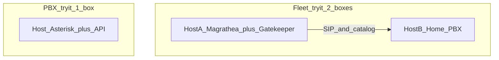

# Fleet try-it deployment (requirements)

**Status:** **Requirements locked** (2026-08-08). Implementation not started.  
**Primary goal:** **Ease and cost of initial deployment** — fewer boxes, fewer steps, portable packaging.  
**Not this track:** LAN-behind-edge media anchoring (rtpengine) — see **Appendix A** (parked).

**Related:** **`DESIGN_RULES.md`** Rules **7**, **9**, **13** · **`GREENFIELD_FLEET_INSTANCE_INSTALL.md`** · **`INSTALL_NODE_SIMPLE.md`** · **`SBC_PRODUCT_TRACKS.md`** · **`FLEET_TRUNK_PEERING_DECISION.md`** §6.1 (RTP bypass default).

---

## Outcome (short)

| Topic | Outcome |
|-------|---------|
| **Try PBX only** | **1** cloud instance — Asterisk + API (singleton-direct). No Magrathea, no Gatekeeper. |
| **Try fleet** | **2** cloud instances — Host A: Magrathea **+** Gatekeeper (co-located); Host B: home PBX. |
| **Prod split (optional)** | Same packages; Gatekeeper and Magrathea on separate hosts when blast radius matters (**3+**). |
| **Portable core** | Versioned **packages/debs** + **one first-boot / tailor script** (env file). This is what ports. |
| **AWS AMI** | Optional **skin** — preinstalled packages; **same** tailor script. Not product home of record. |
| **Docker** | Optional for **Gatekeeper ± Magrathea** only (co-locate vs split at deploy time). **Never** Asterisk-in-Docker. |
| **RTP** | Stay on **bypass** (media → home Asterisk; Asterisk always bridges). Do **not** add rtpengine to shrink try-it. |

---

## Why

Fleet bring-up today is still too complex for a prospect: typically **three** VMs (control, SBC, home) plus multi-step install. That raises cost and drop-off. Co-locating Gatekeeper with Magrathea cuts one VM; documenting a **1-box PBX-only** path covers “just play with the PBX.” Packaging must stay **cloud-portable** (Rule 9) — AMI alone does not port.

---

## Non-goals

- Solving try-it by putting **all audio** through the SBC (rtpengine).
- **Asterisk in Docker** as a recommended path (RTP port-range / media-address / ICE failure modes).
- Baking **SPA** into instance or edge AMIs (directory / Pages pattern stays).
- Merging Gatekeeper and Magrathea into one codebase or one HoR (Rule 13 dual contract stays).
- Requiring multi-cloud Packer images on day one (AMI skin may ship first; Packer later).
- Replacing greenfield/Mode 4 rebuild runbooks — this track **simplifies first spin-up**, not every ops path.

---

## Topologies

### T1 — Solo PBX (1 box)

- Install **pbx3** + **pbx3api** (+ cagi as today) on one VM.
- No Magrathea, no Gatekeeper, no org catalog required for basic panels.
- Optional instance WSS / singleton-direct for webphone lab.
- **Marketing default** for “try the PBX.”

### T2 — Fleet try-it (2 boxes)

- **Host A:** Magrathea (OpenSIPS + Filament admin) **and** Gatekeeper (control API, auth DB, catalog jobs) on the **same** VM — systemd co-install and/or Compose for GK+SBC only.
- **Host B:** normal home instance (Asterisk + API) — **native/deb**, not Docker.
- Tailor script (or compose env) sets: public names (`sbc` / `control` vhosts or paths), org bucket, fleet token/bootstrap user, dispatcher/home registration toward Host B.
- **Rule 13:** Filament/scripts still author edge tables; Gatekeeper still owns catalog/control APIs — co-location is **process/host**, not product merge.

### T3 — Split control / edge (3+ boxes)

- Same artifacts as T2; enable only Magrathea on one host and only Gatekeeper on another.
- Deploy-time choice (compose profiles / unit sets). Preferred when shared blast radius is unacceptable.

---

## Packaging contract

### Portable core (required)

1. **Packages** — existing or thin wrappers: instance debs; Magrathea/SBC install; Gatekeeper (rsync/tarball or package).
2. **Tailor script** (name TBD, e.g. `pbx3-firstboot` / `tailor-fleet-tryit`) reading a small env/file:
   - Topology: `solo` | `fleet_colocated` | `fleet_split`
   - FQDNs / public IPs
   - Org bucket endpoint + credentials (S3-compatible)
   - Bootstrap fleet admin / break-glass handling
   - Home instance id / API URL / setid hints as needed
3. **Idempotent** where practical; safe to re-run with same inputs.
4. **No AWS SDK** in the tailor script’s happy path beyond optional “detect IMDS” — bucket access via S3-compatible config (Rule 9).

### AWS AMI skin (optional, phase after script)

- Prebuilt AMI with packages already installed.
- First boot runs **the same** tailor script (user-data or documented one-liner).
- Document as **AWS convenience**, not the portable definition of the product.

### Multi-cloud images (later)

- Packer (or cloud-adapter `BuildImage`) consumes the same install + tailor inputs → AMI / GCP / Azure / qcow2.
- Do not hand-maintain divergent per-cloud bake scripts.

### Docker (optional, GK + Magrathea only)

- Compose can run Gatekeeper + Magrathea on one host (**T2**) or split (**T3**).
- Magrathea may need **host networking** for SIP; document that.
- **Asterisk stays out of Compose** for try-it and lab appliance.

---

## Acceptance (when implemented)

| # | Check |
|---|--------|
| A1 | Doc’d **T1**: fresh Ubuntu VM → packages + tailor → SPA can hit instance API and place a lab call (or documented smoke). |
| A2 | Doc’d **T2**: two VMs → Host A GK+Magrathea, Host B home → Fleet login + catalog sees home + SIP path works (RTP bypass). |
| A3 | Tailor script runs from a **checked-in** env example; no undocumented AMI-only steps. |
| A4 | **T3** documented as “same packages, split hosts.” |
| A5 | Explicit **non-recommendation** of Asterisk-in-Docker. |
| A6 | AMI (if shipped) is described as skin over A3 — rebuildable from packages + script. |

---

## Phased build effort (estimate)

| Phase | Scope | Effort |
|-------|--------|--------|
| **D0** | This requirements doc + TODO link | Done when committed |
| **D1** | Tailor script + env examples + MkDocs/install pointers for T1 + T2 | ~3–7 days |
| **D2** | Optional Compose recipe for GK+Magrathea (T2/T3) | ~2–3 days |
| **D3** | Optional AWS AMI + user-data calling tailor | ~2–4 days |
| **D4** | Packer multi-cloud | Later |

---

## Appendix A — Optional media plane (parked)

**Not part of try-it.** RTP **bypass** remains product default: endpoint ↔ **home Asterisk** (Asterisk always in media path); SIP via Magrathea.

**rtpengine** only if a real trigger appears: LAN home + public remote, explicit relay mode, or legacy WebRTC↔non-WebRTC gateway. Selective engage; no PBX product mods; HA media deferred.

- Spec trigger: Track A / Peer forbids bypass / LAN-edge pilot.
- Effort if built: ~1–2 weeks SBC MVP (see prior design discussion).
- Gap pointer: **`SBC_PRODUCT_TRACKS.md`** #2 · **`FLEET_TRUNK_PEERING_DECISION.md`** §6.1.

**Do not** implement media plane to reduce instance count or simplify first deploy.

---

## Revision

| Date | Note |
|------|------|
| 2026-08-08 | Requirements locked from plan discussion: ease/cost primary; 2-box fleet; portable core + AMI skin; rtpengine parked. |
