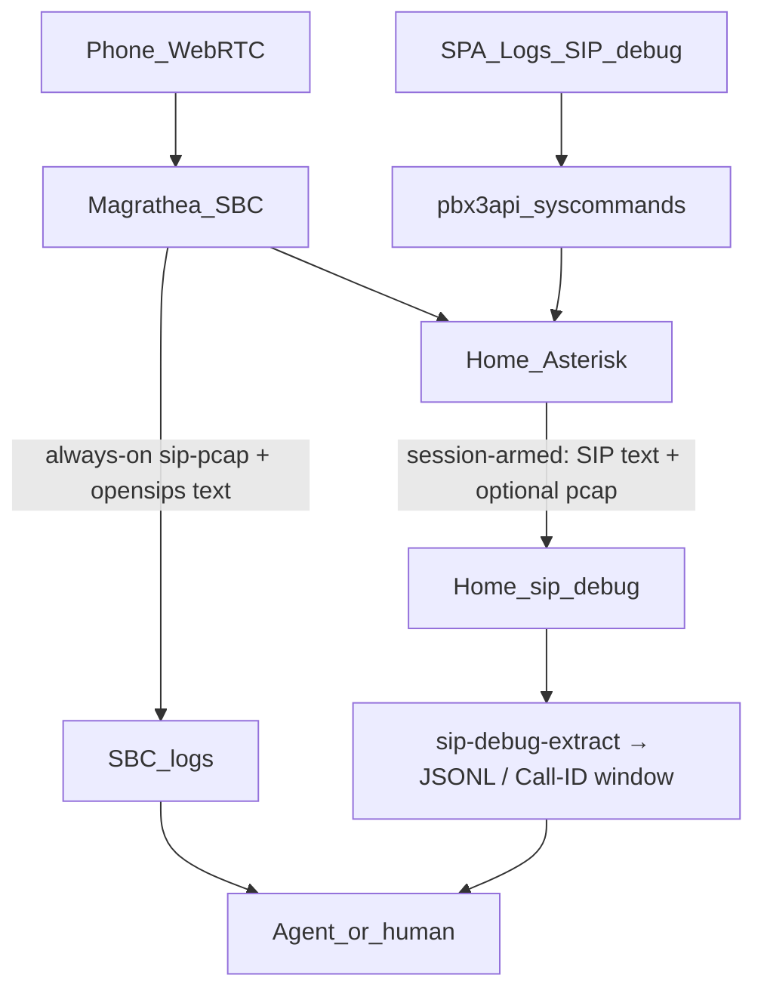

# Home SIP logging — requirements (AI-first)

**Status:** Direction locked **2026-08-11** (amended same day: **SPA arm/disarm in v1**; **S3 `sip-text` / `sip-pcap`**). **Not implemented** (docs lock only).  
**Related:** [`pbx3-directory/docs/FLEET_LOG_RETENTION_REQUIREMENTS.md`](../pbx3-directory/docs/FLEET_LOG_RETENTION_REQUIREMENTS.md) (fleet always-on SIP archive = **SBC**; R3 unchanged) · instance `sys-ua-siplog` · `siplog-set-mode.sh` · pbx3api `LogController` + syscommands · SPA Logs / SIP debug controls · parked Homer/Grafana (TODO #20).  
**Repos when built:** **pbx3** (logger channel + arm/disarm/extract scripts) · **pbx3api** (LogController + sip-debug status/arm/disarm) · **pbx3spa** (start/stop + status + list/download). No Gatekeeper change for v1. No SBC capture model change.

---

## 1. One-line purpose

Give operators and **AI agents** a fast, readable way to debug **home (instance) SIP** — primarily the **SBC↔Asterisk** leg — without turning fleet homes into always-on packet archives and without forcing binary pcap through the LLM context window.

---

## 2. Why home logging still matters in fleet

Fleet phones terminate on the **SBC**. Home `:5060` sees **only SBC↔Asterisk**. That is still the leg that carries:

- PrepDial / SITE_DIAL hairpin behaviour  
- CLIP / PAI / return-AOR presentation  
- Egress mangle / transform  
- GenAst dialstring mistakes  

Desk REGISTER and carrier-facing INVITEs remain on Magrathea (OpenSIPS text + `pbx3sbc-sip-pcap`). Home debug **complements** edge capture; it does not replace it.

---

## 3. Format lock (AI-first)

| Format | Role | Lock |
|--------|------|------|
| **SIP text log** | Full SIP messages in a **dedicated rotated file** (not mixed into noisy `messages`) | **Primary AI surface** |
| **JSONL extract** | One object per message: time, method/status, Call-ID, From, To, RURI, Via branch, body-present flag; optional raw slice | **On-demand derived** (agent script) |
| **pcap** (SIP-only, no RTP) | Forensics / Wireshark / re-extract | **Secondary** — SBC always-on; home **session-armed** only in fleet |
| Homer / HEP / Grafana-in-box | Fleet observability later | **Out of this track** (TODO #20) |

**Why text wins for agents:** SIP debug is pattern matching. Agents SSH and `grep`/`awk`/`Read`. Text enters context immediately. Binary pcap always needs a decode step (`tshark`) before an LLM can reason.

**JSONL** is preferred when the window is large (many messages): structured, filterable, lower token waste. Produce it with the extract script from text (preferred) or from pcap when text was not armed.



---

## 4. Stance (locked)

| # | Lock |
|---|------|
| **H0** | **Fleet always-on SIP archive = SBC only.** R3 in `FLEET_LOG_RETENTION_REQUIREMENTS.md` stands. Home `sys-ua-siplog` stays **default off** in fleet. |
| **H1** | **Session-armed home debug is the product path** for fleet homes (TTL or explicit stop). Not always-on. |
| **H2** | **Primary AI surface = SIP text file.** Pcap is optional companion for the same session window. |
| **H3** | **JSONL extract is the agent contract** for bulk/context — same field schema whether source is text or pcap. |
| **H4** | **Not in the call path** (Design Rule 1). Arm/disarm/extract failure must not affect dial. |
| **H5** | **PII class = CDR-adjacent.** CLI/DNID in SIP; local ring + short session TTL; no catalog / directory bleed. |
| **H6** | **Solo:** existing `siplog-set-mode.sh solo` remains the edge always-on pcap path; text logger may follow the same mode when implemented. |
| **H7** | **SPA controls are in v1.** Instance admin can **see status**, **arm** (text ± pcap, TTL), and **disarm** from the UI. Same backend as CLI scripts. SARK-parity list/download of pcap + text lives on Logs (or a thin SIP debug section). |
| **H8** | **S3 like any other instance log.** Rotated SIP **text** and session **pcap** segments ship via the existing instance log-ship path to `instances/{ksuid}/logs/{class}/…` when fleet/S3 is configured. Telephony and local capture must not depend on S3 (Rule 1 / Rule 6). |

---

## 5. Modes

| Mode | When | Behaviour |
|------|------|-----------|
| **Off** | Fleet default | `sys-ua-siplog` down; PJSIP text logger off; preflight warns if home pcap left running |
| **Session debug** | Operator/agent/SPA arms | Enable PJSIP text → dedicated file; optionally `sv u` dumpcap for same window; auto-off after TTL (default **30 min**, allow **15–60**) or explicit disarm |
| **Solo always-on** | Singleton / direct edge | `siplog-set-mode.sh solo` (pcap); text channel may stay on with existing `logsip*` ring sizing |

### Session arm (v1 shape)

```bash
# CLI and SPA both drive these (SPA via pbx3api → same scripts)
sudo /opt/pbx3/scripts/sip-debug-arm.sh [--ttl 30] [--pcap]
sudo /opt/pbx3/scripts/sip-debug-status.sh
sudo /opt/pbx3/scripts/sip-debug-disarm.sh
```

- Arm must be **idempotent**; disarm restores fleet-safe defaults (pcap down, logger off).
- TTL expiry must disarm even if the SSH session / browser tab dies.
- Document that home capture will **not** show desk REGISTER.
- Fleet UI copy: short note that this captures **SBC↔Asterisk**, not phone REGISTER (edge pcaps are on the SBC).

---

## 6. Agent extract contract (v1 must ship)

Script (ops-local and/or `/opt/pbx3/scripts/sip-debug-extract.sh`):

| Input | Behaviour |
|-------|-----------|
| Optional `--call-id` | Filter to that dialog |
| Optional `--since` / last *N* minutes | Time window |
| Optional `--source text|pcap|auto` | Prefer text; fall back to latest home pcap; document Magrathea paths for edge |

**Stdout (or `-o file`):** newline-delimited JSON objects, one per SIP message, stable keys:

```json
{"t":"2026-08-11T16:02:01.123Z","dir":"in","method":"INVITE","status":null,"call_id":"…","from":"…","to":"…","ruri":"…","cseq":"1 INVITE","via_branch":"…","has_body":true,"raw":null}
```

- Default extract: **no `raw`** (token thrift). `--raw` adds truncated message text when needed.
- Parallel ops pointer (not automated in v1): Magrathea `/var/log/pbx3sbc/sip-pcap/` + `/var/log/opensips/opensips.log` for edge-side bugs.

---

## 7. API / SPA (v1)

### Backend

- Fix **`LogController`**: today `siplog` resolves to `/var/log/siplog`. Real carousel is **`SIPLOG`** = `/opt/pbx3/db/var/log/siplog` (`pbx3` `config.php`). List **directory of pcaps** + download; do not pretend a single file.
- First-class log name for the **SIP text** channel (tail + download), same auth as other system logs.
- **Syscommands** (instance admin, same privilege family as reboot/start/stop):
  - `GET …/sipdebug/status` → `{ armed, text, pcap, ttl_remaining_sec, expires_at }`
  - `POST …/sipdebug/arm` → body `{ ttl_minutes?: 15–60, pcap?: boolean }` (defaults: 30, pcap false)
  - `POST …/sipdebug/disarm`
  - Implementation calls the same `/opt/pbx3/scripts/sip-debug-*.sh` as CLI (no second code path).

### SPA

- **Logs** (or a small **SIP debug** strip on that screen):  
  - Status badge (Off / Armed — text / Armed — text+pcap) + TTL remaining  
  - **Start** (arm) with TTL select + optional “also capture pcap”  
  - **Stop** (disarm)  
  - List/download SIP text + pcap files when present  
- Reuse existing panel patterns; no Wireshark-in-browser.
- Sysglobals `logsip*` ring knobs stay where they are (size only; not the on/off control).

---

## 7a. S3 ship (v1 — same pattern as other instance logs)

| Class | Source | Notes |
|-------|--------|--------|
| **`sip-text`** | Rotated segments of the dedicated SIP text channel | Primary AI-friendly cold store |
| **`sip-pcap`** | Completed dumpcap ring files under `SIPLOG` (when session armed with pcap, or solo) | Same naming family as SBC `sip-pcap`; instance prefix `instances/{ksuid}/…` |

Locks:

- Ship **rotated / completed** files only — never the live open text file or live `siplog.pcap` (same rule as CDR CSV / SBC dumpcap).
- On **disarm** or TTL expiry: rotate/close current text segment so it becomes eligible to ship (do not leave a forever-open file that never uploads).
- Reuse instance log-ship cron / `InstanceLogDirectoryUpload` (extend class list beyond today’s `syslog` / `asterisk-messages` / `cdr`).
- Defaults: local hot ~**7d** ring; S3 max-age ~**30d** (same ballpark as syslog/messages); retention knobs may include the new classes.
- **Solo without org bucket:** local only — no error, no call-path impact (Rule 6).
- SPA archive list/download (Phase 5) should show the new classes when objects exist.
- PII: same treatment as CDR/log archives (private prefix; no catalog bleed).

---

## 8. Explicitly out of v1

- Always-on home pcap in fleet (SPA must not offer a permanent “leave on” for fleet)  
- Browser live SIP follow / Wireshark-in-SPA  
- Changing SBC `pbx3sbc-sip-pcap` / OpenSIPS logging model  
- Homer / HEP as product home of record  
- Fleet Gatekeeper control of home SIP debug (instance Sanctum only)  
- Shipping **JSONL extract** as its own S3 class (derive on demand from `sip-text` / pcap; optional later)

---

## 9. Implementation sketch (when scheduled)

| Slice | Work |
|-------|------|
| **A** | `logger.conf` (or equivalent) dedicated SIP text channel + arm/disarm/status + TTL scripts |
| **B** | Optional pcap companion via existing `sys-ua-siplog` for session window only |
| **C** | `sip-debug-extract.sh` JSONL contract + short agent recipe |
| **D** | `LogController` path + text log name; unit/feature tests |
| **E** | pbx3api sipdebug status/arm/disarm → scripts; ability checks |
| **F** | SPA Logs: status + Start/Stop + TTL + optional pcap + list/download |
| **G** | Instance log-ship: classes `sip-text` + `sip-pcap`; rotate-on-disarm; retention knobs; archive list |
| **H** | Package/docs; fleet-preflight still warns on always-on home pcap |

Est. rough: **~3–5 d** for A–G lean (S3 is mostly extending the existing ship pipeline).

---

## 10. Acceptance (implementation)

- [ ] Fleet default: home pcap off; text logger off  
- [ ] Session arm enables text; optional pcap; TTL or disarm restores off  
- [ ] **SPA:** admin can arm/disarm/see status without SSH  
- [ ] CLI and SPA share the same scripts (no divergent state)  
- [ ] Extract emits JSONL with stable keys; Call-ID filter works  
- [ ] Agent can debug a home-leg SIP issue from text/JSONL without opening Wireshark  
- [ ] LogController lists real `SIPLOG` pcaps + SIP text; `/var/log/siplog` stub gone  
- [ ] Rotated `sip-text` / `sip-pcap` appear under `instances/{ksuid}/logs/…` when org bucket configured; solo without S3 stays local-only  
- [ ] Disarm/TTL closes current text segment so it can ship  
- [ ] R3 / SBC always-on archive unchanged; preflight still flags fleet home pcap left running  
- [ ] Fleet UI does not present always-on home pcap as a normal setting  

---

## 11. Cross-links

| Doc | Relationship |
|-----|----------------|
| `FLEET_LOG_RETENTION_REQUIREMENTS.md` | Always-on fleet SIP = SBC; this file = home **session debug** + instance `sip-text` / `sip-pcap` ship classes |
| `siplog-set-mode.sh` | fleet/solo pcap mode; session arm may call into it temporarily |
| `SINGLE_PANEL_SCREENS.md` | SARK SIP CAP / Logs debt — this track closes start/stop + list for home |
| `SBC_PRODUCT_TRACKS.md` / TODO #20 | Homer/Grafana parked — not this track |
| `FIRST_OUT_CHECKLIST.md` | Not a first-out must; schedule when SIP debug friction bites |
